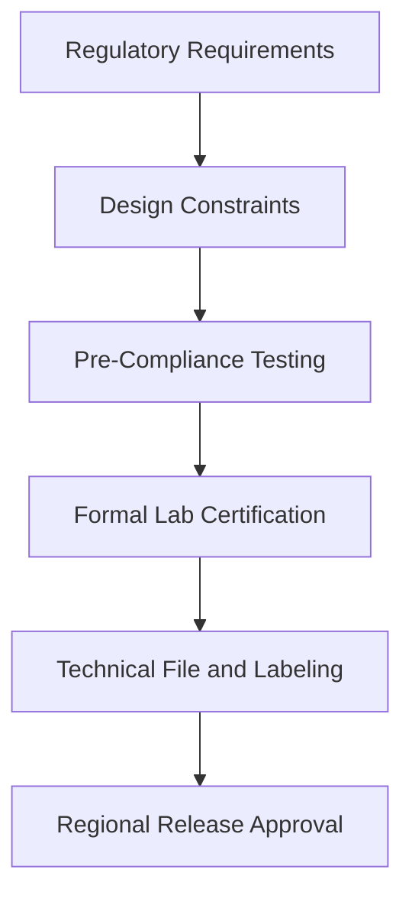
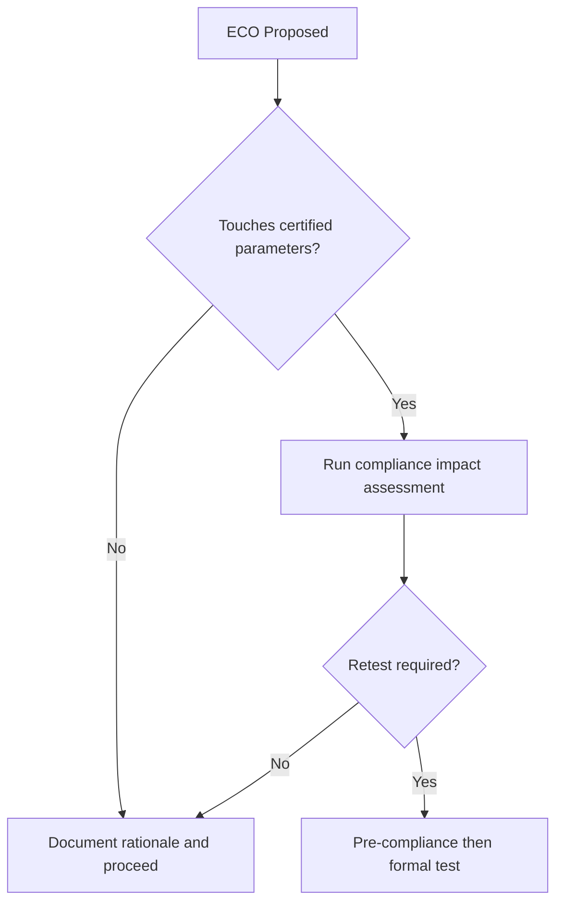

# SWAFarm Certification Requirements

## Executive Summary
This document defines the compliance and certification strategy for SWAFarm products across target markets. It aligns design, test, and documentation requirements to avoid late-stage regulatory delays.

## Purpose
Provide a production-ready certification framework covering RF, EMC, safety-adjacent concerns, and documentation controls.

## Scope
Applies to hardware, RF integration, labeling, test reports, change control, and region-specific release readiness.

## Requirement ID Convention
All normative requirements in this document shall use IDs in the format SWA-CER-NNN.

Rules:
- NNN is a zero-padded sequence (for example, 001, 002, 103).
- IDs are immutable once released; deprecated requirements are retired, not renumbered.
- Requirement-to-test traceability shall reference these IDs in verification artifacts.

Example IDs for this document: SWA-CER-001, SWA-CER-002.

Section ID ranges:
- 0xx: Engineering Rules
- 1xx: Performance Targets
- 2xx: Required Practices
- 3xx: Design Constraints

## Responsibilities
| Role | Responsibility |
|---|---|
| Certification Owner | Maintains compliance matrix and lab coordination |
| RF Engineer | Owns RF compliance evidence |
| Hardware Architect | Owns design conformance |
| QA Lead | Owns test artifact quality and retention |

## Architecture

## Standards
| Area | Standard |
|---|---|
| Evidence quality | Versioned, traceable, reviewable artifacts |
| Change control | Compliance impact assessment for every ECO |
| Labeling | Region-correct product marking and documentation |
| Retesting policy | Trigger-based recertification rules |

## Design Philosophy
Certification is a design-time requirement. Late compliance discovery is treated as a process failure.

## Engineering Rules
1. SWA-CER-001: No regional shipment without approved compliance package.
2. SWA-CER-002: No RF path change without recertification impact review.
3. SWA-CER-003: No uncontrolled BOM substitutions in certified assemblies.

## Required Practices
- SWA-CER-201: Maintain region-by-region compliance matrix.
- SWA-CER-202: Perform pre-compliance testing before formal lab booking.
- SWA-CER-203: Keep certification artifacts linked to hardware and firmware revision identifiers.

## Recommended Practices
- Maintain standing test configurations to reduce retest cycle time.
- Engage labs early for high-risk configuration reviews.

## Design Constraints
| Requirement ID | Constraint | Requirement |
|---|---|---|
| SWA-CER-301 | RF parameters | Must remain within approved module integration constraints |
| SWA-CER-302 | EMC margin | Maintain pre-compliance margin before formal test entry |
| SWA-CER-303 | Documentation | Technical file completeness required at release gate |

## Performance Targets
| Requirement ID | Metric | Target |
|---|---|---|
| SWA-CER-101 | Certification pass rate | High first-pass success via pre-compliance rigor |
| SWA-CER-102 | Recertification lead time | Minimized through controlled change practices |
| SWA-CER-103 | Compliance escapes | Zero released non-compliant SKUs |

## Scalability Considerations
- Compliance data architecture must support multi-region product variants.
- Labeling and documentation generation should be automated where feasible.

## Security Considerations
- Certification packages include security-relevant radio and software controls where required.
- Artifact access must be controlled to prevent unauthorized modifications.

## Reliability Considerations
- Compliance must be sustained across production drift, not only lab samples.
- Periodic audit tests should validate ongoing conformity.

## Maintainability
- Keep traceable mapping between released variants and certification artifacts.
- Define compliance impact workflows for firmware changes.

## Manufacturability
- Production controls must preserve certified configuration boundaries.
- Supplier substitutions require conformity re-evaluation.

## Examples
| Change Type | Required Action |
|---|---|
| Antenna change | RF impact test and likely recertification track |
| Enclosure material change | EMC and RF coupling reassessment |
| Firmware protocol timing change | Compliance impact review and targeted validation |

## Decision Tree

## Checklists
- Compliance matrix up to date.
- Pre-compliance tests complete.
- Formal reports archived.
- Labeling and manuals aligned to region.

## Common Mistakes
1. Treating module certification as full product certification.
2. Making enclosure or antenna changes without impact analysis.
3. Releasing variant labels without document control.

## Frequently Asked Questions
### Why run pre-compliance if formal labs are required anyway?
It reduces costly lab failures and schedule slips.

### Why strict ECO compliance checks?
Small changes can invalidate existing certifications.

## Revision History
| Version | Date | Notes |
|---|---|---|
| 1.0 | 2026-07-29 | Initial baseline |

## Future Roadmap
- Build automated certification impact checker tied to ECO workflow.
- Expand regional compliance templates for faster new-market entry.

## Cross References
- [rf_lorawan_standards.md](rf_lorawan_standards.md)
- [mechanical_design.md](mechanical_design.md)
- [hardware_requirements.md](hardware_requirements.md)
- [manufacturing_rules.md](manufacturing_rules.md)

