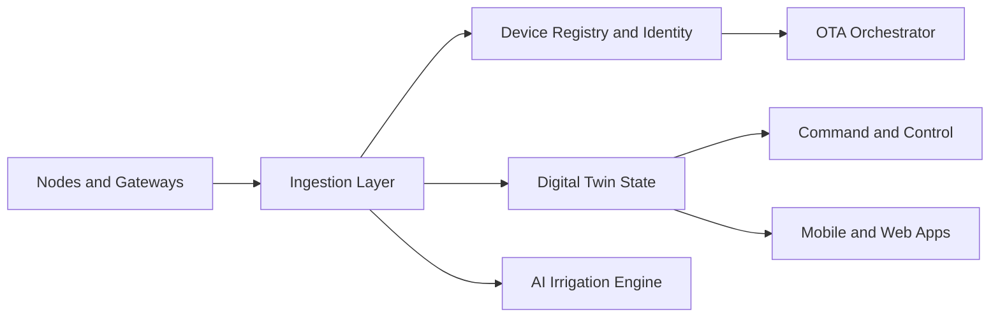
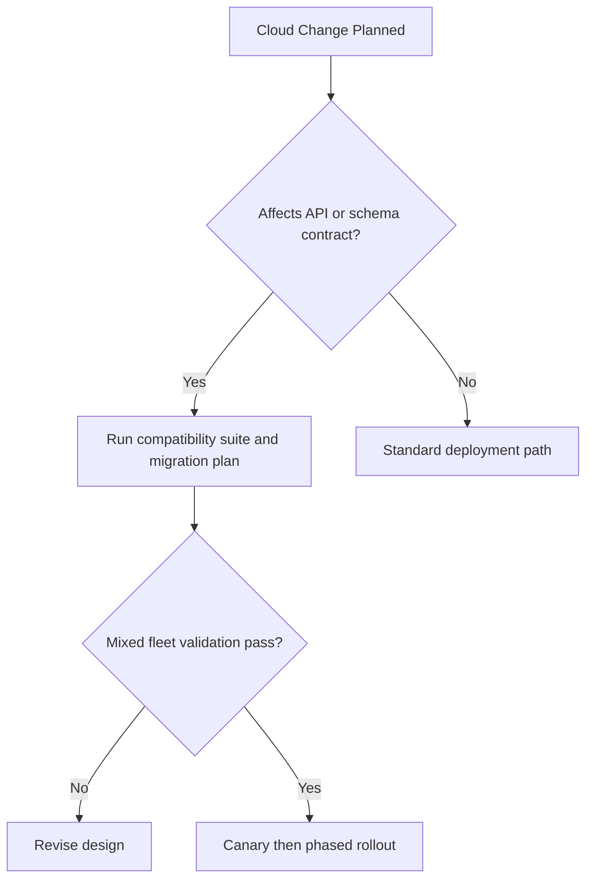

# SWAFarm Cloud Integration

## Executive Summary
This document defines standards for integrating SWAFarm devices, gateways, AI services, and mobile applications with cloud infrastructure at scale.

## Purpose
Ensure reliable ingestion, secure command delivery, OTA orchestration, and long-term compatibility across mixed fleet versions.

## Scope
Applies to device registry, telemetry ingestion, command APIs, digital twin state, OTA orchestration, and observability.

## Requirement ID Convention
All normative requirements in this document shall use IDs in the format SWA-CLD-NNN.

Rules:
- NNN is a zero-padded sequence (for example, 001, 002, 103).
- IDs are immutable once released; deprecated requirements are retired, not renumbered.
- Requirement-to-test traceability shall reference these IDs in verification artifacts.

Example IDs for this document: SWA-CLD-001, SWA-CLD-002.

Section ID ranges:
- 0xx: Engineering Rules
- 1xx: Performance Targets
- 2xx: Required Practices
- 3xx: Design Constraints

## Responsibilities
| Role | Responsibility |
|---|---|
| Cloud Architect | Owns platform architecture and service contracts |
| Embedded Lead | Owns firmware-cloud protocol compatibility |
| QA Lead | Owns integration and regression quality gates |
| Security Lead | Owns identity, auth, and data protection controls |

## Architecture

## Standards
| Area | Standard |
|---|---|
| API design | Versioned contracts and backward compatibility |
| Identity | Strong per-device identity binding |
| Data model | Stable schema with explicit evolution policy |
| Observability | End-to-end metrics, traces, and audit logs |

## Design Philosophy
Cloud architecture must absorb scale and variability from field networks while preserving correctness and operational transparency.

## Engineering Rules
1. SWA-CLD-001: No breaking API change without migration path.
2. SWA-CLD-002: No command execution without authorization and audit.
3. SWA-CLD-003: No OTA campaign without segmentation and rollback controls.

## Required Practices
- SWA-CLD-201: Maintain schema registry with compatibility checks.
- SWA-CLD-202: Implement idempotency in critical write paths.
- SWA-CLD-203: Define SLOs and error budgets for core services.

## Recommended Practices
- Use event-driven processing to decouple ingestion from downstream workloads.
- Use canary and phased rollout for major platform changes.

## Design Constraints
| Requirement ID | Constraint | Requirement |
|---|---|---|
| SWA-CLD-301 | Mixed fleet support | Must support multiple firmware generations simultaneously |
| SWA-CLD-302 | Latency critical commands | Bounded service path and retries |
| SWA-CLD-303 | Data retention | Policy-driven, compliant, and cost-aware |

## Performance Targets
| Requirement ID | Metric | Target |
|---|---|---|
| SWA-CLD-101 | Telemetry ingest success | Greater than 99.9 percent valid events accepted |
| SWA-CLD-102 | Command delivery reliability | Greater than 99.9 percent acknowledged delivery path |
| SWA-CLD-103 | OTA orchestration integrity | Zero unauthorized campaign execution |

## Scalability Considerations
- Design for partitioned data paths and horizontal service scaling.
- Separate hot-path telemetry processing from analytics workloads.

## Security Considerations
- Enforce token/key lifecycle management with rotation policy.
- Encrypt data in transit and at rest per data class policy.

## Reliability Considerations
- Include retries with backoff and dead-letter handling.
- Define disaster recovery strategy with tested restoration procedures.

## Maintainability
- Service interfaces must be documented and contract-tested.
- Operational runbooks and alert routing must be current.

## Manufacturability
- Provisioning APIs must support factory line throughput and traceability.
- Factory-to-cloud registration paths must be deterministic and auditable.

## Examples
| Scenario | Recommended | Not Recommended |
|---|---|---|
| Payload evolution | Versioned schema with compatibility checks | Implicit field changes without versioning |
| OTA rollout | Region and hardware segmented campaign | Single global blast update |

## Decision Tree

## Checklists
- Contract tests passed.
- Observability dashboards updated.
- Security review completed.
- Rollback and incident plans verified.

## Common Mistakes
1. Breaking compatibility with active field firmware.
2. Underestimating ingestion burst and retry storm behavior.
3. Weak auditability for command and OTA actions.

## Frequently Asked Questions
### Why require strict schema versioning?
To prevent silent failures across mixed firmware populations.

### Why separate ingest and analytics planes?
It improves resilience and protects command/control latency.

## Revision History
| Version | Date | Notes |
|---|---|---|
| 1.0 | 2026-07-29 | Initial baseline |

## Future Roadmap
- Add edge-cloud federated decision pipelines for irrigation optimization.
- Add advanced fleet health scoring and predictive intervention workflows.

## Cross References
- [firmware_architecture.md](firmware_architecture.md)
- [testing_standards.md](testing_standards.md)
- [security_standards.md](security_standards.md)
- [swafarm_overview.md](swafarm_overview.md)

