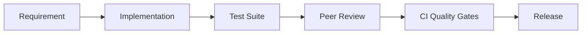
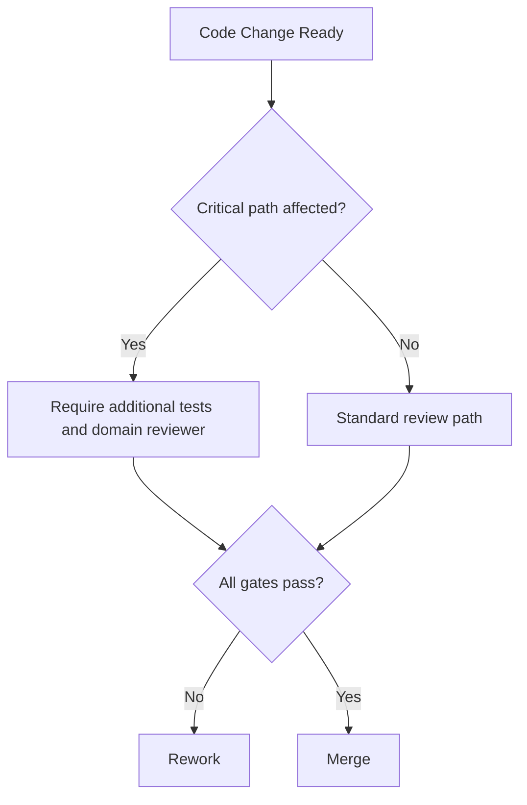

# SWAFarm Coding Standards

## Executive Summary
This document defines coding standards for SWAFarm embedded, backend, and tooling codebases. The goal is safe, maintainable, and testable code across a 10-year product lifecycle.

## Purpose
Establish consistent coding conventions, quality gates, and review expectations that reduce defects and onboarding time.

## Scope
Applies to firmware C/C++, backend services, infrastructure scripts, and test automation.

## Requirement ID Convention
All normative requirements in this document shall use IDs in the format SWA-CDS-NNN.

Rules:
- NNN is a zero-padded sequence (for example, 001, 002, 103).
- IDs are immutable once released; deprecated requirements are retired, not renumbered.
- Requirement-to-test traceability shall reference these IDs in verification artifacts.

Example IDs for this document: SWA-CDS-001, SWA-CDS-002.

Section ID ranges:
- 0xx: Engineering Rules
- 1xx: Performance Targets
- 2xx: Required Practices
- 3xx: Design Constraints

## Responsibilities
| Role | Responsibility |
|---|---|
| Tech Leads | Own language-specific conventions |
| Reviewers | Enforce standards in code review |
| QA | Validate test and coverage gates |
| Security | Validate secure coding requirements |

## Architecture

## Standards
| Area | Standard |
|---|---|
| Style | Enforced by formatter/linter in CI |
| Static analysis | Mandatory for merge eligibility |
| Testing | Unit tests + integration tests for critical paths |
| Error handling | Explicit, structured, and observable |
| API versioning | Backward compatibility rules enforced |

## Design Philosophy
Readable and predictable code is a reliability multiplier. Defensive programming is required in field-facing and safety-adjacent paths.

## Engineering Rules
1. SWA-CDS-001: No merge without passing CI quality gates.
2. SWA-CDS-002: No silent error swallowing.
3. SWA-CDS-003: No undefined ownership semantics in memory/resource management.
4. SWA-CDS-004: No hard-coded credentials or environment secrets.

## Required Practices
- SWA-CDS-201: Use strict compiler warnings and treat critical warnings as errors.
- SWA-CDS-202: Write unit tests for all non-trivial logic.
- SWA-CDS-203: Use code reviews with at least one domain reviewer.

## Recommended Practices
- Keep functions short and single-purpose.
- Prefer explicit interfaces over hidden shared state.

## Design Constraints
| Requirement ID | Constraint | Requirement |
|---|---|---|
| SWA-CDS-301 | Cyclomatic complexity | Keep low in critical modules |
| SWA-CDS-302 | Test coverage | Meet threshold defined by QA policy |
| SWA-CDS-303 | Dependency policy | Approved libraries only |

## Performance Targets
| Requirement ID | Metric | Target |
|---|---|---|
| SWA-CDS-101 | Build reproducibility | Deterministic outputs for tagged releases |
| SWA-CDS-102 | Defect leakage | Continuous reduction quarter-over-quarter |
| SWA-CDS-103 | Mean review turnaround | Controlled to support release cadence |

## Scalability Considerations
- Code structure shall support parallel team ownership.
- Shared libraries shall use semantic versioning and changelog discipline.

## Security Considerations
- Input validation required at all trust boundaries.
- Cryptography use must rely on approved libraries and key handling policy.

## Reliability Considerations
- Fail fast on irrecoverable errors; degrade gracefully when possible.
- Log with stable error codes for fleet analytics.

## Maintainability
- Keep API contracts documented and versioned.
- Remove dead code and feature flags after rollout windows close.

## Manufacturability
- Factory tools and line scripts follow the same review and release controls.

## Examples
| Case | Recommended | Not Recommended |
|---|---|---|
| Error handling | Return typed error and emit telemetry code | Return generic failure with no context |
| Configuration | Versioned schema with defaults | Ad-hoc key-value parsing without schema |

## Decision Tree

## Checklists
- Lint and format checks pass.
- Static analysis warnings reviewed.
- Tests added or updated.
- Security and compatibility impacts assessed.

## Common Mistakes
1. Adding features without observability hooks.
2. Using global mutable state across modules.
3. Ignoring backward compatibility in protocol changes.

## Frequently Asked Questions
### Why enforce strict review gates for factory scripts?
Factory tooling defects can create large-volume quality incidents quickly.

### Why require explicit error taxonomies?
They accelerate root-cause analysis across firmware and cloud telemetry.

## Revision History
| Version | Date | Notes |
|---|---|---|
| 1.0 | 2026-07-29 | Initial baseline |

## Future Roadmap
- Add language-specific annexes for C/C++, Python, and cloud services.
- Integrate AI-assisted static analysis triage with human approval.

## Cross References
- [firmware_architecture.md](firmware_architecture.md)
- [testing_standards.md](testing_standards.md)
- [security_standards.md](security_standards.md)
- [cloud_integration.md](cloud_integration.md)

