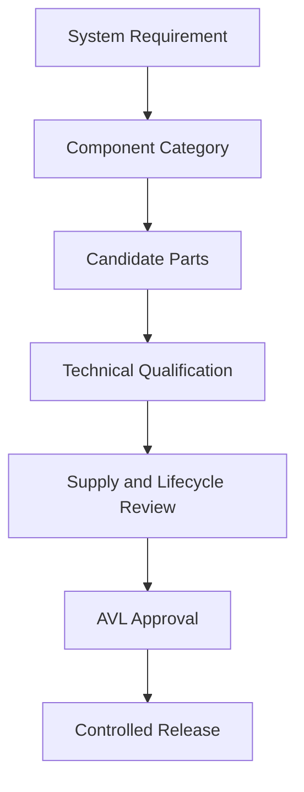
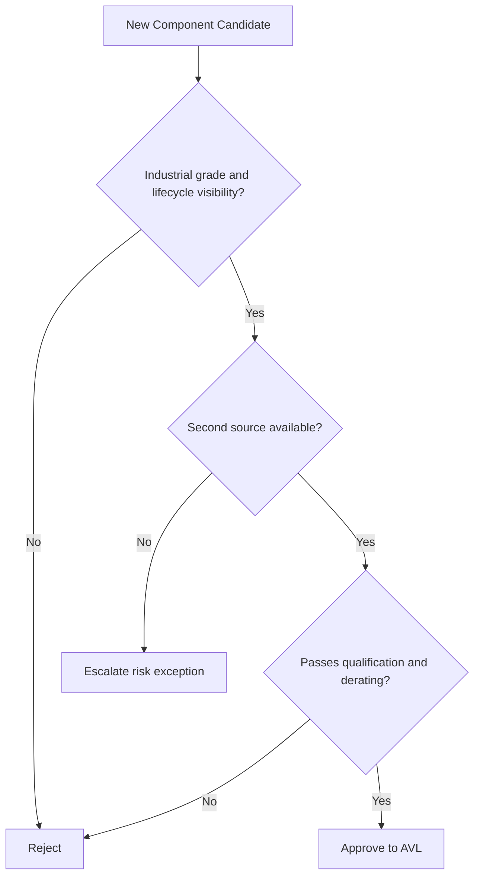

# SWAFarm Component Standards

## Executive Summary
This document defines component selection, qualification, and lifecycle governance standards for SWAFarm hardware. The objective is predictable quality, supply resilience, and maintainability at million-unit scale.

## Purpose
Set component-level rules that convert system reliability and cost targets into enforceable sourcing and design decisions.

## Scope
Applies to active, passive, electromechanical, connector, and protection components used in SWAFarm hardware products.

## Requirement ID Convention
All normative requirements in this document shall use IDs in the format SWA-CST-NNN.

Rules:
- NNN is a zero-padded sequence (for example, 001, 002, 103).
- IDs are immutable once released; deprecated requirements are retired, not renumbered.
- Requirement-to-test traceability shall reference these IDs in verification artifacts.

Example IDs for this document: SWA-CST-001, SWA-CST-002.

Section ID ranges:
- 0xx: Engineering Rules
- 1xx: Performance Targets
- 2xx: Required Practices
- 3xx: Design Constraints

## Responsibilities
| Role | Responsibility |
|---|---|
| Hardware Architect | Defines approved component classes |
| Sourcing | Maintains AVL and lifecycle risk data |
| Manufacturing Engineer | Validates process compatibility |
| QA Lead | Approves qualification evidence |

## Architecture

## Standards
| Category | Standard |
|---|---|
| Lifecycle | Prefer components with long-term supply commitment |
| Sourcing | At least two qualified suppliers for critical categories |
| Temperature grade | Industrial range for exposed field hardware |
| Compliance | Use parts with accessible compliance declarations |
| Obsolescence control | PCN/EOL monitoring mandatory |

## Design Philosophy
Part selection must optimize total cost of ownership, not only line-item unit cost. Reliability and supply continuity are weighted ahead of marginal price gains.

## Engineering Rules
1. SWA-CST-001: No NRND components in new designs.
2. SWA-CST-002: No components lacking traceable manufacturer data.
3. SWA-CST-003: No custom-only parts without business-approved risk case.
4. SWA-CST-004: Critical parts shall have approved alternates before MP ramp.

## Required Practices
- SWA-CST-201: Maintain AVL with manufacturer part number, alternates, and qualification status.
- SWA-CST-202: Perform fit-form-function evaluation before substitutions.
- SWA-CST-203: Use derating policy for voltage, current, power, and temperature stress.

## Recommended Practices
- Standardize footprints across families to simplify alternates.
- Prefer components with broad distributor presence in India, US, and EU.

## Design Constraints
| Requirement ID | Constraint | Requirement |
|---|---|---|
| SWA-CST-301 | Electrolytic capacitors | Lifetime calculation at worst thermal zone |
| SWA-CST-302 | Relays | Contact rating margin for target load profiles |
| SWA-CST-303 | Connectors | Mating cycle and ingress risk alignment with field service plan |
| SWA-CST-304 | TVS/protection parts | Energy rating aligned with surge profile |

## Performance Targets
| Requirement ID | Metric | Target |
|---|---|---|
| SWA-CST-101 | Approved alternate coverage | 100 percent for critical components |
| SWA-CST-102 | EOL exposure | Less than 2 percent of active BOM value |
| SWA-CST-103 | Qualification cycle time | Controlled and measurable per part class |

## Scalability Considerations
- Part family standardization reduces qualification overhead at scale.
- AVL governance must support region-specific sourcing substitutions.

## Security Considerations
- Procurement sources must be authorized to reduce counterfeit risk.
- Chain-of-custody checks are mandatory for cryptographic or identity-related components.

## Reliability Considerations
- Use statistically meaningful lot sampling during incoming qualification.
- Track field failure modes back to component lots when possible.

## Maintainability
- Favor package sizes that enable robust manufacturing and rework where necessary.
- Avoid highly specialized parts that create service bottlenecks.

## Manufacturability
- Confirm stencil and reflow compatibility for all package types.
- Ban mixed package strategies that increase assembly escape risk without clear benefit.

## Examples
| Decision | Recommended | Rejected | Why |
|---|---|---|---|
| Buck regulator | Industrial grade with automotive-like protections | Consumer regulator with thin documentation | Field reliability and qualification confidence |
| Relay choice | Dual-source industrial relay family | Single-source low-cost relay | Supply risk and wear uncertainty |

## Decision Tree

## Checklists
- Datasheet and lifecycle status verified.
- Derating calculations attached.
- Alternate part validated.
- Qualification test evidence archived.

## Common Mistakes
1. Selecting lowest-cost part without lifecycle visibility.
2. Substituting parts without full fit-form-function review.
3. Ignoring PCN alerts until production impact occurs.

## Frequently Asked Questions
### Why are second sources mandatory for critical parts?
Because single-source risk becomes unacceptable at million-unit scale.

### Can lower-grade parts be used in non-critical paths?
Only with documented risk acceptance and proof they do not impact reliability targets.

## Revision History
| Version | Date | Notes |
|---|---|---|
| 1.0 | 2026-07-29 | Initial baseline |

## Future Roadmap
- Add automated AVL health scoring linked to ERP/PLM.
- Add supplier risk heatmap by region.

## Cross References
- [hardware_requirements.md](hardware_requirements.md)
- [manufacturing_rules.md](manufacturing_rules.md)
- [cost_targets.md](cost_targets.md)
- [security_standards.md](security_standards.md)

