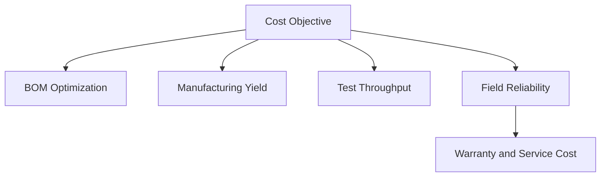
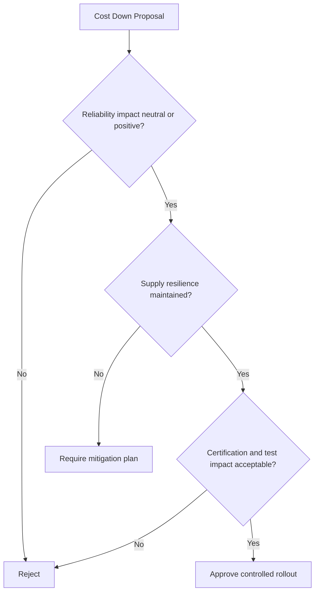

# SWAFarm Cost Targets

## Executive Summary
This document defines SWAFarm cost governance standards across product lifecycle phases. It balances BOM reduction with reliability, certification, and maintainability objectives.

## Purpose
Provide objective cost targets and decision logic for architecture, component selection, manufacturing, and operations.

## Scope
Applies to node hardware, manufacturing test, provisioning, firmware operations (OTA), and cloud-linked lifecycle costs.

## Requirement ID Convention
All normative requirements in this document shall use IDs in the format SWA-CTT-NNN.

Rules:
- NNN is a zero-padded sequence (for example, 001, 002, 103).
- IDs are immutable once released; deprecated requirements are retired, not renumbered.
- Requirement-to-test traceability shall reference these IDs in verification artifacts.

Example IDs for this document: SWA-CTT-001, SWA-CTT-002.

Section ID ranges:
- 0xx: Engineering Rules
- 1xx: Performance Targets
- 2xx: Required Practices
- 3xx: Design Constraints

## Responsibilities
| Role | Responsibility |
|---|---|
| CTO | Approves cost strategy and trade-offs |
| Hardware Architect | Drives BOM architecture decisions |
| Manufacturing Engineer | Drives process and yield cost optimization |
| Sourcing | Executes supplier and AVL cost strategy |

## Architecture

## Standards
| Cost Layer | Standard |
|---|---|
| BOM | Controlled target per revision and region |
| Manufacturing | Yield and cycle-time tracked against baseline |
| Quality | Cost of poor quality tracked monthly |
| Operations | OTA and cloud servicing costs measured per active device |

## Design Philosophy
Cost decisions must optimize total lifecycle economics. A lower component cost is rejected if it increases defect rate, certification risk, or service burden.

## Engineering Rules
1. SWA-CTT-001: No cost-down change without validation against reliability and quality KPIs.
2. SWA-CTT-002: No single-source dependency accepted solely for short-term cost gain.
3. SWA-CTT-003: No change that increases field service frequency without executive approval.

## Required Practices
- SWA-CTT-201: Maintain costed BOM by revision and volume band.
- SWA-CTT-202: Track yield-adjusted cost, not nominal BOM alone.
- SWA-CTT-203: Run formal engineering change review for all cost-down proposals.

## Recommended Practices
- Standardize components across SKUs to improve purchasing leverage.
- Use regional sourcing strategy with qualification parity.

## Design Constraints
| Requirement ID | Constraint | Requirement |
|---|---|---|
| SWA-CTT-301 | Reliability floor | Cost-down cannot violate MTBF targets |
| SWA-CTT-302 | Certification impact | Must remain within approved compliance envelope |
| SWA-CTT-303 | Firmware impact | No hidden software complexity increase without budgeting |

## Performance Targets
| Requirement ID | Metric | Target Direction |
|---|---|---|
| SWA-CTT-101 | BOM reduction trajectory | Planned quarterly reduction without quality regression |
| SWA-CTT-102 | Cost of poor quality | Continuous reduction |
| SWA-CTT-103 | Warranty cost per device | Controlled and declining with maturity |

## Scalability Considerations
- Cost model must include million-unit volume effects and regional logistics.
- Tooling and fixture amortization must be included in COGS planning.

## Security Considerations
- Security controls are mandatory costs, not optional spend categories.
- Avoid low-cost substitutions that weaken cryptographic assurance.

## Reliability Considerations
- Include reliability penalty in all cost-down business cases.
- Prefer stable, proven platforms over fragile low-cost alternatives.

## Maintainability
- Include support and diagnostics overhead in lifecycle cost analysis.
- Favor reusable platform modules to reduce long-term engineering burden.

## Manufacturability
- Optimize for first-pass yield and test efficiency.
- Quantify process changes before approving material substitutions.

## Examples
| Proposal | Benefit | Risk | Decision |
|---|---|---|---|
| Lower-cost relay family | Unit cost reduction | Higher failure rate uncertainty | Reject until qualification proves parity |
| Standardized connector family | Lower procurement complexity | None significant | Approve |

## Decision Tree

## Checklists
- Technical qualification complete.
- Yield and throughput impact estimated.
- Reliability and warranty impact modeled.
- Rollback strategy defined.

## Common Mistakes
1. Measuring success only by BOM line-item deltas.
2. Ignoring hidden firmware and validation costs.
3. Approving substitutions without multi-lot validation.

## Frequently Asked Questions
### Why is yield-adjusted cost required?
Because low nominal BOM can still produce higher true cost if defect rates rise.

### Why include OTA/cloud cost in hardware strategy?
Device architecture directly affects operational servicing cost over years.

## Revision History
| Version | Date | Notes |
|---|---|---|
| 1.0 | 2026-07-29 | Initial baseline |

## Future Roadmap
- Add product-line cost dashboards with predictive variance alerts.
- Add region-specific landed-cost optimization models.

## Cross References
- [component_standards.md](component_standards.md)
- [manufacturing_rules.md](manufacturing_rules.md)
- [hardware_requirements.md](hardware_requirements.md)
- [swafarm_overview.md](swafarm_overview.md)

