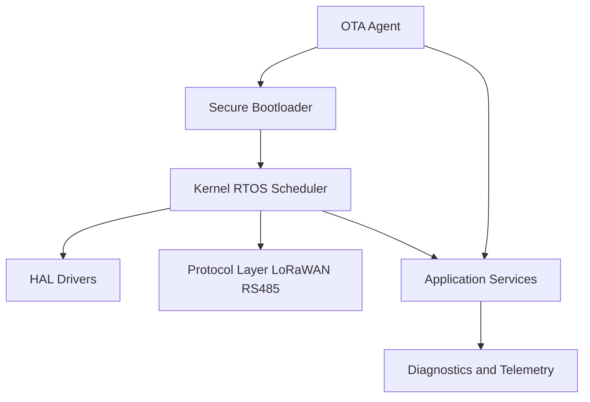
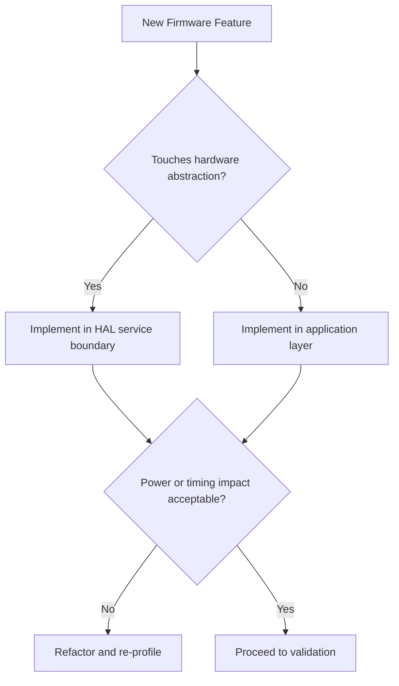

# SWAFarm Firmware Architecture

## Executive Summary
This document defines the firmware architecture for SWAFarm nodes, with priorities on deterministic behavior, low power operation, secure OTA updates, and long-term maintainability.

## Purpose
Provide a stable architecture blueprint and engineering rules for embedded firmware across current and future hardware revisions.

## Scope
Applies to node firmware components: boot, HAL, drivers, protocol stacks, telemetry, control logic, diagnostics, and OTA update agents.

## Requirement ID Convention
All normative requirements in this document shall use IDs in the format SWA-FWA-NNN.

Rules:
- NNN is a zero-padded sequence (for example, 001, 002, 103).
- IDs are immutable once released; deprecated requirements are retired, not renumbered.
- Requirement-to-test traceability shall reference these IDs in verification artifacts.

Example IDs for this document: SWA-FWA-001, SWA-FWA-002.

Section ID ranges:
- 0xx: Engineering Rules
- 1xx: Performance Targets
- 2xx: Required Practices
- 3xx: Design Constraints

## Responsibilities
| Role | Responsibility |
|---|---|
| Embedded Lead | Owns architecture and release policy |
| Systems Engineer | Maintains requirement mapping |
| QA Lead | Defines verification and regression criteria |
| Security Lead | Defines cryptographic and secure-boot controls |

## Architecture

## Standards
| Area | Standard |
|---|---|
| Boot integrity | Secure boot with signed image verification |
| Update model | A/B or equivalent safe rollback strategy |
| Layering | HAL separation from application logic |
| Protocol handling | Versioned payload contracts |
| Observability | Structured diagnostics and error codes |

## Design Philosophy
Firmware must be resilient to partial failures and communication instability. Recovery behavior is an architecture feature, not a patch activity.

## Engineering Rules
1. SWA-FWA-001: No blocking calls in timing-critical task contexts without bounded timeout.
2. SWA-FWA-002: No direct hardware register access from business logic layers.
3. SWA-FWA-003: No production build with disabled watchdog strategy.
4. SWA-FWA-004: All externally visible payloads and commands must be versioned.

## Required Practices
- SWA-FWA-201: Maintain state diagrams for critical control flows.
- SWA-FWA-202: Enforce static analysis and MISRA-inspired safe coding constraints.
- SWA-FWA-203: Execute regression suite for each release candidate.

## Recommended Practices
- Use event-driven scheduling for power efficiency.
- Keep protocol adapters isolated so transport evolution does not affect core logic.

## Design Constraints
| Requirement ID | Constraint | Requirement |
|---|---|---|
| SWA-FWA-301 | Memory headroom | Reserve growth margin for feature roadmap |
| SWA-FWA-302 | Power budget | Duty cycle and sleep policy must match node power target |
| SWA-FWA-303 | OTA robustness | Atomic update and recoverability from interrupted transfers |

## Performance Targets
| Requirement ID | Metric | Target |
|---|---|---|
| SWA-FWA-101 | Boot-to-operational readiness | Within product startup target window |
| SWA-FWA-102 | OTA completion reliability | Greater than 99 percent in stable network windows |
| SWA-FWA-103 | Protocol command timeout handling | Deterministic and logged |

## Scalability Considerations
- Support hardware revision abstraction without rewriting application logic.
- Device command handling must remain backward-compatible for mixed-fleet deployments.

## Security Considerations
- Cryptographic keys shall never be hard-coded in plaintext source.
- Production images must be signed and verified before activation.

## Reliability Considerations
- Use watchdog + fault classification + controlled restart policy.
- Persist crash counters and fault context for postmortem analysis.

## Maintainability
- Enforce module ownership and API contracts.
- Keep feature flags explicit and documented.

## Manufacturability
- Factory test hooks must be accessible through controlled firmware interfaces.
- Provisioning mode behavior must be deterministic and auditable.

## Examples
| Topic | Preferred | Avoid |
|---|---|---|
| Sensor tasking | Scheduled acquisition with retry envelope | Unbounded polling loops |
| OTA flow | Staged activation with integrity checks | Immediate overwrite with no rollback |

## Decision Tree

## Checklists
- Architecture layering preserved.
- Static analysis and tests clean.
- OTA rollback validated.
- Telemetry and error codes documented.

## Common Mistakes
1. Coupling protocol format changes with control logic changes.
2. Ignoring low-power transitions during feature additions.
3. Releasing without mixed-fleet compatibility tests.

## Frequently Asked Questions
### Why enforce strict layering?
It prevents hardware churn from destabilizing system behavior.

### Why require rollback-ready OTA?
It limits fleet-wide failure risk and improves recovery speed.

## Revision History
| Version | Date | Notes |
|---|---|---|
| 1.0 | 2026-07-29 | Initial baseline |

## Future Roadmap
- Add secure attestation and richer remote diagnostics.
- Add optional edge AI runtime partition once resource profile is finalized.

## Cross References
- [hardware_requirements.md](hardware_requirements.md)
- [coding_standards.md](coding_standards.md)
- [security_standards.md](security_standards.md)
- [cloud_integration.md](cloud_integration.md)

