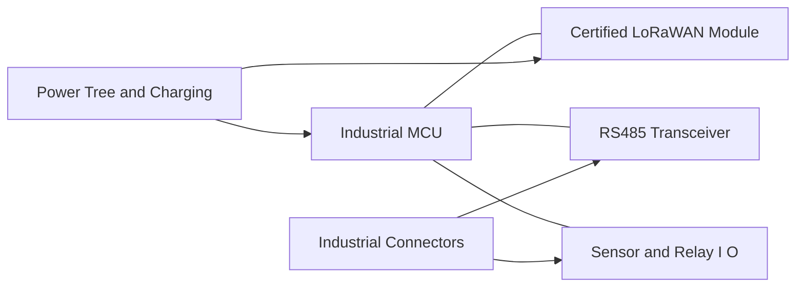
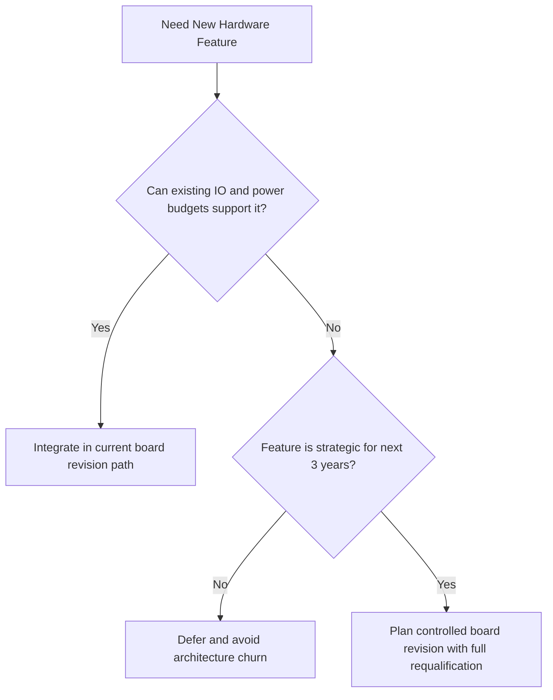

# SWAFarm Hardware Requirements

## Executive Summary
This document defines the mandatory hardware requirements for SWAFarm production nodes and gateway-facing field interfaces. Requirements are written for long lifecycle operation, high-volume manufacturing, and global deployment in harsh agricultural environments.

## Purpose
Establish a single, testable hardware requirement baseline that drives schematic design, PCB implementation, validation plans, and manufacturing readiness.

## Scope
Applies to:
- LoRaWAN smart node hardware
- Sensor and actuator I/O
- RS485 Modbus RTU interface
- Power input, charging, and energy storage integration
- External connectors and enclosure interfaces

Does not cover cloud or app implementation details.

## Requirement ID Convention
All normative requirements in this document shall use IDs in the format SWA-HWR-NNN.

Rules:
- NNN is a zero-padded sequence (for example, 001, 002, 103).
- IDs are immutable once released; deprecated requirements are retired, not renumbered.
- Requirement-to-test traceability shall reference these IDs in verification artifacts.

Example IDs for this document: SWA-HWR-001, SWA-HWR-002.

Section ID ranges:
- 0xx: Engineering Rules
- 1xx: Performance Targets
- 2xx: Required Practices
- 3xx: Design Constraints

## Responsibilities
| Role | Responsibility |
|---|---|
| Systems Engineer | Owns requirement IDs and traceability |
| Hardware Architect | Converts requirements into design constraints |
| RF Engineer | Validates radio-related constraints |
| Power Engineer | Validates power and battery requirements |
| QA Lead | Verifies requirement coverage in test plans |
| Manufacturing Engineer | Ensures requirements are testable on line |

## Architecture

## Standards
| Area | Minimum Standard |
|---|---|
| Sensor Inputs | Minimum 5 simultaneously supported channels |
| Actuator Outputs | Minimum 5 relay outputs |
| Communications | LoRaWAN + RS485 Modbus RTU |
| Power Sources | Solar + rechargeable battery + external DC |
| Environmental | IP65 system-level deployment strategy |
| Expansion | Reserve architecture paths for BLE, cellular, edge AI |

## Design Philosophy
Design choices shall prioritize reliability and service life over short-term BOM reduction. Hardware shall remain maintainable for 10 years with controlled component substitutions.

## Engineering Rules
1. SWA-HWR-001: Do not use hobby-grade connectors, relays, or regulator families.
2. SWA-HWR-002: All critical components require second-source or approved mitigation.
3. SWA-HWR-003: Every external line shall include protection against ESD and surge classes defined by system test plans.
4. SWA-HWR-004: Board interfaces shall be revisioned and documented before layout release.

## Required Practices
- SWA-HWR-201: Assign requirement IDs to all electrical and mechanical constraints.
- SWA-HWR-202: Validate sensor and relay channels under worst-case temperature and supply variation.
- SWA-HWR-203: Verify sleep current using production-representative hardware.
- SWA-HWR-204: Include production test points for major power rails and communication interfaces.

## Recommended Practices
- Use modular front-end blocks for future analog and PWM expansion.
- Reserve connector pins and GPIO options for future product variants.
- Select components with published lifecycle policy and PCN discipline.

## Design Constraints
| Requirement ID | Constraint | Requirement |
|---|---|---|
| SWA-HWR-301 | MCU headroom | Minimum 30 percent CPU and memory reserve at current release baseline |
| SWA-HWR-302 | RS485 network tolerance | Must support multidrop field bus with robust line protection |
| SWA-HWR-303 | Relay subsystem | Include flyback and fault isolation strategy |
| SWA-HWR-304 | Charging subsystem | Safe operation across field temperature profile |
| SWA-HWR-305 | Connector strategy | Field-serviceable and polarity-safe |

## Performance Targets
| Requirement ID | Metric | Target |
|---|---|---|
| SWA-HWR-101 | Sleep current | Meet product power budget from power_management.md |
| SWA-HWR-102 | Relay actuation reliability | Greater than 99.9 percent command success in validation matrix |
| SWA-HWR-103 | Sensor data acquisition validity | Greater than 99.5 percent valid sample capture in qualification tests |
| SWA-HWR-104 | Field uptime | Greater than 99.5 percent excluding external network outages |

## Scalability Considerations
- Hardware architecture shall support multiple SKU variants without PCB redesign where practical.
- Connector and power sections shall support manufacturing test fixture automation.
- Design shall allow phased introduction of BLE/cellular daughter paths.

## Security Considerations
- Device identity root must be anchored in immutable hardware identity.
- Debug ports must be gated or disabled for production.
- Hardware support for secure boot and signed firmware verification is mandatory.

## Reliability Considerations
- Apply voltage/current derating policy across active and passive components.
- Use conformal coating strategy only if required by environment and validated for serviceability impact.
- Avoid single points of thermal runaway in charging and regulator subsystems.

## Maintainability
- Board-level diagnostics shall expose health telemetry to firmware.
- Replaceable field connectors are preferred over permanent cable bonds.

## Manufacturability
- PCB panelization rules and tooling holes must be defined before EVT freeze.
- Critical placement tolerances shall be validated with contract manufacturer DFM feedback.

## Examples
| Requirement | Good Example | Poor Example |
|---|---|---|
| Relay driver | Driver with current margin and flyback suppression | Direct MCU pin switching of inductive load |
| RS485 port | Protected transceiver with termination strategy | Bare transceiver with no transient control |

## Decision Tree

## Checklists
- Requirements traceability complete.
- All mandatory interfaces validated in schematic review.
- Protection and derating checks complete.
- DFM and DFT review sign-off captured.

## Common Mistakes
1. Underestimating connector degradation in outdoor service.
2. Not budgeting current peaks for relay switching.
3. Leaving no growth headroom for firmware and future sensors.

## Frequently Asked Questions
### Why require three power source modes?
To support diverse field installations and reduce deployment friction.

### Why mandate second-source strategy?
To preserve production continuity and cost control across a 10-year lifecycle.

## Revision History
| Version | Date | Notes |
|---|---|---|
| 1.0 | 2026-07-29 | Initial baseline |

## Future Roadmap
- Add standard profiles for BLE/cellular-capable hardware variants.
- Introduce edge AI accelerator interface criteria when workload is finalized.

## Cross References
- [swafarm_overview.md](swafarm_overview.md)
- [component_standards.md](component_standards.md)
- [pcb_design_rules.md](pcb_design_rules.md)
- [power_management.md](power_management.md)
- [rf_lorawan_standards.md](rf_lorawan_standards.md)

