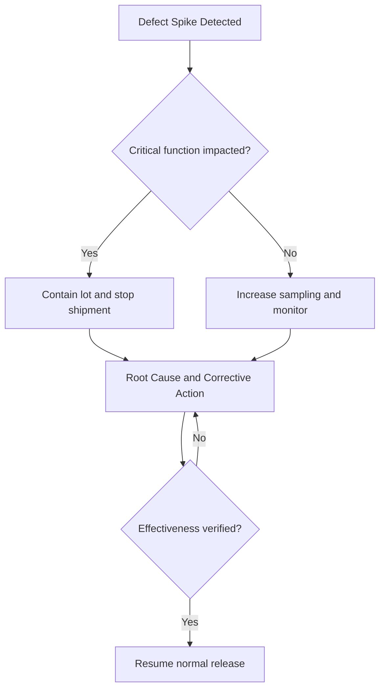

# SWAFarm Manufacturing Rules

## Executive Summary
This document defines production engineering rules for SWAFarm devices from pilot through mass manufacturing. The focus is yield stability, traceability, and controlled process scalability.

## Purpose
Standardize manufacturing process controls, quality gates, test strategy, and corrective action workflows.

## Scope
Applies to SMT, assembly, test, calibration, provisioning, packaging, and outgoing quality workflows.

## Requirement ID Convention
All normative requirements in this document shall use IDs in the format SWA-MFR-NNN.

Rules:
- NNN is a zero-padded sequence (for example, 001, 002, 103).
- IDs are immutable once released; deprecated requirements are retired, not renumbered.
- Requirement-to-test traceability shall reference these IDs in verification artifacts.

Example IDs for this document: SWA-MFR-001, SWA-MFR-002.

Section ID ranges:
- 0xx: Engineering Rules
- 1xx: Performance Targets
- 2xx: Required Practices
- 3xx: Design Constraints

## Responsibilities
| Role | Responsibility |
|---|---|
| Manufacturing Engineer | Process design and line readiness |
| QA Lead | Quality gates and defect control |
| Hardware/Firmware Leads | Testability support and fixture requirements |
| Operations | Throughput, logistics, and execution discipline |

## Architecture

## Standards
| Stage | Standard |
|---|---|
| Incoming | Component and lot verification |
| Assembly | Controlled process window and machine recipe management |
| Test | ICT + FCT coverage aligned with failure risk |
| Traceability | Serial-level genealogy from components to firmware |
| Quality | CAPA process with measurable closure effectiveness |

## Design Philosophy
Manufacturing quality is designed upstream. Testability, fixture access, and revision control are non-negotiable product properties.

## Engineering Rules
1. SWA-MFR-001: No production release without validated test coverage report.
2. SWA-MFR-002: No unmanaged process parameter changes on active lines.
3. SWA-MFR-003: No shipment from lots with unresolved critical defects.
4. SWA-MFR-004: Every unit must carry traceable identity and firmware manifest.

## Required Practices
- SWA-MFR-201: Maintain control plan and PFMEA per product family.
- SWA-MFR-202: Enforce golden sample and fixture calibration schedule.
- SWA-MFR-203: Record per-unit test results with timestamp and station ID.

## Recommended Practices
- Use inline analytics to detect drift early.
- Use automated optical verification tuned to known escape modes.

## Design Constraints
| Requirement ID | Constraint | Requirement |
|---|---|---|
| SWA-MFR-301 | Fixture cycle time | Must support target throughput with margin |
| SWA-MFR-302 | Station downtime | Measured and controlled through preventive maintenance |
| SWA-MFR-303 | Rework policy | Controlled by defect class and approval matrix |

## Performance Targets
| Requirement ID | Metric | Target |
|---|---|---|
| SWA-MFR-101 | First Pass Yield | Greater than 95 percent at pilot, greater than 98 percent at scale |
| SWA-MFR-102 | Defect escape rate | Less than 300 DPPM after process stabilization |
| SWA-MFR-103 | Rework rate | Trending downward quarter-over-quarter |

## Scalability Considerations
- Manufacturing execution data must support multi-factory rollouts.
- Provisioning and key injection pipeline must scale without weakening controls.

## Security Considerations
- Provisioning stations must enforce credential access controls.
- Secure elements and credentials require strict chain-of-custody.

## Reliability Considerations
- Capture burn-in and environmental stress data to detect infant mortality patterns.
- Correlate returns with process and lot history.

## Maintainability
- Keep fixture software versioned and auditable.
- Ensure line instructions are controlled and revision-matched.

## Manufacturability
- DFM/DFT findings must be closed before MP release.
- Any unresolved manufacturing risk requires formal exception approval.

## Examples
| Problem | Correct Action | Incorrect Action |
|---|---|---|
| Rising relay failures | Lot trace and process audit, hold affected lots | Continue shipping while investigating |
| OTA provisioning mismatch | Stop line and validate station image | Manual patching without record |

## Decision Tree

## Checklists
- PFMEA and control plan approved.
- Fixtures calibrated and validated.
- Serialization and traceability verified.
- OQC criteria met for release.

## Common Mistakes
1. Treating pilot exceptions as acceptable for mass production.
2. Weak revision synchronization between firmware and test stations.
3. Incomplete defect coding that hides systemic issues.

## Frequently Asked Questions
### Why is serial-level traceability mandatory?
It enables fast containment and root-cause precision at fleet scale.

### Why require both ICT and FCT?
ICT catches assembly-level faults; FCT validates integrated behavior.

## Revision History
| Version | Date | Notes |
|---|---|---|
| 1.0 | 2026-07-29 | Initial baseline |

## Future Roadmap
- Expand automated anomaly detection on line telemetry.
- Standardize cross-factory digital work instructions.

## Cross References
- [component_standards.md](component_standards.md)
- [pcb_design_rules.md](pcb_design_rules.md)
- [testing_standards.md](testing_standards.md)
- [security_standards.md](security_standards.md)

