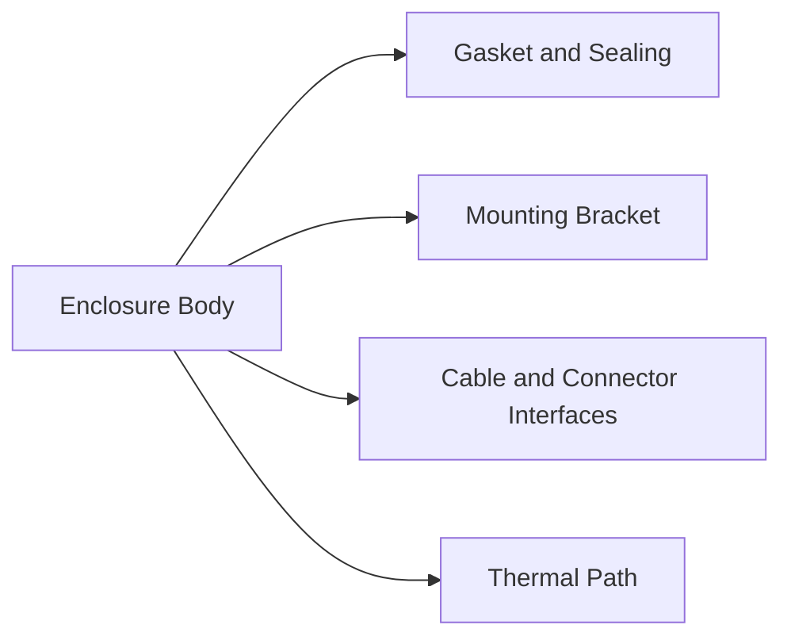
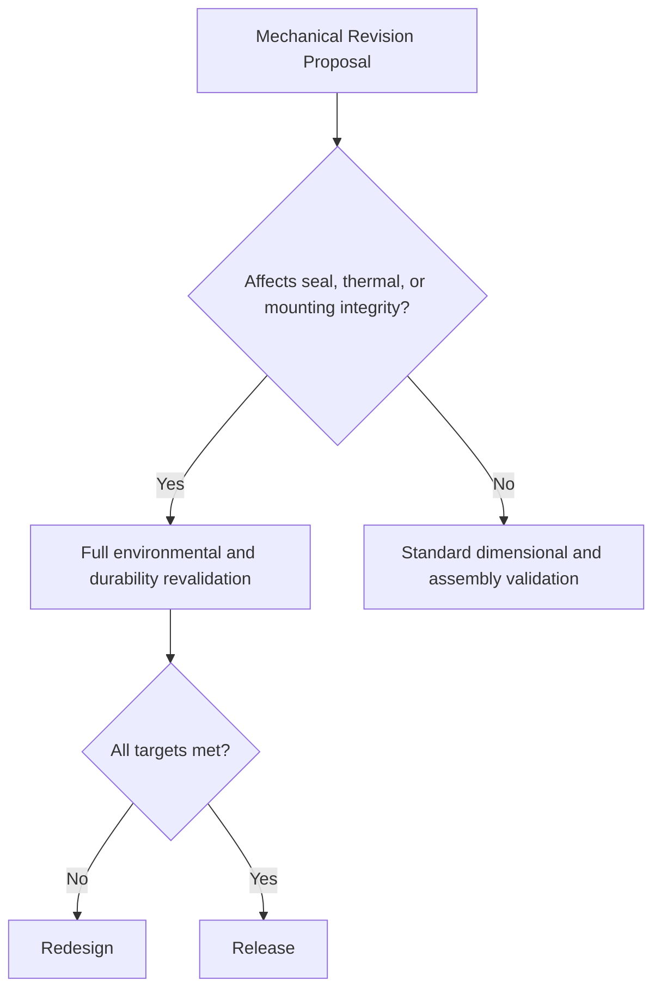

# SWAFarm Mechanical Design

## Executive Summary
This document defines mechanical and enclosure design standards for SWAFarm outdoor devices. It focuses on environmental durability, field serviceability, and production consistency.

## Purpose
Provide engineering requirements for enclosure architecture, ingress protection strategy, mounting, thermal behavior, and connector mechanics.

## Scope
Applies to enclosure materials, sealing strategy, mounting hardware, cable interfaces, and mechanical validation.

## Requirement ID Convention
All normative requirements in this document shall use IDs in the format SWA-MEC-NNN.

Rules:
- NNN is a zero-padded sequence (for example, 001, 002, 103).
- IDs are immutable once released; deprecated requirements are retired, not renumbered.
- Requirement-to-test traceability shall reference these IDs in verification artifacts.

Example IDs for this document: SWA-MEC-001, SWA-MEC-002.

Section ID ranges:
- 0xx: Engineering Rules
- 1xx: Performance Targets
- 2xx: Required Practices
- 3xx: Design Constraints

## Responsibilities
| Role | Responsibility |
|---|---|
| Mechanical Lead | Owns enclosure and structural design standards |
| Hardware Architect | Ensures electrical-mechanical integration |
| Manufacturing Engineer | Ensures tooling and assembly robustness |
| QA Lead | Owns environmental and durability qualification |

## Architecture

## Standards
| Area | Standard |
|---|---|
| Ingress strategy | System-level IP65 deployment objective |
| Material | UV and weather resistant industrial materials |
| Fasteners | Corrosion-resistant hardware |
| Serviceability | Non-destructive access where required |

## Design Philosophy
Mechanical design must protect electronics while supporting rapid field installation and repeatable manufacturing.

## Engineering Rules
1. SWA-MEC-001: No enclosure change without environmental regression review.
2. SWA-MEC-002: Cable entry paths must preserve ingress and strain relief integrity.
3. SWA-MEC-003: Mounting design must tolerate installation variability.

## Required Practices
- SWA-MEC-201: Conduct tolerance stack analysis for all sealed interfaces.
- SWA-MEC-202: Validate assembly torque windows and fastener retention.
- SWA-MEC-203: Verify connector access under field installation constraints.

## Recommended Practices
- Standardize mounting geometry across product families.
- Minimize unique mechanical hardware where practical.

## Design Constraints
| Requirement ID | Constraint | Requirement |
|---|---|---|
| SWA-MEC-301 | Thermal rise | Maintain electronics within rated operating limits |
| SWA-MEC-302 | UV exposure | Material selection supports long-term outdoor use |
| SWA-MEC-303 | Vibration and shock | Meets transport and field handling durability |

## Performance Targets
| Requirement ID | Metric | Target |
|---|---|---|
| SWA-MEC-101 | Enclosure leak failures | Near zero in qualification and production sampling |
| SWA-MEC-102 | Mounting-related field returns | Continuous reduction trend |
| SWA-MEC-103 | Connector mechanical failures | Below warranty threshold targets |

## Scalability Considerations
- Tooling strategy should support high-volume repeatability.
- Mechanical platform should allow regional mounting variants with minimal redesign.

## Security Considerations
- Tamper-evident or tamper-resistant features for sensitive interfaces.
- Physical access to debug/program ports must be controlled.

## Reliability Considerations
- Validate gasket compression retention over thermal cycles.
- Evaluate corrosion risks in humid and saline-adjacent environments.

## Maintainability
- Field technicians should replace serviceable components without enclosure damage.
- Labeling and orientation markers must remain legible over service life.

## Manufacturability
- Assembly sequence must minimize damage risk and rework complexity.
- Mold/tool changes require first-article validation and dimensional capability checks.

## Examples
| Design Choice | Recommended | Not Recommended |
|---|---|---|
| Cable entry | Gland with validated strain relief | Open hole with sealant-only strategy |
| Mounting | Slotted bracket with anti-rotation features | Rigid single-point mount |

## Decision Tree

## Checklists
- Tolerance stack verified.
- Sealing and ingress tests passed.
- Mounting robustness validated.
- Assembly and service instructions updated.

## Common Mistakes
1. Underestimating seal degradation under UV and heat.
2. Designing connector access without field ergonomics testing.
3. Ignoring assembly torque variation effects.

## Frequently Asked Questions
### Why design for serviceability in sealed units?
Serviceability reduces total lifecycle cost and replacement waste.

### Why require enclosure retest for small changes?
Minor geometry changes can significantly alter sealing and thermal behavior.

## Revision History
| Version | Date | Notes |
|---|---|---|
| 1.0 | 2026-07-29 | Initial baseline |

## Future Roadmap
- Add standardized accessory rail and bracket ecosystem.
- Add enhanced anti-tamper options for high-risk deployments.

## Cross References
- [hardware_requirements.md](hardware_requirements.md)
- [pcb_design_rules.md](pcb_design_rules.md)
- [certification_requirements.md](certification_requirements.md)
- [manufacturing_rules.md](manufacturing_rules.md)

