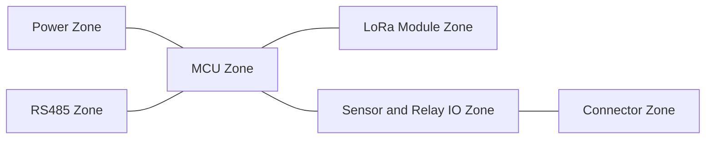
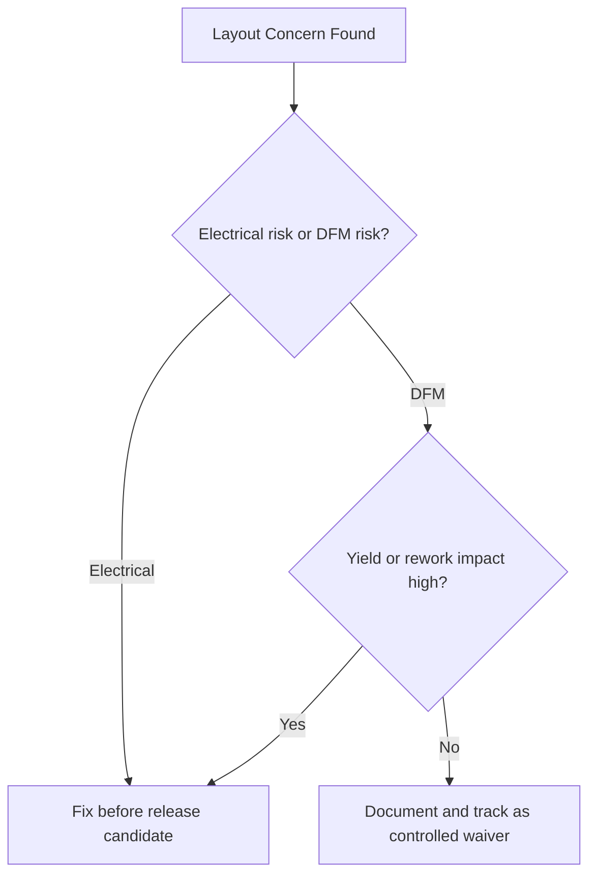

# SWAFarm PCB Design Rules

## Executive Summary
This document defines PCB design rules for SWAFarm industrial node and gateway electronics. Rules are intended to reduce field failures, improve EMC robustness, and maximize manufacturing yield.

## Purpose
Provide enforceable layout, stackup, routing, and review standards for production boards.

## Scope
Applies to all SWAFarm PCB designs, including digital, analog, RF-adjacent, power, and mixed-signal sections.

## Requirement ID Convention
All normative requirements in this document shall use IDs in the format SWA-PDR-NNN.

Rules:
- NNN is a zero-padded sequence (for example, 001, 002, 103).
- IDs are immutable once released; deprecated requirements are retired, not renumbered.
- Requirement-to-test traceability shall reference these IDs in verification artifacts.

Example IDs for this document: SWA-PDR-001, SWA-PDR-002.

Section ID ranges:
- 0xx: Engineering Rules
- 1xx: Performance Targets
- 2xx: Required Practices
- 3xx: Design Constraints

## Responsibilities
| Role | Responsibility |
|---|---|
| PCB Lead | Owns rule deck and layout quality |
| Hardware Architect | Approves architecture-level placement strategy |
| RF Engineer | Approves RF keepouts and return paths |
| Manufacturing Engineer | Approves DFM and panelization readiness |

## Architecture

## Standards
| Area | Standard |
|---|---|
| Grounding | Continuous low-impedance ground strategy |
| High-current routing | Wide traces or copper pours with thermal checks |
| RF | Respect module keepout and antenna clearance rules |
| Isolation | Separate noisy switching/relay paths from sensitive sensing paths |
| DFM | Use fabricator-supported minimums with margin |

## Design Philosophy
Layout is a reliability function. Placement and return-path control are treated as first-class design constraints, not post-routing cleanup tasks.

## Engineering Rules
1. SWA-PDR-001: Place power conversion and switching loops compactly.
2. SWA-PDR-002: Keep relay and inductive switching currents away from sensor reference paths.
3. SWA-PDR-003: Maintain explicit RF keepout regions and validated antenna placement.
4. SWA-PDR-004: Route RS485 differential pairs with controlled topology and protection proximity.
5. SWA-PDR-005: No unrouted or unreviewed net exceptions at release.

## Required Practices
- SWA-PDR-201: Use pre-layout floorplan review.
- SWA-PDR-202: Run ERC/DRC with project-specific rule deck before each review gate.
- SWA-PDR-203: Perform return-current path review for every high-speed or switching net class.

## Recommended Practices
- Use dedicated test pads for critical rails and debug interfaces.
- Keep analog front-end references local and shielded.
- Use net classes to enforce consistency across revisions.

## Design Constraints
| Requirement ID | Constraint | Requirement |
|---|---|---|
| SWA-PDR-301 | Copper balancing | Controlled for manufacturability and warpage reduction |
| SWA-PDR-302 | Thermal | Verify hotspot margin at ambient extremes |
| SWA-PDR-303 | Creepage/clearance | Align with voltage classes and safety goals |
| SWA-PDR-304 | Connector edge placement | Support enclosure and cable strain behavior |

## Performance Targets
| Requirement ID | Metric | Target |
|---|---|---|
| SWA-PDR-101 | Manufacturing first-pass PCB yield | Greater than 98 percent in stable production |
| SWA-PDR-102 | EMI/EMC pre-compliance pass rate | Greater than 90 percent before formal lab testing |
| SWA-PDR-103 | Field noise-related sensor defects | Near zero after production stabilization |

## Scalability Considerations
- Standardized stackups reduce NPI friction across product variants.
- Library-controlled footprints and rule classes improve multi-team consistency.

## Security Considerations
- Debug/programming interfaces must support production lock strategy.
- Sensitive traces and secure elements require layout-aware attack surface minimization.

## Reliability Considerations
- Evaluate thermal cycling fatigue risks on heavy components.
- Reinforce connector and relay regions mechanically where required.

## Maintainability
- Silkscreen and reference designators must support field diagnostics.
- Critical circuits should be probe-accessible without disassembly complexity.

## Manufacturability
- Panelization, fiducials, tooling holes, and assembly clearances are mandatory review items.
- Avoid component placements that block AOI or rework access.

## Examples
| Topic | Good Practice | Bad Practice |
|---|---|---|
| Return paths | Continuous reference under switching drivers | Split plane crossing without control |
| Relay layout | Physical separation from analog front-end | Relay near high-impedance analog node |

## Decision Tree

## Checklists
- Floorplan approved.
- RF keepouts validated.
- Power loops minimized and reviewed.
- DRC clean with no unapproved waivers.
- DFM sign-off complete.

## Common Mistakes
1. Late-stage placement changes that break return-path assumptions.
2. Underestimating relay noise coupling into sensing channels.
3. Missing thermal-via strategy under power components.

## Frequently Asked Questions
### Why enforce strict zone partitioning?
It improves noise immunity, debug efficiency, and revision consistency.

### Why require DFM review before release?
Manufacturing escape costs are significantly higher than design-stage corrections.

## Revision History
| Version | Date | Notes |
|---|---|---|
| 1.0 | 2026-07-29 | Initial baseline |

## Future Roadmap
- Add high-density variant rules for future edge AI boards.
- Add formal SI/PI thresholds when interfaces increase in speed.

## Cross References
- [hardware_requirements.md](hardware_requirements.md)
- [manufacturing_rules.md](manufacturing_rules.md)
- [rf_lorawan_standards.md](rf_lorawan_standards.md)
- [power_management.md](power_management.md)

