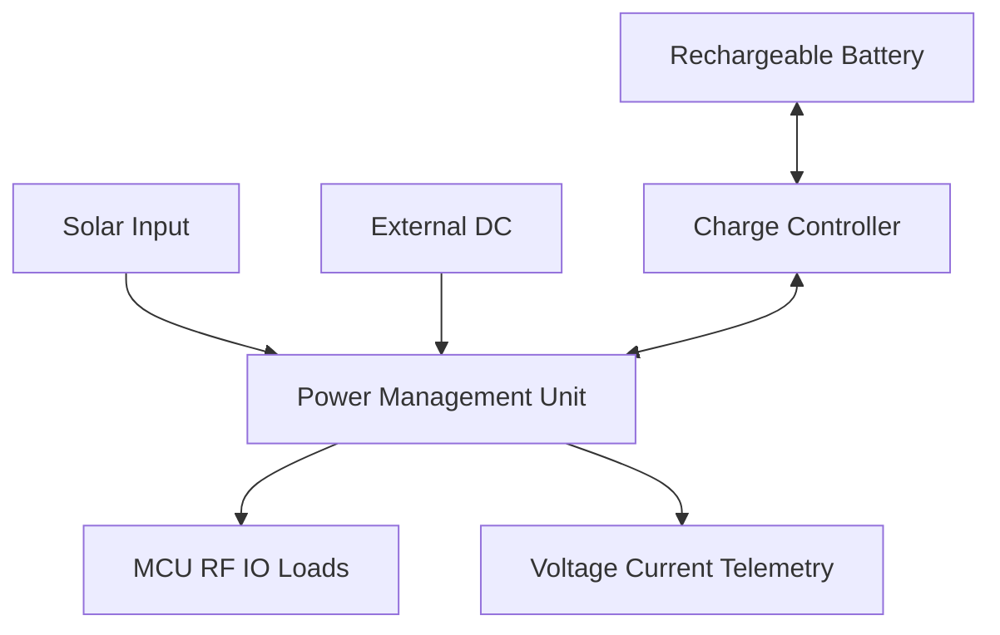
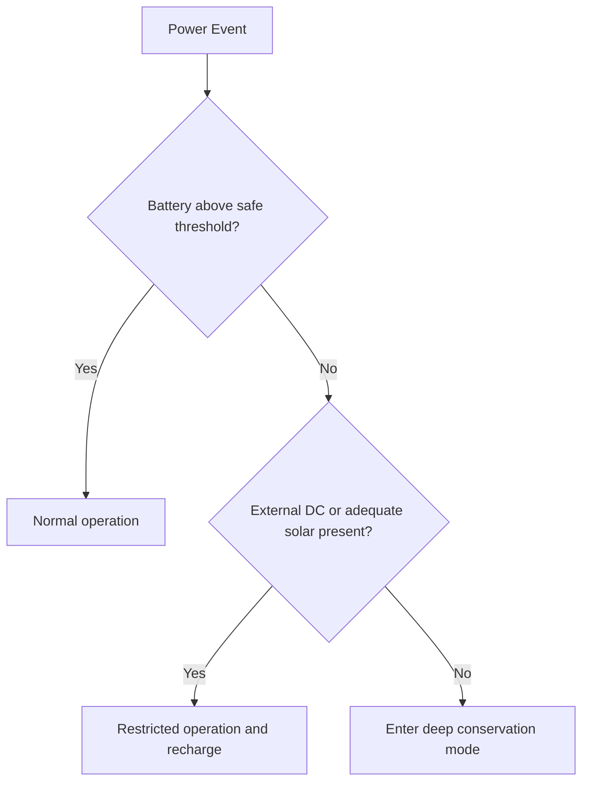

# SWAFarm Power Management

## Executive Summary
This document defines power architecture standards for SWAFarm nodes, including solar input, rechargeable battery operation, and external DC backup. The objective is long service life, ultra-low power operation, and robust protection under field conditions.

## Purpose
Set design and validation requirements that guarantee safe and efficient energy operation for off-grid and hybrid deployments.

## Scope
Applies to power input paths, charging, battery protection, load switching, sleep/wake strategy support, and telemetry for power health.

## Requirement ID Convention
All normative requirements in this document shall use IDs in the format SWA-PWM-NNN.

Rules:
- NNN is a zero-padded sequence (for example, 001, 002, 103).
- IDs are immutable once released; deprecated requirements are retired, not renumbered.
- Requirement-to-test traceability shall reference these IDs in verification artifacts.

Example IDs for this document: SWA-PWM-001, SWA-PWM-002.

Section ID ranges:
- 0xx: Engineering Rules
- 1xx: Performance Targets
- 2xx: Required Practices
- 3xx: Design Constraints

## Responsibilities
| Role | Responsibility |
|---|---|
| Power Engineer | Owns power architecture and protection strategy |
| Embedded Lead | Owns power mode control policy |
| Hardware Architect | Owns integration and component margin policy |
| QA Lead | Owns power validation matrix |

## Architecture

## Standards
| Area | Standard |
|---|---|
| Input handling | Safe arbitration across solar, battery, and external DC |
| Charging | Temperature-aware charging policy |
| Protection | Reverse polarity, over-current, over-voltage, and short-circuit safeguards |
| Power telemetry | Report battery and supply health for fleet analytics |

## Design Philosophy
Power design shall maximize uptime and battery longevity while avoiding unsafe operating zones. Conservative design margins are mandatory.

## Engineering Rules
1. SWA-PWM-001: Never exceed battery chemistry limits in charge profile configuration.
2. SWA-PWM-002: No release without validated low-voltage behavior and graceful degradation.
3. SWA-PWM-003: All high-risk fault modes must map to protective hardware or firmware response.

## Required Practices
- SWA-PWM-201: Build a measured power budget for each firmware operating mode.
- SWA-PWM-202: Validate charging and discharge behavior across thermal extremes.
- SWA-PWM-203: Include brownout and recovery behavior tests in release gating.

## Recommended Practices
- Add load shedding strategy for non-critical outputs during low-energy periods.
- Use hardware support for accurate coulomb or proxy energy tracking where feasible.

## Design Constraints
| Requirement ID | Constraint | Requirement |
|---|---|---|
| SWA-PWM-301 | Sleep current | Must satisfy multi-year service objective under defined duty cycle |
| SWA-PWM-302 | Charge safety | Must comply with battery vendor constraints |
| SWA-PWM-303 | Thermal margin | No hotspot exceeds component reliability limits |

## Performance Targets
| Requirement ID | Metric | Target |
|---|---|---|
| SWA-PWM-101 | Sleep-mode current | Meets hardware program power budget |
| SWA-PWM-102 | Brownout recovery | Deterministic and non-corrupting |
| SWA-PWM-103 | Battery service interval | Multi-year objective for target deployment profile |

## Scalability Considerations
- Power architecture shall support variant loads from optional BLE/cellular add-ons.
- Telemetry granularity should support fleet-level battery health forecasting.

## Security Considerations
- Power-fault telemetry should be integrity-protected to avoid false control actions.
- Update logic must prevent unsafe firmware transitions under low battery states.

## Reliability Considerations
- Design for repetitive solar variability and long idle periods.
- Validate relay switching impact on supply stability and RF performance.

## Maintainability
- Expose battery and input health metrics for remote diagnostics.
- Define clear field replacement criteria for battery modules where serviceable.

## Manufacturability
- Charging and protection paths require dedicated production test steps.
- Battery-related assembly must include safety handling controls.

## Examples
| Scenario | Recommended | Not Recommended |
|---|---|---|
| Low battery event | Controlled output shed and telemetry alert | Abrupt shutdown without state preservation |
| Input source switching | Managed transition with hold-up margin | Uncontrolled switchover causing reset storms |

## Decision Tree

## Checklists
- Power budget documented and reviewed.
- Charge/discharge tests across temperature complete.
- Fault protections validated.
- Brownout and recovery tests passed.

## Common Mistakes
1. Ignoring transient current peaks in power budgeting.
2. Using unsuitable charging profiles for battery chemistry.
3. Not instrumenting power health for fleet diagnostics.

## Frequently Asked Questions
### Why require telemetry for power health?
It enables proactive service and prevents avoidable field failures.

### Why validate relay and RF during low battery?
Because combined current events can expose instability not seen in isolated tests.

## Revision History
| Version | Date | Notes |
|---|---|---|
| 1.0 | 2026-07-29 | Initial baseline |

## Future Roadmap
- Add adaptive power policy driven by seasonal usage models.
- Add optional supercapacitor-assisted transient buffering guidance.

## Cross References
- [hardware_requirements.md](hardware_requirements.md)
- [firmware_architecture.md](firmware_architecture.md)
- [pcb_design_rules.md](pcb_design_rules.md)
- [testing_standards.md](testing_standards.md)

