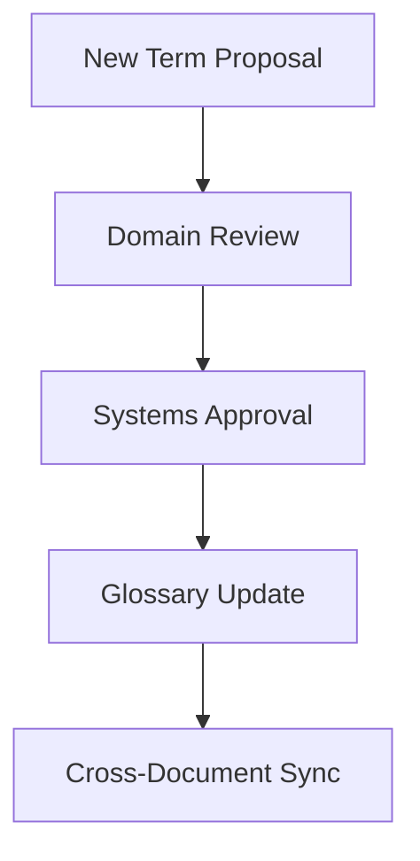
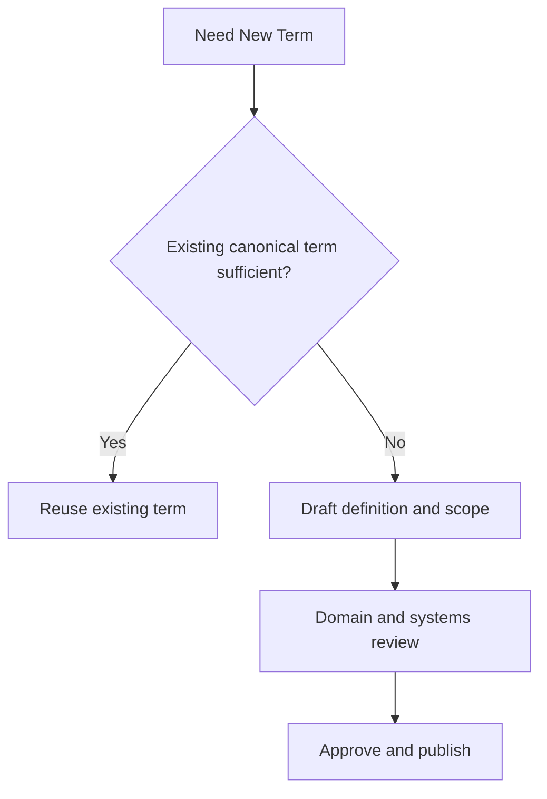

# SWAFarm Project Glossary

## Executive Summary
This glossary defines canonical technical terminology used across SWAFarm engineering standards. Consistent vocabulary is mandatory for requirements, design reviews, manufacturing records, and incident analysis.

## Purpose
Create a shared language that prevents ambiguity and improves cross-functional execution.

## Scope
Applies to hardware, firmware, RF, manufacturing, cloud, QA, and security documentation.

## Requirement ID Convention
All normative requirements in this document shall use IDs in the format SWA-GLS-NNN.

Rules:
- NNN is a zero-padded sequence (for example, 001, 002, 103).
- IDs are immutable once released; deprecated requirements are retired, not renumbered.
- Requirement-to-test traceability shall reference these IDs in verification artifacts.

Example IDs for this document: SWA-GLS-001, SWA-GLS-002.

Section ID ranges:
- 0xx: Engineering Rules
- 1xx: Performance Targets
- 2xx: Required Practices
- 3xx: Design Constraints

## Responsibilities
| Role | Responsibility |
|---|---|
| Systems Engineering | Owns glossary baseline and update governance |
| Domain Leads | Propose term additions and corrections |
| Technical Writer | Maintains formatting and cross-reference quality |

## Architecture

## Standards
| Rule | Standard |
|---|---|
| Canonical usage | One preferred term per concept |
| Versioning | Glossary updates are revision-controlled |
| Deprecation | Legacy terms mapped to canonical terms |

## Design Philosophy
Terminology standardization is a reliability tool: precise language reduces design errors and integration defects.

## Engineering Rules
1. SWA-GLS-001: Use glossary terms in all formal engineering artifacts.
2. SWA-GLS-002: Do not introduce conflicting synonyms in requirements or interfaces.
3. SWA-GLS-003: Update glossary before adopting new platform-wide terminology.

## Required Practices
- SWA-GLS-201: Cross-check new standards documents against glossary terms.
- SWA-GLS-202: Include glossary references in onboarding and design review templates.

## Recommended Practices
- Add examples for high-risk ambiguous terms.
- Periodically review term usage drift in active repositories.

## Design Constraints
| Requirement ID | Constraint | Requirement |
|---|---|---|
| SWA-GLS-301 | Clarity | Definitions must be unambiguous and testable where applicable |
| SWA-GLS-302 | Stability | Terms should remain stable across product revisions |
| SWA-GLS-303 | Traceability | Changed definitions must include rationale |

## Performance Targets
| Requirement ID | Metric | Target |
|---|---|---|
| SWA-GLS-101 | Terminology inconsistencies in reviews | Continuous reduction |
| SWA-GLS-102 | Glossary update turnaround | Predictable and controlled |

## Scalability Considerations
- Glossary must support regional teams and multi-product variants.
- Canonical terms should map cleanly to data model and API vocabulary.

## Security Considerations
- Security terms must align exactly with policy and control implementations.
- Avoid vague labels for security severity and incident types.

## Reliability Considerations
- Reliability metrics terminology must remain consistent over time for trend analysis.

## Maintainability
- Keep definitions concise and linked to related standards.
- Remove or deprecate obsolete terms with explicit mapping.

## Manufacturability
- Manufacturing and quality terminology must align with line systems and reports.

## Examples
| Canonical Term | Definition | Avoided Synonyms |
|---|---|---|
| Device Identity | Immutable unique identity used for trust and traceability | Device code, serial token |
| OTA Campaign | Controlled deployment plan for firmware updates | Push, blast update |
| First Pass Yield | Units passing all required tests without rework | Initial pass rate |
| Mixed Fleet | Coexisting deployed devices with different firmware versions | Split fleet |

## Decision Tree

## Checklists
- New term has one-line and detailed definition.
- Conflicting synonyms identified and deprecated.
- Cross-references updated.
- Revision history entry added.

## Common Mistakes
1. Using similar terms with different meanings across teams.
2. Allowing API terms to diverge from system requirements language.
3. Introducing acronyms without definitions.

## Frequently Asked Questions
### Why maintain a formal glossary for engineers?
Because ambiguity scales into costly defects in multi-team programs.

### How are term conflicts resolved?
By systems engineering arbitration with domain input and documented rationale.

## Revision History
| Version | Date | Notes |
|---|---|---|
| 1.0 | 2026-07-29 | Initial baseline |

## Future Roadmap
- Add machine-readable term registry for automated linting.
- Add multilingual support notes for global operations.

## Cross References
- [swafarm_overview.md](swafarm_overview.md)
- [hardware_requirements.md](hardware_requirements.md)
- [firmware_architecture.md](firmware_architecture.md)
- [cloud_integration.md](cloud_integration.md)
- [manufacturing_rules.md](manufacturing_rules.md)

## Core Terms
| Term | Definition |
|---|---|
| SWAFarm Node | Field device with sensing, actuation, and low-power communications |
| Edge Gateway | Intermediate local aggregation and backhaul bridge |
| Digital Twin | Cloud-side authoritative representation of device state |
| OTA | Over-the-air firmware or configuration update process |
| DFM | Design for manufacturability |
| DFT | Design for test |
| FPY | First pass yield |
| CAPA | Corrective and preventive action process |
| MTBF | Mean time between failures |
| PCN | Product change notification from supplier |

