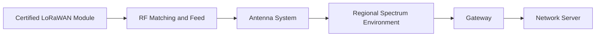
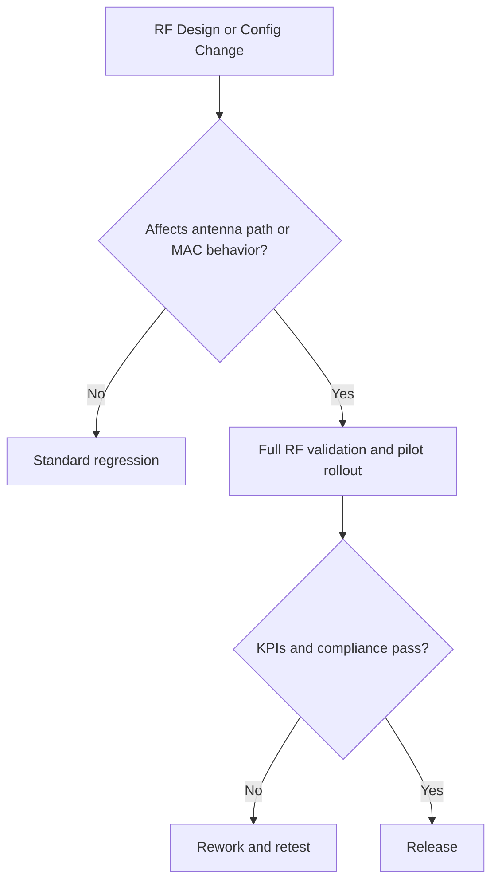

# SWAFarm RF and LoRaWAN Standards

## Executive Summary
This document defines RF and LoRaWAN design standards for SWAFarm devices across India, US, EU, and Middle East target deployments. It sets requirements for link reliability, coexistence, certification readiness, and future migration strategy.

## Purpose
Ensure robust long-range communication performance with controlled regulatory and field risk.

## Scope
Applies to LoRaWAN node RF path, antenna integration, regional configuration, and RF test/validation workflows.

## Requirement ID Convention
All normative requirements in this document shall use IDs in the format SWA-RFL-NNN.

Rules:
- NNN is a zero-padded sequence (for example, 001, 002, 103).
- IDs are immutable once released; deprecated requirements are retired, not renumbered.
- Requirement-to-test traceability shall reference these IDs in verification artifacts.

Example IDs for this document: SWA-RFL-001, SWA-RFL-002.

Section ID ranges:
- 0xx: Engineering Rules
- 1xx: Performance Targets
- 2xx: Required Practices
- 3xx: Design Constraints

## Responsibilities
| Role | Responsibility |
|---|---|
| RF Engineer | Owns RF architecture, tuning, and validation |
| Hardware Architect | Ensures board and enclosure RF compatibility |
| Firmware Lead | Owns regional stack configuration and adaptive behavior |
| QA Lead | Owns RF regression and qualification coverage |

## Architecture

## Standards
| Area | Standard |
|---|---|
| Module strategy | Certified LoRaWAN module for current production generations |
| Antenna design | Controlled impedance feed and validated enclosure integration |
| Regional setup | Market-specific channel plans and compliance settings |
| Link policy | Adaptive data rate and retry policy tuned per deployment profile |

## Design Philosophy
Prioritize predictable link robustness and certification confidence over aggressive but fragile RF optimization.

## Engineering Rules
1. SWA-RFL-001: No antenna or enclosure material changes without RF revalidation.
2. SWA-RFL-002: No region deployment without approved channel plan and duty-cycle policy.
3. SWA-RFL-003: No firmware release that changes MAC behavior without field A/B validation.

## Required Practices
- SWA-RFL-201: Maintain link budget analysis with margin assumptions.
- SWA-RFL-202: Validate radiated behavior in representative enclosure states.
- SWA-RFL-203: Track packet success metrics by region and environment profile.

## Recommended Practices
- Keep module-to-antenna path short and controlled.
- Use diversity in gateway placement guidelines for weak-coverage zones.

## Design Constraints
| Requirement ID | Constraint | Requirement |
|---|---|---|
| SWA-RFL-301 | Enclosure coupling | Must not collapse antenna efficiency below target threshold |
| SWA-RFL-302 | RF coexistence | Minimize interference from digital switching and relay events |
| SWA-RFL-303 | Certification | Keep design within module integration constraints |

## Performance Targets
| Requirement ID | Metric | Target |
|---|---|---|
| SWA-RFL-101 | Uplink success in baseline deployment | Greater than 99 percent in validated conditions |
| SWA-RFL-102 | Downlink command reliability | Greater than 99 percent under configured retry policy |
| SWA-RFL-103 | Regional compliance escapes | Zero in released SKUs |

## Scalability Considerations
- Regional profile management must be software-configurable and auditable.
- RF test workflows must support high-volume sampling without bottlenecks.

## Security Considerations
- Device join credentials and network keys must be protected per security policy.
- MAC command handling must be hardened against malformed payloads.

## Reliability Considerations
- Ensure robust communication during battery voltage variation and temperature extremes.
- Validate antenna stability against mechanical stress and moisture exposure.

## Maintainability
- Keep RF tuning artifacts and test reports versioned with hardware revisions.
- Use consistent region profile naming across firmware and cloud.

## Manufacturability
- Antenna assembly process controls must include orientation and placement checks.
- RF-critical assembly changes require dedicated process qualification.

## Examples
| Scenario | Recommended | Not Recommended |
|---|---|---|
| New region rollout | Add validated regional profile and pilot test | Reuse another region profile without validation |
| Cost-down enclosure change | Re-run RF and certification impact tests | Assume no RF impact |

## Decision Tree

## Checklists
- Region profile approved.
- Link budget updated.
- Enclosure-coupled RF tests passed.
- Firmware MAC regression completed.

## Common Mistakes
1. Treating certified modules as zero-effort RF integration.
2. Ignoring enclosure and cable effects on antenna performance.
3. Deploying unvalidated regional channel configurations.

## Frequently Asked Questions
### Why stay with certified modules now?
They reduce compliance risk and accelerate reliable scaling.

### When to consider custom RF?
Only when volume economics justify full recertification and risk absorption.

## Revision History
| Version | Date | Notes |
|---|---|---|
| 1.0 | 2026-07-29 | Initial baseline |

## Future Roadmap
- Evaluate custom RF track at defined volume and margin milestones.
- Add optional BLE service channel coexistence rules.

## Cross References
- [hardware_requirements.md](hardware_requirements.md)
- [pcb_design_rules.md](pcb_design_rules.md)
- [certification_requirements.md](certification_requirements.md)
- [security_standards.md](security_standards.md)

