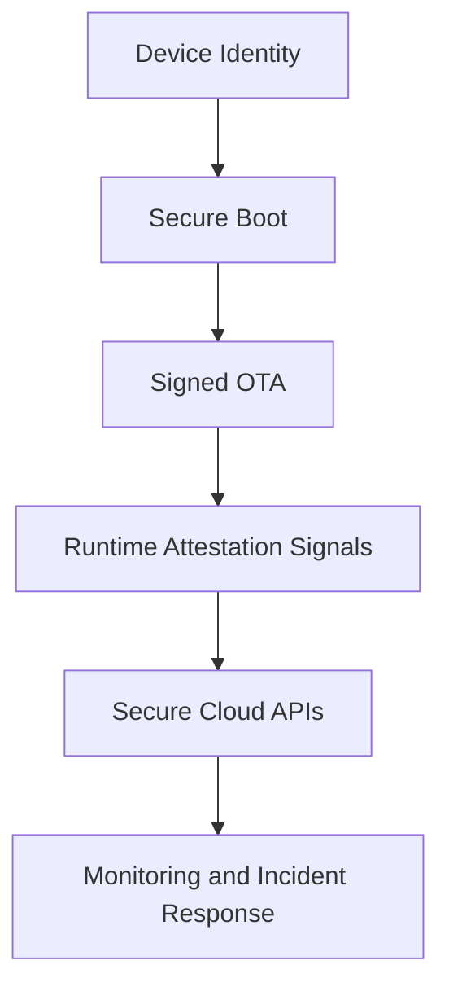
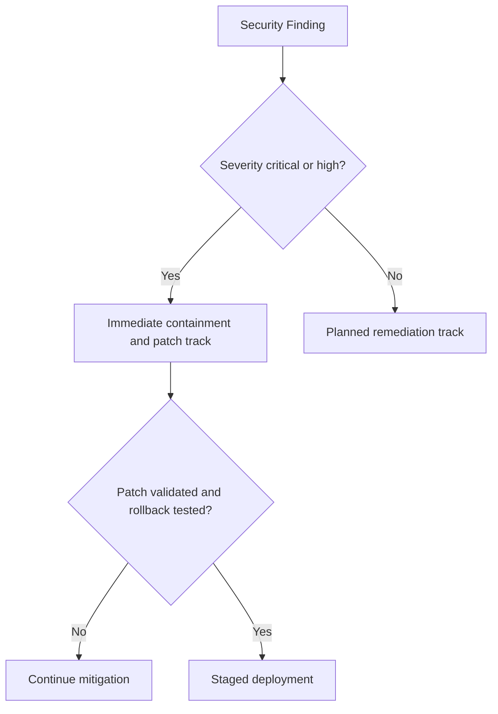

# SWAFarm Security Standards

## Executive Summary
This document defines mandatory security controls for SWAFarm devices, gateways, cloud services, and lifecycle operations. The goal is resilient, auditable security for large-scale industrial deployment.

## Purpose
Provide a unified security baseline spanning hardware roots of trust, firmware integrity, credential management, secure communications, and incident response.

## Scope
Applies to device identity, secure boot, OTA, cloud APIs, access control, logging, and vulnerability management.

## Requirement ID Convention
All normative requirements in this document shall use IDs in the format SWA-SEC-NNN.

Rules:
- NNN is a zero-padded sequence (for example, 001, 002, 103).
- IDs are immutable once released; deprecated requirements are retired, not renumbered.
- Requirement-to-test traceability shall reference these IDs in verification artifacts.

Example IDs for this document: SWA-SEC-001, SWA-SEC-002.

Section ID ranges:
- 0xx: Engineering Rules
- 1xx: Performance Targets
- 2xx: Required Practices
- 3xx: Design Constraints

## Responsibilities
| Role | Responsibility |
|---|---|
| Security Lead | Owns standards and threat model updates |
| Embedded Lead | Implements secure device behavior |
| Cloud Lead | Implements service-side access and telemetry controls |
| QA Lead | Runs security validation and regression testing |

## Architecture

## Standards
| Area | Standard |
|---|---|
| Identity | Unique per-device credentials and immutable hardware identity |
| Firmware integrity | Signed images, verification before activation |
| Transport security | Encrypted channels for all IP-connected links |
| Access control | Least-privilege RBAC and audit logging |
| Vulnerability response | Severity-based SLA and remediation workflow |

## Design Philosophy
Security is built into architecture and process, not appended near release. Controls must remain practical at manufacturing and fleet scale.

## Engineering Rules
1. SWA-SEC-001: No plaintext storage of production secrets.
2. SWA-SEC-002: No unsigned firmware execution path.
3. SWA-SEC-003: No debug interface exposure in production without approved controls.
4. SWA-SEC-004: No security exception without owner, expiry, and mitigation.

## Required Practices
- SWA-SEC-201: Threat modeling for all major features and interfaces.
- SWA-SEC-202: Security test cases integrated into regression suites.
- SWA-SEC-203: Credential provisioning with audited, least-privilege access.

## Recommended Practices
- Use hardware-backed key storage when available.
- Implement anomaly detection on authentication and OTA flows.

## Design Constraints
| Requirement ID | Constraint | Requirement |
|---|---|---|
| SWA-SEC-301 | Compute overhead | Security controls must fit power and memory budgets |
| SWA-SEC-302 | Provisioning throughput | Must scale without weakening key management controls |
| SWA-SEC-303 | Compatibility | Security updates must support mixed fleet versions |

## Performance Targets
| Requirement ID | Metric | Target |
|---|---|---|
| SWA-SEC-101 | Critical vulnerability remediation | Within policy SLA windows |
| SWA-SEC-102 | Unauthorized access attempts detected | 100 percent logged and alertable |
| SWA-SEC-103 | Signed firmware enforcement | 100 percent on production devices |

## Scalability Considerations
- Key and certificate lifecycle management must scale to millions of devices.
- Audit logging architecture must support long-term forensic retention.

## Security Considerations
- Enforce mutual trust boundaries among device, gateway, and cloud planes.
- Maintain periodic third-party security reviews and penetration testing.

## Reliability Considerations
- Security controls must fail safely and avoid bricking devices.
- OTA security checks must preserve recovery behavior under interrupted updates.

## Maintainability
- Security policies and key rotations require documented runbooks.
- Rule and signature updates must be versioned and reversible.

## Manufacturability
- Credential injection stations must be isolated, audited, and controlled.
- Manufacturing keys must never be reused as production runtime keys.

## Examples
| Scenario | Correct Approach | Incorrect Approach |
|---|---|---|
| Factory provisioning | Per-device unique credentials with audit trail | Shared keys for production batches |
| Emergency patch | Signed hotfix with staged rollout | Unsigned direct write process |

## Decision Tree

## Checklists
- Threat model updated.
- Signing pipeline verified.
- Access controls reviewed.
- Incident response contacts and playbook confirmed.

## Common Mistakes
1. Reusing credentials across devices.
2. Leaving debug access enabled in production images.
3. Treating logs as optional for security operations.

## Frequently Asked Questions
### Why insist on per-device credentials?
It limits blast radius and enables precise revocation.

### Why require rollback-safe security updates?
To avoid availability incidents while enforcing integrity.

## Revision History
| Version | Date | Notes |
|---|---|---|
| 1.0 | 2026-07-29 | Initial baseline |

## Future Roadmap
- Add remote attestation maturity model.
- Add post-quantum migration watchlist and readiness criteria.

## Cross References
- [firmware_architecture.md](firmware_architecture.md)
- [cloud_integration.md](cloud_integration.md)
- [testing_standards.md](testing_standards.md)
- [certification_requirements.md](certification_requirements.md)

