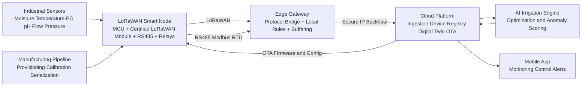
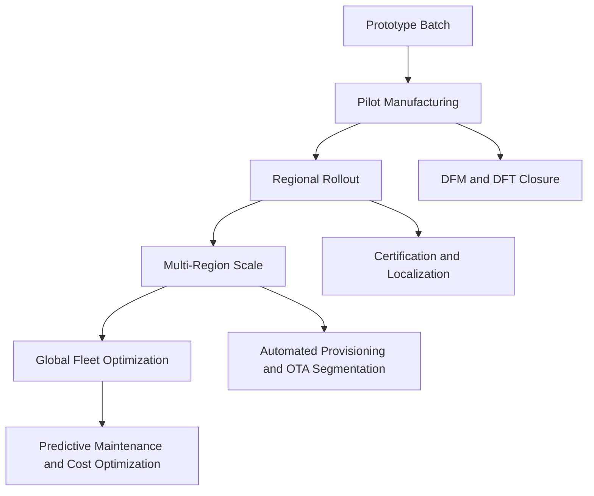
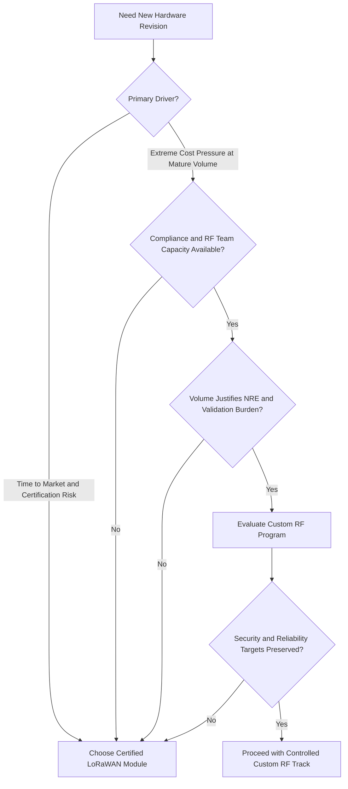
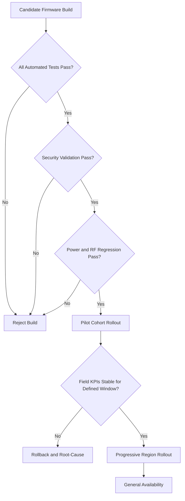

# SWAFarm Engineering Overview

## Executive Summary
SWAFarm is an industrial smart agriculture platform engineered for high-volume manufacturing, long field life, and global regulatory readiness. The system combines low-power LoRaWAN smart nodes, an edge gateway, cloud services, mobile applications, AI-driven irrigation intelligence, and a secure lifecycle management pipeline including OTA updates.

This overview defines the product-level technical doctrine for all SWAFarm engineering disciplines. It establishes how architectural decisions are made, what constraints are non-negotiable, and how subsystem standards fit together over a 10-year evolution horizon. The primary target market is India, with design and compliance strategies aligned for expansion into the United States, Europe, and the Middle East.

The recommended program strategy is:
1. Use certified LoRaWAN modules for current generations to reduce certification risk and time-to-market.
2. Use modular interfaces in hardware and firmware to preserve migration options for custom RF, BLE, and cellular variants.
3. Enforce strict manufacturing and testability rules from revision A to avoid redesign churn at scale.
4. Build for fleet-level observability and maintainability from day one.

## Purpose
This document is the top-level engineering handbook for SWAFarm. It provides system-wide principles, architecture boundaries, design rules, quality gates, and decision frameworks used across hardware, firmware, cloud, QA, manufacturing, and operations.

## Scope
This document applies to:
- LoRaWAN Smart Nodes
- Edge Gateway
- Cloud Platform and APIs
- Mobile applications
- AI irrigation engine
- OTA firmware update pipeline
- Device management services
- Manufacturing, validation, and field service workflows

Out of scope for this document:
- Low-level implementation details that belong in subsystem-specific standards
- Market-facing product messaging
- Region-specific legal contracts and commercial terms

## Requirement ID Convention
All normative SWAFarm engineering requirements shall use IDs in the format `SWA-<PREFIX>-NNN`.

Rules:
- `SWA` is the global program prefix.
- `<PREFIX>` is the document/domain code.
- `NNN` is a zero-padded sequence (for example, `001`, `014`, `237`).
- IDs are immutable after release. Obsolete requirements are deprecated, not renumbered.
- Verification evidence (test cases, qualification reports, production checks) shall reference requirement IDs.

Section ID ranges:
- 0xx: Engineering Rules
- 1xx: Performance Targets
- 2xx: Required Practices
- 3xx: Design Constraints

| Document | Prefix |
|---|---|
| swafarm_overview.md | SWO |
| hardware_requirements.md | HWR |
| component_standards.md | CST |
| pcb_design_rules.md | PDR |
| manufacturing_rules.md | MFR |
| firmware_architecture.md | FWA |
| coding_standards.md | CDS |
| cost_targets.md | CTT |
| rf_lorawan_standards.md | RFL |
| power_management.md | PWM |
| testing_standards.md | TST |
| security_standards.md | SEC |
| mechanical_design.md | MEC |
| certification_requirements.md | CER |
| cloud_integration.md | CLD |
| project_glossary.md | GLS |

## Responsibilities
SWAFarm engineering ownership is distributed across functional leads with clear accountability.

| Function | Primary Responsibility | Key Outputs | Approval Authority |
|---|---|---|---|
| CTO | Technical strategy and portfolio risk | Technology roadmap, architecture governance | Final technical direction |
| Chief Systems Engineer | End-to-end requirements integrity | System requirements baseline, interface contracts | Cross-domain architecture decisions |
| Chief Hardware Architect | Node/gateway hardware platform | Schematics, PCB architecture, DFM readiness | Hardware design sign-off |
| Chief Embedded Engineer | Firmware platform and reliability | RTOS architecture, drivers, power modes, OTA strategy | Firmware release sign-off |
| RF Engineer | LoRaWAN and RF performance/compliance | Link budget, antenna strategy, RF test plans | RF design and test acceptance |
| Power Electronics Engineer | Power, charging, battery life targets | Power tree, charging profiles, protection schemes | Power architecture sign-off |
| Manufacturing Engineer | Yield, throughput, field return control | Test fixtures, process controls, PFMEA | Production release gate |
| QA Lead | Verification strategy and defect containment | Test matrices, qualification reports | Quality gate release |
| Technical Writer | Controlled engineering knowledge base | Standards docs, revision history discipline | Documentation baseline release |

### RACI Snapshot (System-Level)
| Decision Area | Responsible | Accountable | Consulted | Informed |
|---|---|---|---|---|
| Node architecture baseline | Hardware Architect | Chief Systems Engineer | RF, Power, Manufacturing | CTO, QA |
| OTA update policy | Embedded Engineer | CTO | QA, Cloud | Operations |
| Regional certification plan | RF Engineer | CTO | Hardware, Manufacturing | Program Management |
| Cost-down strategy | Manufacturing Engineer | CTO | Hardware, Sourcing, QA | Finance |

## Architecture

### Platform Architecture Overview

### Preferred Node Hardware Stack
1. Industrial-grade MCU with long-term availability.
2. Certified LoRaWAN module (current generations).
3. Isolated or robust RS485 interface for Modbus RTU field interoperability.
4. Relay and output subsystem with surge and fault protection.
5. Power management optimized for solar, battery, and external DC sources.
6. Environmental and mechanical design for IP65 outdoor deployment.

### Why This Architecture
The architecture separates business logic, connectivity logic, and hardware abstraction boundaries. This reduces recertification burden, isolates failures, and enables incremental upgrades (for example, later BLE or cellular add-ons) without destabilizing the full platform.

## Standards

### System Standards Baseline
| Domain | Baseline Standard Direction | Rationale |
|---|---|---|
| Wireless | LoRaWAN (regional parameterization by market) | Long-range, low-power, mature ecosystem |
| Wired Field Bus | RS485 Modbus RTU | Widely deployed in industrial environments |
| Firmware Upgrade | Signed OTA with staged rollout | Fleet risk containment and security |
| Device Identity | Unique immutable hardware identity + cryptographic credentials | Anti-cloning and secure provisioning |
| Data Contracts | Versioned schemas with backward compatibility | Long-term maintainability |
| Manufacturing | Serialization, traceability, calibrated test records | Yield control and root-cause analysis |

### Regional Operation Constraints
| Region | Design Consideration | Program Impact |
|---|---|---|
| India | Harsh thermal conditions, variable infrastructure | Wider electrical margins, resilient retry logic |
| United States | Regulatory certification and channel planning | Certification documentation and SKU mapping |
| Europe | Compliance rigor and documentation depth | Strong traceability and conformity evidence |
| Middle East | Heat, dust, outdoor reliability stress | Enclosure sealing, thermal path validation |

## Design Philosophy
SWAFarm design philosophy prioritizes operational continuity and lifecycle economics over short-term feature velocity.

Core principles:
1. Reliability first: no architecture decision may reduce field stability for marginal feature gain.
2. Manufacturability by design: prototypes must already reflect production intents.
3. Security by default: all connectivity and update channels are authenticated and auditable.
4. Modular evolution: each subsystem must permit controlled upgrades without platform reset.
5. Measurable quality: every major requirement must map to a verification method.

## Engineering Rules
1. SWA-SWO-001: Never introduce single-source critical components without approved risk mitigation.
2. SWA-SWO-002: No unversioned protocol or payload changes in production paths.
3. SWA-SWO-003: No firmware release without rollback strategy and staged deployment controls.
4. SWA-SWO-004: No hardware revision release without DFM review, test coverage review, and supply risk review.
5. SWA-SWO-005: No cloud API change without compatibility validation for deployed firmware and mobile clients.
6. SWA-SWO-006: No security exception without documented expiry and owner.

## Required Practices
| Requirement ID | Practice | Requirement |
|---|---|---|
| SWA-SWO-201 | Requirements Traceability | Every subsystem requirement must map to design artifacts and tests |
| SWA-SWO-202 | Design Reviews | Formal multi-discipline reviews at architecture, schematic, layout, and release gates |
| SWA-SWO-203 | Version Control Discipline | Controlled branching, tagged releases, immutable artifacts |
| SWA-SWO-204 | Manufacturing Traceability | Per-unit serial history for test results, calibration, and firmware |
| SWA-SWO-205 | Incident Response | Defined triage, containment, root-cause, and corrective action workflow |
| SWA-SWO-206 | Field Feedback Loop | Structured defect coding and prioritized reliability backlog |

## Recommended Practices
1. Build HAL and service-layer abstractions in firmware to minimize board-revision coupling.
2. Use interface control documents for every external electrical and software interface.
3. Maintain golden test datasets for AI irrigation model validation.
4. Use canary cohorts for OTA and cloud feature rollouts.
5. Perform periodic design-for-cost reviews without compromising reliability gates.

## Design Constraints
| Requirement ID | Constraint | Target Direction |
|---|---|---|
| SWA-SWO-301 | Sensor Capacity | Minimum 5 sensors per node with extensible architecture |
| SWA-SWO-302 | Outputs | Minimum 5 relay outputs with future PWM/digital/analog expansion |
| SWA-SWO-303 | Power Inputs | Solar, rechargeable battery, and external DC support |
| SWA-SWO-304 | Power Behavior | Ultra-low-power operation for extended off-grid runtime |
| SWA-SWO-305 | Environmental | Outdoor deployment with IP65-class system strategy |
| SWA-SWO-306 | Protocols | LoRaWAN primary, RS485 Modbus RTU secondary |
| SWA-SWO-307 | Future Expansion | BLE, cellular, and edge AI compatibility reserved in architecture |

## Performance Targets
System performance targets are defined to support production-scale deployments and lifecycle cost control.

| Requirement ID | Area | Baseline Target |
|---|---|---|
| SWA-SWO-101 | Node Availability | Greater than 99.5% operational availability excluding infrastructure outages |
| SWA-SWO-102 | OTA Success Rate | Greater than 99% successful update completion in stable network windows |
| SWA-SWO-103 | Fleet Telemetry Integrity | Greater than 99.9% valid payload parse rate |
| SWA-SWO-104 | Relay Command Reliability | Greater than 99.9% command execution acknowledgment under normal conditions |
| SWA-SWO-105 | Manufacturing First Pass Yield | Greater than 95% at pilot, greater than 98% at volume |
| SWA-SWO-106 | Early Life Failure Rate | Less than 0.5% in first 90 days post-installation |
| SWA-SWO-107 | Battery Service Life Objective | Multi-year field service interval under defined duty cycles |

## Scalability Considerations
1. Fleet-level architecture must support millions of nodes with partitioned ingestion and event-driven processing.
2. Device identity and provisioning must be globally unique and collision-resistant.
3. OTA orchestration must support phased deployments by region, hardware revision, and risk class.
4. Data pipelines must decouple ingestion from analytics to avoid operational coupling failures.
5. Support organization needs remote diagnostics, command traceability, and failure signature indexing.

### Scaling Workflow

## Security Considerations
Security is treated as a product property, not an optional add-on.

Mandatory controls:
1. Secure boot chain for firmware integrity assurance.
2. Signed firmware images and anti-rollback policy.
3. Unique per-device credentials with secure manufacturing injection flow.
4. Encrypted transport on all IP-connected backhaul and cloud links.
5. Role-based control and audit logging for operational actions.
6. Vulnerability response process with severity-based SLAs.

Trade-off guidance:
- Certified modules reduce RF/certification risk but may constrain deep optimization access.
- Custom RF may reduce long-term cost at high volume but increases compliance and security engineering burden.
- Recommendation: retain certified modules through early high-growth phases and reevaluate at stable volume milestones.

## Reliability Considerations
Reliability is achieved through architecture redundancy in critical paths, conservative component derating, robust environmental design, and rigorous validation.

Required reliability practices:
1. Electrical protection for surge, reverse polarity, and transients.
2. Environmental qualification aligned with regional stress profiles.
3. Firmware watchdog and self-healing mechanisms for recoverable faults.
4. Design for graceful degradation when sensors or links fail.
5. Fleet-level reliability metrics with quarterly trend review.

## Maintainability
Maintainability objectives:
1. Field service procedures must not require invasive board-level rework.
2. Firmware architecture must support modular updates and diagnostic telemetry.
3. Configuration management must be centralized and versioned.
4. Documentation must be revision-controlled and linked to hardware/firmware releases.

## Manufacturability
Manufacturability requirements:
1. PCB and enclosure designs must pass DFM and DFA reviews before pilot release.
2. Test strategy must include ICT, functional test, calibration verification, and provisioning traceability.
3. Component selection must include second-source strategy for critical categories.
4. Production line software must enforce revision compatibility and data capture quality.

## Decision Trees

### Architecture Choice: Certified LoRaWAN Module vs Custom RF

### OTA Release Decision

## Examples

### Example 1: Recommended Node Integration Pattern
| Layer | Recommended Approach | Why |
|---|---|---|
| Sensor Input | Isolated or protected interfaces with filtering | Improves noise immunity and survivability |
| Communications | LoRaWAN primary, RS485 fallback for local integration | Balances long-range telemetry and local interoperability |
| Output Control | Relay drivers with fault feedback paths | Enables safer actuation and diagnostics |
| Power | Multi-source arbitration with robust charging policy | Maintains uptime under variable solar and grid conditions |
| Firmware | Event-driven scheduling with deep sleep strategy | Maximizes battery life while preserving responsiveness |

### Example 2: Trade-off Evaluation Snapshot
| Option | Advantage | Disadvantage | Recommendation |
|---|---|---|---|
| Single high-integration MCU+RF | Lower BOM in ideal conditions | Vendor lock-in and migration risk | Use only if second-source and lifecycle risk is controlled |
| Discrete MCU + certified LoRa module | Lower certification risk, better modularity | Slightly higher BOM | Recommended for near-term production |
| Aggressive cost-down connectors | Lower unit cost | Higher field failure risk in harsh environments | Reject for outdoor industrial use |

## Checklists

### System Architecture Review Checklist
- Requirements baseline approved and versioned.
- Interface boundaries defined for hardware, firmware, cloud, and mobile.
- Regional deployment assumptions validated.
- Security controls mapped to threat categories.
- Manufacturability risks captured with owners.
- Serviceability workflows reviewed by operations.

### Production Readiness Checklist
- Pilot yield and defect Pareto reviewed.
- Critical component supply risk mitigations approved.
- OTA rollback and recovery validated on representative hardware.
- Certification evidence packet prepared for target region.
- Device provisioning and identity controls tested at line rate.
- Field diagnostics and support runbook approved.

## Common Mistakes
1. Optimizing BOM cost before reliability maturity is achieved.
2. Treating certification as an end-stage activity instead of a design-time constraint.
3. Releasing firmware without robust rollback and telemetry instrumentation.
4. Assuming one regional hardware profile fits all climates and infrastructure conditions.
5. Underestimating manufacturing data traceability requirements at scale.
6. Coupling cloud API changes tightly to firmware releases without compatibility strategy.

## Frequently Asked Questions

### 1. Why prioritize certified LoRaWAN modules initially?
They reduce RF compliance and certification risk, accelerate release cycles, and let engineering focus on platform reliability. For high-volume mature phases, custom RF can be evaluated if lifecycle economics justify the additional complexity.

### 2. Why enforce both LoRaWAN and RS485?
LoRaWAN supports low-power wide-area telemetry. RS485 Modbus RTU enables industrial local interoperability and on-site integration flexibility.

### 3. Why is traceability mandatory for each manufactured unit?
At million-device scale, root-cause analysis, recall containment, and reliability improvements depend on per-unit historical data.

### 4. Why require staged OTA rollouts?
Staging limits fleet-wide risk, enables early anomaly detection, and supports controlled rollback.

### 5. Why emphasize multi-supplier components?
Single-source dependency creates significant supply and pricing risk over a 10-year lifecycle.

## Revision History
| Version | Date | Authoring Function | Summary |
|---|---|---|---|
| 1.0 | 2026-07-29 | Systems Engineering Office | Initial production baseline for SWAFarm engineering overview |

## Future Roadmap
| Horizon | Planned Evolution | Dependency |
|---|---|---|
| Near Term | Harden LoRaWAN node platform and manufacturing pipeline | Stable certified module path |
| Mid Term | Introduce optional BLE service channel and enhanced edge intelligence | Firmware modularity and power budget headroom |
| Mid Term | Expand autonomous diagnostics and predictive maintenance | Fleet telemetry quality and cloud analytics maturity |
| Long Term | Evaluate custom RF economics for select SKUs | Volume scale, certification capacity, risk tolerance |
| Long Term | Multi-region compliance automation and SKU orchestration | Unified configuration and release governance |

## Cross References
This overview is normative with supporting detail in:
- [hardware_requirements.md](hardware_requirements.md)
- [component_standards.md](component_standards.md)
- [pcb_design_rules.md](pcb_design_rules.md)
- [manufacturing_rules.md](manufacturing_rules.md)
- [firmware_architecture.md](firmware_architecture.md)
- [coding_standards.md](coding_standards.md)
- [cost_targets.md](cost_targets.md)
- [rf_lorawan_standards.md](rf_lorawan_standards.md)
- [power_management.md](power_management.md)
- [testing_standards.md](testing_standards.md)
- [security_standards.md](security_standards.md)
- [mechanical_design.md](mechanical_design.md)
- [certification_requirements.md](certification_requirements.md)
- [cloud_integration.md](cloud_integration.md)
- [project_glossary.md](project_glossary.md)

---

Document classification: SWAFarm Internal Engineering Standard.
