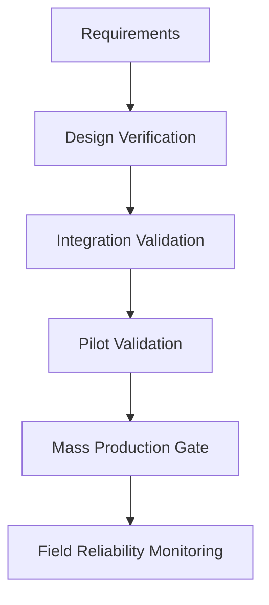
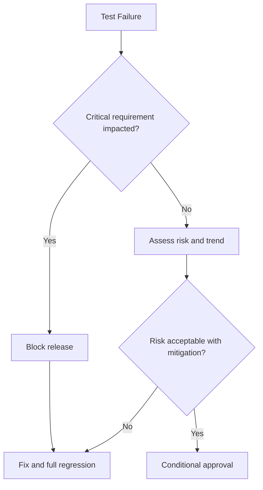

# SWAFarm Testing Standards

## Executive Summary
This document defines verification and validation standards for SWAFarm hardware, firmware, manufacturing, and platform integration. It ensures measurable quality gates before each release stage.

## Purpose
Create a uniform test strategy that maps product requirements to objective evidence and release decisions.

## Scope
Applies to design verification tests, production tests, firmware regressions, RF validation, environmental testing, and field trial acceptance.

## Requirement ID Convention
All normative requirements in this document shall use IDs in the format SWA-TST-NNN.

Rules:
- NNN is a zero-padded sequence (for example, 001, 002, 103).
- IDs are immutable once released; deprecated requirements are retired, not renumbered.
- Requirement-to-test traceability shall reference these IDs in verification artifacts.

Example IDs for this document: SWA-TST-001, SWA-TST-002.

Section ID ranges:
- 0xx: Engineering Rules
- 1xx: Performance Targets
- 2xx: Required Practices
- 3xx: Design Constraints

## Responsibilities
| Role | Responsibility |
|---|---|
| QA Lead | Owns test strategy and release quality gates |
| Hardware/Firmware Leads | Provide testable interfaces and automation hooks |
| Manufacturing Engineer | Owns production test execution quality |
| Systems Engineer | Maintains requirement-to-test traceability |

## Architecture

## Standards
| Layer | Standard |
|---|---|
| Requirement coverage | 100 percent mapping for critical requirements |
| Automation | High automation for regression-critical paths |
| Reproducibility | Controlled fixtures, datasets, and versions |
| Defect tracking | Severity-based triage and closure evidence |

## Design Philosophy
Testing must reveal risk early and repeatedly. Quality gates are prevention mechanisms, not reporting exercises.

## Engineering Rules
1. SWA-TST-001: No release without passing all critical test gates.
2. SWA-TST-002: No unresolved critical defects at release authorization.
3. SWA-TST-003: Every defect fix requires regression proof in related domains.

## Required Practices
- SWA-TST-201: Maintain test plans with objective pass/fail criteria.
- SWA-TST-202: Run environmental and power-stress tests on production-representative hardware.
- SWA-TST-203: Capture test artifacts in version-controlled repositories.

## Recommended Practices
- Use hardware-in-loop automation for firmware and communication scenarios.
- Apply risk-based exploratory testing for edge-case behaviors.

## Design Constraints
| Requirement ID | Constraint | Requirement |
|---|---|---|
| SWA-TST-301 | Test duration | Must fit release cadence while preserving coverage |
| SWA-TST-302 | Fixture availability | Redundant capability for critical test stations |
| SWA-TST-303 | Data integrity | Immutable test evidence for release decisions |

## Performance Targets
| Requirement ID | Metric | Target |
|---|---|---|
| SWA-TST-101 | Requirement coverage completeness | 100 percent for critical, high for non-critical |
| SWA-TST-102 | Regression pass stability | Consistent across consecutive runs |
| SWA-TST-103 | Defect escape rate | Continuous reduction with maturity |

## Scalability Considerations
- Test infrastructure must scale for regional variants and hardware revisions.
- Automated regression capacity must support concurrent release trains.

## Security Considerations
- Security tests include credential lifecycle, OTA integrity, and API abuse cases.
- Test environments must protect production-like secrets.

## Reliability Considerations
- Include long-duration soak and repeated power-cycle tests.
- Validate behavior under intermittent connectivity and brownout conditions.

## Maintainability
- Test cases require ownership, review cadence, and deprecation policy.
- Metrics dashboards should highlight flaky tests and drift.

## Manufacturability
- Validate ICT/FCT coverage against known failure modes.
- Ensure production test escapes are analyzed and fed back to design.

## Examples
| Test Type | Strong Example | Weak Example |
|---|---|---|
| OTA validation | Interrupted transfer + rollback verification | Single happy-path update |
| RF regression | Multi-region channel profile verification | One-site signal check |

## Decision Tree

## Checklists
- Requirement traceability matrix updated.
- Automation results archived.
- Manual validation evidence complete.
- Release gate sign-offs captured.

## Common Mistakes
1. Over-relying on happy-path tests.
2. Skipping long-duration tests due schedule pressure.
3. Treating flaky tests as acceptable noise.

## Frequently Asked Questions
### Why require requirement-level traceability?
It prevents hidden coverage gaps that appear only in production.

### Why include manufacturing test data in QA analysis?
Production trends often reveal systemic design weaknesses.

## Revision History
| Version | Date | Notes |
|---|---|---|
| 1.0 | 2026-07-29 | Initial baseline |

## Future Roadmap
- Add digital twin simulation-assisted validation workflows.
- Add predictive test selection based on change impact analysis.

## Cross References
- [hardware_requirements.md](hardware_requirements.md)
- [firmware_architecture.md](firmware_architecture.md)
- [manufacturing_rules.md](manufacturing_rules.md)
- [security_standards.md](security_standards.md)

