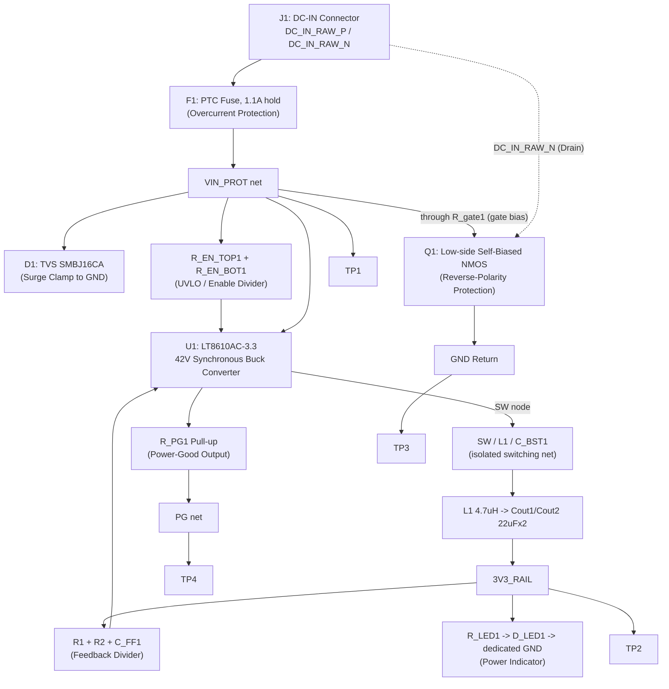

# SWAFarm Node V1 — "01_power" Milestone: Design Review Package

Author: Hardware Architect (AI-assisted)
Status: **ERC clean (0 errors, 0 warnings), verified via live netlist trace — ready for expert team review**
Scope: The subset of the power supply subsystem actually captured in KiCad as of this review: DC-IN connector → overcurrent/surge/reverse-polarity protection → LT8610AC-3.3 buck converter → 3.3V rail → power-good + indicator LED → test points.
Source of truth verified live against `Hardware/SWAFarmNodeV1/SWAFarmNodeV1.kicad_sch` via KiCad MCP (`list_schematic_components`, `generate_netlist`, `trace_netlist_connection`, `run_erc`) on 2026-07-30.

This document is scoped narrowly to what is **actually captured today** (27 components / 7 nets). It is not a restatement of the full target architecture — see [`SWAFarmNodeV1_PowerSupply_Design.md`](SWAFarmNodeV1_PowerSupply_Design.md) for the solar input, BQ25792 charger, BQ76920 protection, and battery pack, which remain uncaptured per `TODO.md`.

---

## 1. Scope and Traceability

| Task Requirement | Design Element | Status |
|---|---|---|
| 12V DC input | J1 → F1 (PTC) → D1 (TVS) → Q1 (reverse-polarity) → VIN_PROT | Captured, verified |
| Buck conversion to 3.3V | U1 (LT8610AC-3.3) + L1 + Cin/Cout + RT/FB/SS/BST/INTVCC support network | Captured, verified |
| Power-good indication | R_PG1 pull-up + TP4 + D_LED1/R_LED1 indicator | Captured, verified (was miswired, fixed — §4) |
| Solar input, BQ25792 charger, BQ76920 protection, battery pack | — | **Not captured** (deferred per `TODO.md`) |

---

## 2. Block Diagram (as-built, current)



---

## 3. Circuit Connections (per net, verified from live netlist post-fix)

All connections below were extracted via `generate_netlist()` + `trace_netlist_connection()` against the **corrected** schematic (post-fix, 2026-07-30) — pin-accurate, not inferred from the block diagram.

### VIN_PROT (post-fuse protected input rail)
| Component | Pin |
|---|---|
| F1 | 2 |
| Cin1 | 1 |
| Cin2 | 1 |
| D1 | 1 |
| R_EN_TOP1 | 1 |
| R_gate1 | 1 |
| TP1 | 1 |
| U1 | 5, 6 |

### Net-(Q1-G) — Q1 gate bias (new isolated net, was missing before the fix)
| Component | Pin |
|---|---|
| R_gate1 | 2 |
| Q1 | 1 (Gate) |

### DC_IN_RAW_P / DC_IN_RAW_N (raw connector pins, pre-protection)
| Net | Component | Pin |
|---|---|---|
| DC_IN_RAW_P | J1 | 1 |
| DC_IN_RAW_P | F1 | 1 |
| DC_IN_RAW_N | J1 | 2 |
| DC_IN_RAW_N | Q1 | 3 (Drain) |

### 3V3_RAIL (regulated output)
| Component | Pin |
|---|---|
| U1 | 14 (BIAS — datasheet-recommended tie to VOUT for efficiency, not a defect) |
| L1 | 1 |
| Cout1 | 1 |
| Cout2 | 1 |
| C_FF1 | 1 |
| R1 | 1 |
| R_PG1 | 1 |
| R_LED1 | 1 |
| TP2 | 1 |

### PG (power-good, open-drain)
| Component | Pin |
|---|---|
| U1 | 15 |
| R_PG1 | 2 |
| TP4 | 1 |

### Net-(C_BST1-Pad2) — SW switching node (now correctly isolated from GND)
| Component | Pin |
|---|---|
| U1 | 9 (SW) |
| L1 | 2 |
| C_BST1 | 2 |

### GND (verified clean — no longer includes U1's SW pins or L1 pin 2)
| Component | Pin |
|---|---|
| U1 | 1, 8, 17 |
| C_INTVCC1 | 1 |
| C_SS1 | 2 |
| Cin1 | 2 |
| Cin2 | 2 |
| Cout1 | 2 |
| Cout2 | 2 |
| D1 | 2 |
| D_LED1 | 1 (cathode) |
| Q1 | 2 (Source) |
| R2 | 2 |
| R_EN_BOT1 | 2 |
| R_RT1 | 2 |
| TP3 | 1 |

### Net-(D_LED1-A) — LED indicator series connection (new, was shorted before the fix)
| Component | Pin |
|---|---|
| R_LED1 | 2 |
| D_LED1 | 2 (anode) |

### Internal U1 support nets
| Net | Component | Pin |
|---|---|---|
| Net-(U1-BST) | U1 pin 12 | C_BST1 pin 1 |
| Net-(U1-TR/SS) | U1 pin 2 | C_SS1 pin 1 |
| Net-(U1-RT) | U1 pin 3 | R_RT1 pin 1 |
| Net-(U1-EN/UV) | U1 pin 4 | R_EN_TOP1 pin 2, R_EN_BOT1 pin 1 |
| Net-(U1-INTVcc) | U1 pin 13 | C_INTVCC1 pin 2 |
| Net-(U1-FB) | U1 pin 16 | R1 pin 2, R2 pin 1, C_FF1 pin 2 |
| unconnected-(U1-NC-Pad7) | U1 pin 7 | — (no-connect, expected) |

---

## 4. Defects Found and Fixed (2026-07-30)

The committed ERC snapshot (`SWAFarmNodeV1_erc.json`, timestamped 21:52:27) reported 0 violations, and `TODO.md` originally stated "ERC clean." That was **stale** — the schematic had changed since that snapshot. A live re-run found real defects; investigating them surfaced a more serious one than ERC alone reported. All four are now fixed and independently re-verified via netlist trace (§3).

### Defect 1 (most severe) — U1's SW switching node was shorted to GND
A `power:GND` symbol (`#PWR12`) was placed directly on the wire connecting U1's SW pins (9/10/11) to L1 and C_BST1. This is a hard short on the buck converter's switching node — not something the default KiCad ERC severity matrix flags (output-pin-to-power-net isn't a default error), so it was found only by manually cross-checking `L1 pin 2 → GND` and `U1 pin 9 → GND` against the buck converter's expected topology (SW must feed L1 and the bootstrap cap, never GND directly). This was also the actual cause of the ERC "Output/Power-output pin conflict (U1, #FLG01)" error — once the short was removed, that error disappeared on its own. **Fix:** deleted the stray `#PWR12` symbol. The SW node is now its own isolated net (`Net-(C_BST1-Pad2)`), correctly bridging only U1 pin 9, L1 pin 2, and C_BST1 pin 2.

Both `#FLG01` and `#FLG02` PWR_FLAG symbols in the design turned out to be legitimate (stacked on GND and on VIN_PROT respectively — standard practice to satisfy ERC's power-source requirement on externally-fed nets) and needed no change. The original review's suspicion of an "orphaned PWR_FLAG" was itself a misdiagnosis, corrected during this fix.

### Defect 2 — Q1's gate resistor (R_gate1) was unwired
R_gate1 (10k, intended as Q1's self-bias gate resistor) was physically drawn on top of the existing VIN_PROT→Q1-gate wire but not spliced into it — both of its pads were fully unconnected, and Q1's gate was tied straight to VIN_PROT with no series resistance. **Fix:** split the through-wire into two segments around R_gate1's pins, so the path is now VIN_PROT → R_gate1 → Q1 gate, as its reference designator implies.

### Defect 3 — Power-indicator LED was electrically dead
D_LED1's cathode and anode both landed on the same wire (the SW node from Defect 1) — zero volts across it under any condition. Once Defect 1 was fixed, D_LED1's cathode would have been left floating on the now-isolated SW/L1 net instead of true ground, which is worse. **Fix:** relocated D_LED1 to a clear area, gave it its own dedicated GND symbol (`#PWR15`), and reconnected R_LED1 → D_LED1 anode → D_LED1 cathode → GND as a proper series string. R_LED1 was already correctly wired toward the LED (the original review's claim that R_LED1 wasn't in series with D_LED1 was inaccurate — it was, just both landing on the wrong shared net; corrected here).

### Result
```
run_erc() → ✅ ERC Check Passed — No electrical violations detected (0 errors, 0 warnings)
```
Fresh `SWAFarmNodeV1_erc.json` exported 2026-07-30T23:56:59, replacing the stale snapshot.

None of these were architecture-level issues — all four were wiring-completion defects of the kind a pre-layout review exists to catch.

---

## 5. Bill of Materials

The as-built BOM has been **merged into the single project BOM** at [`BOM/SWAFarmNodeV1_PowerSupply_BOM.csv`](../BOM/SWAFarmNodeV1_PowerSupply_BOM.csv) — there is intentionally only one BOM file now (a separate as-built-only file was created during this review and then folded back in, to avoid two BOMs drifting out of sync going forward).

The merged file adds a **Status** column per row:
- **Captured — 01_power (as-built):** the 27 components actually in the schematic today, verified against the live netlist.
- **Planned — not yet in KiCad:** solar input, charger (BQ25792), battery protection (BQ76920), battery pack, and load-switching rows from the original architecture doc.
- **Superseded — see notes:** original architecture-doc rows whose planned implementation was replaced by a different as-built approach (see below).

**Deviations from the original architecture doc surfaced during the merge — flag for reviewer sign-off:**
- **Reverse-polarity protection approach changed.** Architecture doc §4.5 specified a TI LM74610-Q1 ideal-diode controller + FET (rows `U_RP1`/`Q_RP1`). As-built uses a simpler self-biased NMOS (`Q1` + `R_gate1`, no controller IC) — functionally similar (near-zero conduction drop) but without the LM74610's guaranteed ~2µs turn-off spec. **This needs explicit reviewer approval or a decision to reinstate the original approach.**
- **TVS standoff voltage changed** from the planned SMBJ36CA (36V) to the as-built SMBJ16CA (16V) — tighter and more appropriate for a 12V rail, but not yet re-verified against VIN_PROT's worst-case operating voltage.
- **RefDes collisions queued up for the next capture milestone:** the as-built buck stage claimed `U1` and `L1`. The architecture doc's planned charger (`U1`) and charger inductor (`L1`) will need renumbering (e.g. `U2`, `L2`) when that stage is captured — flagged explicitly in the BOM notes so it isn't missed.
- Buck converter support network (feedback, soft-start, BST/INTVCC decoupling, UVLO divider, power-good pull-up) was originally one placeholder line (`C_BUCK1`); as-built specifies 14 individual parts — normal detailed-design expansion, not a concern.
- Power-indicator LED and all 4 test points are as-built additions with no counterpart in the original architecture doc.

**Component-only ROM cost for the captured subset: ~$7.40/unit** (excludes PCB fabrication, assembly, test — the merged file's Planned rows total separately and are unchanged from the original architecture doc estimate).

---

## 6. Recommendation

The `01_power` schematic is now internally electrically consistent (ERC clean, netlist-verified). Before advancing to footprint placement/PCB layout, the expert team should specifically weigh in on:
1. The reverse-polarity topology deviation (§5) — accept the simpler self-biased NMOS or require the originally-specified LM74610-Q1.
2. The TVS standoff voltage change (36V planned → 16V as-built) — confirm adequate margin.
3. J1's connector part family (Phoenix Contact MSTB vs. the as-built MKDS) — confirm which to lock.
4. General schematic review per `TODO.md`'s existing open item: reverse-polarity MOSFET part number, EN/UV UVLO threshold, and RT switching-frequency choice against the LT8610AC datasheet.

## Cross References
- [SWAFarmNodeV1_PowerSupply_Design.md](SWAFarmNodeV1_PowerSupply_Design.md) — full target architecture (solar, charger, battery protection — not yet captured)
- [../TODO.md](../TODO.md) — milestone tracker
- [../BOM/SWAFarmNodeV1_PowerSupply_BOM.csv](../BOM/SWAFarmNodeV1_PowerSupply_BOM.csv) — single merged BOM (as-built + planned + superseded)
- [../Hardware/SWAFarmNodeV1/SWAFarmNodeV1.kicad_sch](../Hardware/SWAFarmNodeV1/SWAFarmNodeV1.kicad_sch) — source schematic
- [../Hardware/SWAFarmNodeV1/SWAFarmNodeV1_erc.json](../Hardware/SWAFarmNodeV1/SWAFarmNodeV1_erc.json) — fresh ERC report (0 violations)
- [../.ai/knowledge/power_management.md](../.ai/knowledge/power_management.md) — normative power policy
- [../.ai/knowledge/pcb_design_rules.md](../.ai/knowledge/pcb_design_rules.md) — applies once layout begins
