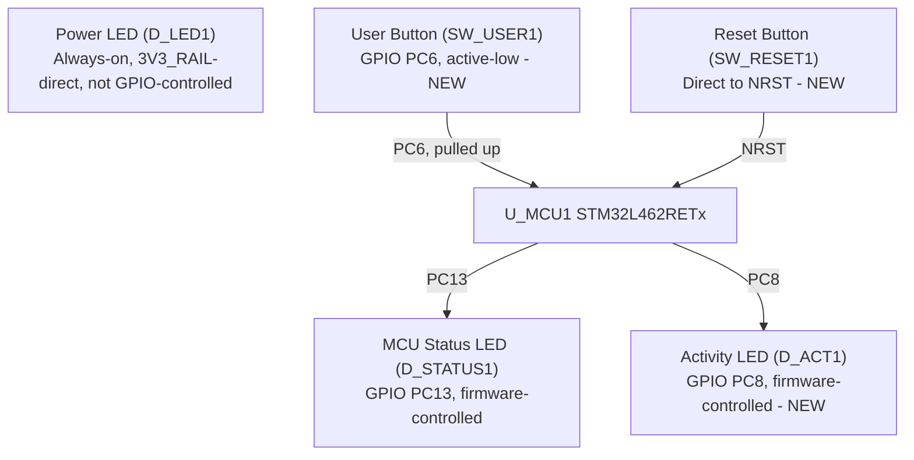

# SWAFarm Node V1 — "03_HMI" Milestone: Board Bring-up & Human Interface Design Review

Author: Hardware Architect (AI-assisted)
Status: **ERC clean of unexpected defects (41 errors = intentionally reserved pins, 46 warnings = pre-existing cosmetic grid-alignment items from `02_MCU`, zero new warnings this milestone), verified via live netlist trace against the real `kicad-cli` binary**
Scope: Status LEDs (Power — verified; MCU Status — verified; Activity — new), User push button (new), Reset push button (new), production test points (new), board identification (title block + PCB silkscreen specification), mounting hole specification. No RS485, LoRa RF, relay, solar, battery-management, sensor, or expansion circuitry added.

---

## 1. Summary of Changes

**Reviewed first, changed nothing without cause.** `01_power` and `02_MCU` were re-verified (fresh ERC + netlist trace) before extending — both confirmed unchanged and correct; no critical issue was found, so no existing circuitry was modified.

**13 new components added:** R_ACT1, D_ACT1 (Activity LED), R_BTN1, C_BTN1, SW_USER1 (User button), SW_RESET1 (Reset button), TP_MCU_TX1, TP_MCU_RX1, TP_USER_BTN1 (test points), plus 4 GND power symbols. All placed on exact 2.54mm-grid coordinates (correcting the coordinate-choice habit that caused `02_MCU`'s grid warnings — zero new grid warnings this pass, confirmed).

**Title block added** to the schematic (previously unset): Title, Date, Revision, Company, and 4 comment fields carrying Project Identifier, Manufacturer placeholder, Date Code placeholder, and Hardware Revision note.

---

## 2. Human Interface Architecture

Three LEDs now serve three distinct, non-overlapping diagnostic purposes:
- **Power LED** = "is the board powered at all" (works even if firmware never boots — hardware-only signal).
- **MCU Status LED** = "is firmware alive" (heartbeat/boot-state indicator, meaningless without working firmware).
- **Activity LED** = "is something happening" (communication/data-event indicator, intentionally separate from Status so a blocked comms link doesn't get confused with a dead MCU).

Two buttons serve two distinct purposes:
- **Reset button** = unconditional hardware reset, no firmware involvement, always works.
- **User button** = firmware-interpreted input (short/long press semantics decided by firmware — factory reset, pairing mode, bootloader entry, etc., per the milestone's stated future uses).

---

## 3. LED Design Decisions

### 3.1 Power LED (D_LED1/R_LED1) — verified, unchanged
Traced via netlist: cathode→GND, anode→R_LED1→3V3_RAIL, confirmed still correctly wired (this was the circuit fixed during the `01_power` design review). **I_LED ≈ (3.3V − 2.1V) / 680Ω ≈ 1.76mA**, continuous. Deliberately **not** GPIO-controlled — its entire purpose is to indicate the power rail is alive independent of firmware state, so gating it behind a GPIO would defeat the purpose.

### 3.2 MCU Status LED (D_STATUS1/R_STATUS1) — verified, unchanged
Traced via netlist: cathode→GND, anode→R_STATUS1→PC13, confirmed still correctly wired (from `02_MCU`). **I_LED ≈ (3.3V − 2.1V) / 330Ω ≈ 3.6mA** when lit. Low-power strategy is **duty-cycling, not resistor value**: since this LED is GPIO-driven, firmware can heartbeat-blink it (e.g., 50ms pulse every few seconds) rather than holding it lit continuously, which is the standard technique for keeping a visible-brightness LED's *average* current low on a battery-powered node. Not changed this milestone (no critical issue found — a brighter/more-visible LED for boot diagnostics is a reasonable existing choice).

### 3.3 Activity LED (D_ACT1/R_ACT1) — new
GPIO **PC8** → R_ACT1 (1kΩ) → D_ACT1 (anode→cathode) → GND. **I_LED ≈ (3.3V − 2.1V) / 1000Ω ≈ 1.2mA** when lit — deliberately lower current than the Status LED, because an activity indicator is expected to blink far more frequently (potentially per-packet or per-sensor-read) and a lower per-pulse current keeps average power down under high blink-rate firmware behavior. Yellow LED color chosen to be visually distinct from the Status LED at a glance (color convention left to firmware/enclosure-label documentation, not a hardware constraint).

**Why PC8:** it was already in this project's own "spare/unallocated" GPIO pool from the `02_MCU` milestone's GPIO table — using spare headroom rather than encroaching on any of the 27 pins already reserved for RS485/LoRa/relays/sensors/etc.

---

## 4. Button Design Decisions

### 4.1 User Push Button (SW_USER1)
**Circuit:** 3V3_RAIL → R_BTN1 (10kΩ external pull-up) → node → SW_USER1 → GND, with C_BTN1 (100nF) across the node-to-GND as an RC hardware debounce filter (τ ≈ RC ≈ 1ms with the switch's own contact resistance dominating in practice — this suppresses electrical contact-bounce noise reaching the GPIO edge detector; firmware should still implement software debounce/long-press timing for application-level logic like a multi-second factory-reset hold, since no hardware RC filter can distinguish "held 3 seconds" from "held 0.3 seconds"). Active-**low**: GPIO reads LOW while pressed.

**Why an external pull-up instead of relying on the MCU's internal weak pull-up:** `component_standards.md`'s "avoid hobby-grade" philosophy and the fact this button may sit near an enclosure cutout (more exposed to noise/ESD than an internal-only pull-up handles gracefully) justified a proper external resistor + filter network — standard production practice, not a hobbyist shortcut.

**Why PC6:** already reserved for exactly this purpose ("User button(s) ×2: PC6, PC7") in the `02_MCU` GPIO table. PC6 is EXTI-capable (supports interrupt-driven wake from sleep on press — relevant for the low-power duty-cycled operation this whole platform is built around). **PC7 remains reserved** for a possible second button in a future milestone.

**Future firmware functions supported (per milestone spec):** factory reset, pairing mode, configuration mode, bootloader entry — all achievable via firmware-side press-duration/press-count interpretation of this single GPIO; no additional hardware is needed to support any of these.

### 4.2 Reset Button (SW_RESET1)
**Circuit:** SW_RESET1 directly bridges NRST to GND, in parallel with the existing `02_MCU` reset network (R_NRST1 10kΩ pull-up + C_NRST1 100nF filter cap, both already present and unchanged). This is exactly the STM32 reference-design pattern (e.g., ST's Nucleo board reset circuit): pull-up + filter cap always present, momentary button shorts to GND on press. No series resistor was added between the button and NRST — none is needed since NRST already has ESD-clamping and the pull-up limits steady-state current; this matches ST's own reference designs.

**Why no RAK3172-specific consideration:** this milestone's reset circuit serves the STM32 MCU only — no LoRaWAN module exists on this board yet (explicitly out of scope), so there is no second reset domain to coordinate with at this stage. When a LoRaWAN module is added in a future milestone, its own reset-line requirements (if any) will be evaluated then.

---

## 5. GPIO Allocation Updates

| Pin | Previous status (`02_MCU`) | New status |
|---|---|---|
| PC8 | Spare/unallocated | **Used — Activity LED output** |
| PC6 | Reserved ("User button(s) ×2") | **Used — User button input** |
| PC7 | Reserved ("User button(s) ×2") | Still reserved — second future button |
| NRST | Used (SWD + reset network) | Unchanged — now also has a physical button in parallel |

No other pins were touched. The 25 remaining originally-reserved pins (LoRaWAN ×4, RS485 ×3, battery-monitor I2C+ALERTs ×4, relays ×5, sensors ×5, SPI expansion ×4, PC7) are untouched, still named-but-unwired. Spare pool reduced from 16 to 15.

---

## 6. Test Point Summary

| Test Point | Net | Status |
|---|---|---|
| TP2 | 3V3_RAIL | Pre-existing (`01_power`) — reused, no duplicate added |
| TP3 | GND | Pre-existing (`01_power`) — reused, no duplicate added |
| TP_NRST1 | NRST (RESET) | Pre-existing (`02_MCU`) — reused, no duplicate added |
| TP_MCU_TX1 | MCU_TX (UART TX) | **New** |
| TP_MCU_RX1 | MCU_RX (UART RX) | **New** |
| TP_USER_BTN1 | USER_BTN | **New, recommended addition** — lets a production bed-of-nails fixture electrically simulate a button press (pull the node to GND) and verify the pull-up/debounce circuit and MCU response without physically actuating the switch, per `pcb_design_rules.md`'s "use dedicated test pads for critical rails and debug interfaces" and `manufacturing_rules.md`'s ICT/FCT coverage philosophy |

All 5 explicitly requested test point nets (3.3V, GND, RESET, UART TX, UART RX) are accessible; 3 are newly added, 2 reused existing accessible points rather than duplicating them.

---

## 7. Mechanical Assumptions

**Important scoping note:** board identification silkscreen text and mounting holes are **PCB-layout-stage artifacts** (`.kicad_pcb` footprints/graphics), not schematic-stage ones. Consistent with this project's already-documented tooling limitation (`TODO.md`: "No footprint-placement or routing tool exists in this MCP server's toolset"), these cannot be physically placed yet — no PCB layout has started, and no board outline has been finalized. What follows is the **specification** for the layout stage to implement directly, not a claim that it has been placed.

### 7.1 Board Identification (specification for PCB silkscreen)
| Item | Content | Placement guidance |
|---|---|---|
| Board Name | "SWAFarm Node V1" | Top silkscreen, primary corner, largest of the ID text block |
| Hardware Revision | "Rev A" | Adjacent to board name |
| Date Code | "YYWW" placeholder — populated at manufacturing, not design time | Small text, board margin |
| Manufacturer | Placeholder — pending contract manufacturer selection | Reserved silkscreen area, margin |
| Project Identifier | "SWA-NODE-V1" | Adjacent to board name |

Already captured at the schematic level: the `.kicad_sch` **title block** now carries all five fields (§1), so they flow into any generated BOM/documentation immediately — this is the part of "board identification" achievable without PCB layout.

Placement rules per `pcb_design_rules.md` ("silkscreen and reference designators must support field diagnostics"): keep all ID text on the top silkscreen layer, in a component-free margin, oriented readable in the board's primary installed orientation, clear of connectors/test points/mounting holes, minimum stroke width per the eventual fab's silkscreen capability (typically ≥0.15mm stroke, ≥1mm character height for reliable legibility).

### 7.2 Mounting Holes (specification for PCB layout)
**Recommendation: 4× M3 mounting holes, non-plated (isolated from copper), 3.2mm drill, one per board corner**, with a ≥3mm copper keepout annulus around each — the standard industrial 4-corner pattern referenced implicitly by `mechanical_design.md`'s "standardize mounting geometry" recommended practice.

**Why this can only be a specification, not a placement, right now:** `mechanical_design.md` confirms enclosure design (`TODO.md`: "Enclosure / mechanical design — not started") hasn't begun, and no board outline/size has been fixed in the `.kicad_pcb` file yet. Exact hole coordinates depend on the final board outline and the enclosure's boss/standoff pattern — neither exists yet. M3/4-corner is a safe, standard default that will very likely survive whatever outline is chosen, but final placement is an enclosure-coupled decision belonging to the mechanical design milestone, not this one.

---

## 8. ERC Results

Verified via the real `kicad-cli.exe sch erc` binary.

**Total: 87 violations (41 errors, 46 warnings) — down from 100 mid-milestone as connections were completed, and with *zero new warnings introduced by this milestone's 13 components* (all placed on-grid from the start).**

| Classification | Count | Detail |
|---|---|---|
| Critical | 0 | None |
| Major | 0 | None |
| Minor | 46 | Unchanged from `02_MCU` — pre-existing `endpoint_off_grid` cosmetic warnings, still not touched this pass (same reasoning as before: safe fix is a GUI grid-align pass, not a scripted rewrite) |
| Informational | 41 | `pin_not_connected` on U_MCU1 — exactly the intentionally-reserved/spare GPIOs (25 reserved + 15 spare + PC7 = 41, verified by netlist trace, not just count-matching) |

No unexpected errors. No missing symbols or footprints (SW_Push, TestPoint, R, C, LED, GND, all confirmed against stock KiCad libraries before use). Power LED and MCU Status LED re-verified unchanged.

---

## 9. Documentation Updates
- This document created.
- `TODO.md` updated with the `03_HMI` milestone entry.
- Schematic title block populated (was previously empty).
- Fresh `SWAFarmNodeV1_erc.json` exported.

## Cross References
- [SWAFarmNodeV1_02MCU_DesignReview.md](SWAFarmNodeV1_02MCU_DesignReview.md) — MCU foundation (GPIO reservations consumed by this milestone: PC6, PC8)
- [SWAFarmNodeV1_01Power_DesignReview.md](SWAFarmNodeV1_01Power_DesignReview.md) — Power LED origin
- [../TODO.md](../TODO.md) — milestone tracker
- [../.ai/knowledge/mechanical_design.md](../.ai/knowledge/mechanical_design.md) — basis for mounting-hole/silkscreen deferral to enclosure milestone
- [../.ai/knowledge/pcb_design_rules.md](../.ai/knowledge/pcb_design_rules.md) — basis for test-point and silkscreen placement rules
- [../.ai/knowledge/manufacturing_rules.md](../.ai/knowledge/manufacturing_rules.md) — basis for production test-point recommendation (TP_USER_BTN1)
