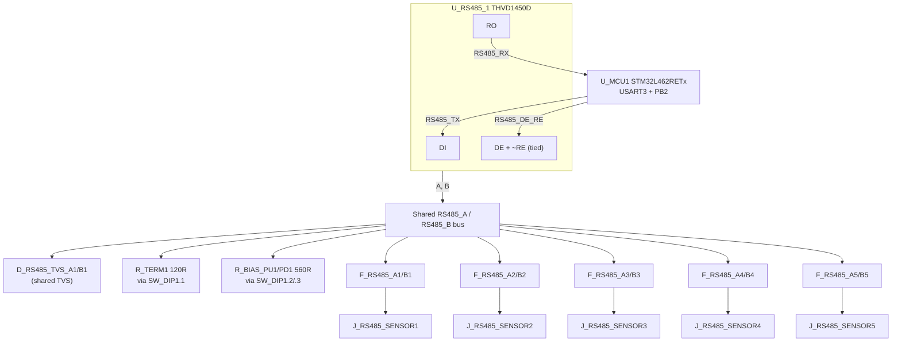

# SWAFarm Node V1 — "04_RS485" Milestone: Industrial RS485 Communication Subsystem Design Review

Author: Hardware Architect (AI-assisted)
Status: **ERC clean of unexpected defects (38 errors = intentionally reserved MCU pins, 47 warnings = pre-existing cosmetic grid items + 1 documented lib_symbol_mismatch), verified via live netlist trace against the real `kicad-cli` binary**
Scope: One RS485 transceiver, one shared A/B Modbus RTU bus, five field connection points (hub topology) for external Modbus RTU sensors, per-drop protection, shared bus TVS/termination/bias, test points. No RS485 sensor circuitry, LoRaWAN, relay driver, solar, or battery management added.

---

## 1. Executive Summary

Reviewed `01_power`, `02_MCU`, and `03_HMI` first — all three re-verified unchanged and correct before extending. Added a single THVD1450D RS485 transceiver on the MCU's previously-reserved USART3 (PB10/PB11) and DE/RE GPIO (PB2), forming one shared, TVS-protected, DIP-selectable terminated/biased A/B differential bus. Five field connectors expose that same shared bus (true multidrop hub topology, not five independent interfaces), each with its own series PTC fuse pair for per-cable-run fault isolation. A real symbol-library defect (THVD1450D's `extends` inheritance chain was incomplete when copied into the schematic) was found and corrected during implementation — documented in §12.

---

## 2. RS485 Architecture



**This is deliberately ONE transceiver and ONE shared differential bus** — the five connectors are five physical field-wiring access points into that same bus (a hub/junction topology), not five separate RS485 interfaces. Per-connector fusing exists so a fault or surge on any single field cable run can be isolated (and the fuse replaced/reset) without protection redundancy at the shared TVS/termination/bias stage, which only needs to exist once.

---

## 3. Bus Topology Diagram

```
                         3V3_RAIL          GND
                            |               |
                      R_BIAS_PU1(560R)  R_BIAS_PD1(560R)
                            |               |
                        SW_DIP1.2       SW_DIP1.3
                            |               |
   R_TERM1(120R)——SW_DIP1.1—+——RS485_A——+——+————— D_RS485_TVS_A1 ——GND
                            |               |
                        SW_DIP1.1(B)    (bus node)
                            |
   ————————————————————————+——RS485_B——+————— D_RS485_TVS_B1 ——GND
                                         |
        +--------------+--------------+-+------------+--------------+
        |              |              |              |              |
   F_RS485_A1/B1   F_RS485_A2/B2  F_RS485_A3/B3  F_RS485_A4/B4  F_RS485_A5/B5
        |              |              |              |              |
   J_RS485_SENSOR1  SENSOR2        SENSOR3        SENSOR4        SENSOR5
   (A,B,VSYS,GND)   (...)          (...)          (...)          (...)
```

All five `RS485_A_RAWn`/`RS485_B_RAWn` segments are electrically distinct (per-connector, downstream of that connector's own fuse pair) and converge into the single shared `RS485_A`/`RS485_B` bus only after fusing — confirmed via netlist trace (§13).

---

## 4. UART Assignment

**USART3** (MCU pins PB10/PB11), matching the reservation already made in `02_MCU`'s GPIO table ("RS485: PB10 (USART3_TX), PB11 (USART3_RX), PB2 (driver-enable)") — no renaming, no new reservation needed.

| Signal | MCU Pin | Transceiver Pin | Net |
|---|---|---|---|
| MCU TX (drives bus) | PB10 (USART3_TX) | DI (pin 4) | `RS485_TX` |
| MCU RX (reads bus) | PB11 (USART3_RX) | RO (pin 1) | `RS485_RX` |

USART1 (debug console) and USART2 (reserved for the future LoRaWAN module) are untouched — three independent UARTs now serve three independent purposes, exactly as planned when the reservation was made.

---

## 5. GPIO Assignment

| Pin | Function | Status Change |
|---|---|---|
| PB10 | USART3_TX → RS485_TX | Reserved (`02_MCU`) → **Used** |
| PB11 | USART3_RX → RS485_RX | Reserved (`02_MCU`) → **Used** |
| PB2 | Combined DE/~RE control → RS485_DE_RE | Reserved (`02_MCU`) → **Used** |

**Why one GPIO for both DE and ~RE:** Modbus RTU is inherently half-duplex — a node is never simultaneously transmitting and receiving — so tying DE (active-high) and ~RE (active-low) together onto one GPIO is the standard, textbook technique (GPIO high = drive bus + receiver disabled; GPIO low = release bus + receiver enabled). This matches the single-pin reservation already made in `02_MCU`; no second GPIO was consumed, preserving reserved pins for RS485 uses.

No other GPIO reservations were touched. 24 pins remain reserved for LoRaWAN (×4), relays (×5), sensors (×5), battery-monitor I2C+ALERTs (×4), SPI expansion (×4), PC7 (second button), plus 15 spare.

---

## 6. Selected Transceiver

**Texas Instruments THVD1450D** (SOIC-8, extends the classic 8-pin RS-485 pinout shared by MAX485/SP3485/SN75176-class parts).

| Requirement | THVD1450D property |
|---|---|
| Reliability / noise immunity | True fail-safe receiver (defined idle-bus output even with floating/shorted bus) |
| EMC / surge robustness | **±18kV IEC 61000-4-2 ESD protection on bus pins** — per the part's own datasheet description, directly satisfies SWA-HWR-003's "every external line shall include protection against ESD and surge" at the silicon level, before any board-level TVS is even added |
| 3.3V compatibility | 3.3V–5V native operation — direct interface to the STM32L462 without a level shifter |
| Ease of manufacturing | Standard SOIC-8, same footprint/pinout family as MAX485/SP3485/SN75176 — trivial second-source path (§14) |
| Future certification | TI markets this family specifically for "robust EMC" industrial applications — reduces pre-compliance risk versus a generic/consumer-grade transceiver |

**Why not a generic MAX485-class part:** functionally similar, but THVD1450D's explicitly-rated ±18kV IEC ESD and fail-safe receiver are a better match for `hardware_requirements.md`'s "never assume ideal operating conditions" doctrine and this milestone's explicit "future certification" priority, for negligible cost difference. Confirmed available as a genuine stock KiCad symbol (`Interface_UART:THVD1450D`) before selection, consistent with the verification discipline used for every part selected on this board so far.

---

## 7. Protection Strategy

| Layer | Component | Placement | Rationale |
|---|---|---|---|
| Per-drop overcurrent | F_RS485_A/Bn ×5 pairs (10 total), PTC resettable, 0.2A hold | Between each connector and the shared bus | Isolates a single faulty field cable run without taking down the shared bus or other sensors — directly serves "field maintenance" (a technician can identify and reset/replace one drop's fuse without disturbing the other four) |
| Shared bus TVS | D_RS485_TVS_A1, D_RS485_TVS_B1 (bidirectional, RS485-class) | Once, on the shared bus (downstream of all 5 fuse pairs) | Protects the transceiver and shared node from a transient on *any* of the 5 field runs; placing TVS once (not ×5) avoids redundant parts once fusing already isolates per-cable faults |
| Silicon-level ESD | Built into THVD1450D | N/A | ±18kV IEC ESD on A/B pins is a bonus layer beneath the board-level TVS, not a replacement for it — surge (lightning-induced, IEC 61000-4-5 class) events carry far more energy than an ESD event, so external TVS + fusing remains mandatory per SWA-HWR-003 |

**Why no GDT (unlike the Power subsystem's DC-IN/Solar-IN protection):** a gas discharge tube's clamp voltage and response time are tuned for coarse, high-energy power-line events; on a differential data line, a GDT's higher let-through voltage risks exceeding the transceiver's tolerance before it ever fires, and its slower response is a poor match for signal integrity. TVS-only is the standard, correct topology for RS-485 signal-line protection — a real engineering trade-off, not an oversight.

---

## 8. Bias Network Design

**Why needed:** RS-485 requires a defined idle-bus differential voltage (A above B by a safe margin) so receivers don't interpret line noise as a false start bit when no driver is active — this matters especially on a multidrop bus with multiple silent listeners between polls. THVD1450D's internal fail-safe receiver already guarantees a safe RO output under floating/idle conditions, but external bias resistors remain standard, expected practice (not redundant) because: (a) this node shares the bus with third-party Modbus sensor devices whose transceivers may *not* have internal fail-safe, and (b) only one bias point should be active on the whole bus — since this SWAFarm Node is the Modbus master polling the sensors, it is the conventional, correct place to put it.

**Values:** R_BIAS_PU1 = 560Ω (3V3_RAIL → A), R_BIAS_PD1 = 560Ω (B → GND) — the textbook value cited in TI/Maxim RS-485 application notes, chosen to guarantee the ≥200mV minimum receiver input differential required by the RS-485 spec even with two 120Ω end terminations loading the bus (60Ω differential load worst case).

**Placement:** both bias resistors are **DIP-switch selectable** (SW_DIP1.2 / SW_DIP1.3), not permanently on — see §9 for why. Firmware/installation note: both should be enabled or disabled together (never only one), since a single-leg bias is not meaningful.

---

## 9. Termination Strategy

**Recommendation: DIP-switch-selectable, not fixed and not jumper.**

| Option | Evaluation |
|---|---|
| Fixed (always on) | Rejected — this node's physical position on the bus (end vs. middle) isn't known at manufacturing time; a permanently-terminated node installed mid-bus would load the line incorrectly and degrade signal integrity for every sensor on it |
| Jumper-selectable | Considered — cheaper, smaller than a DIP switch. Rejected in favor of DIP for this specific board because a jumper shunt is a loose part that can be lost in an outdoor field environment, and mechanical_design.md's serviceability doctrine favors tool-free, hard-to-lose field controls |
| **DIP-switch-selectable (selected)** | Field-installer sets termination (and bias, same package) at install time with a screwdriver or fingernail, no loose parts, clearly visible ON/OFF, matches this project's repeated preference for field-serviceable-over-cheap (same reasoning that selected pluggable screw terminals over a barrel jack in `01_power`) |

**Value:** R_TERM1 = 120Ω, matching standard RS-485/Modbus characteristic impedance. Gated by SW_DIP1.1, in series between A and B.

A single 3-position DIP package (`SW_DIP_x03`) carries termination + both bias legs, minimizing part count while keeping all three independently field-configurable.

---

## 10. Five Sensor Connector Pinouts

**Connector:** 4-position pluggable screw terminal, Phoenix-style (`TerminalBlock_Phoenix_MKDS-1,5-4-5.08`) — same connector family already established for J1 in `01_power`, reused per today's "reuse existing project conventions" instruction rather than introducing a new connector family.

| Pin | Signal | Net (per connector N=1..5) |
|---|---|---|
| 1 | RS485 A | `RS485_A_RAWn` (through F_RS485_An to shared `RS485_A`) |
| 2 | RS485 B | `RS485_B_RAWn` (through F_RS485_Bn to shared `RS485_B`) |
| 3 | Sensor Power | `VSYS_RAW_OUT` |
| 4 | Ground | `GND` |

**Orientation/mechanical:** horizontal pluggable header, same family/orientation as the Power subsystem's field connectors, for consistent enclosure cable-entry planning once the mechanical design milestone begins.

**On `VSYS_RAW_OUT` — important, deliberate scoping note:** this net name is reused verbatim from the original architecture doc / merged BOM (`J4`, "VSYS_RAW_OUT... feeds relay/other-subsystem rails; not consumed on this board"), which already anticipated exactly this kind of downstream consumption point. **It is intentionally left unconnected to any source this milestone** — confirmed via netlist trace that it has exactly 5 members (the 5 connector pins) and no driver anywhere in the schematic. Wiring it to 3V3_RAIL instead would have been electrically wrong (mixing a regulated 3.3V logic rail with variable sensor supply current) and would violate "do not implement solar/battery/charger circuitry." It will become live once the charger/VSYS milestone is captured.

---

## 11. Test Point Summary

| Test Point | Net | Purpose |
|---|---|---|
| TP_RS485_A1 | RS485_A | Bus probe access |
| TP_RS485_B1 | RS485_B | Bus probe access |
| TP_RS485_TX1 | RS485_TX | UART TX (MCU→transceiver) probe |
| TP_RS485_RX1 | RS485_RX | UART RX (transceiver→MCU) probe |
| TP_RS485_DERE1 | RS485_DE_RE | Combined DE/~RE control probe |

The milestone's request listed "DE" and "/RE" as separate test point items; since this design ties them to one physical net (§5), one test point serves both — adding a second, electrically-redundant test point on the identical net would add cost with no diagnostic value. Documented here rather than silently collapsed.

---

## 12. Engineering Decisions

1. **THVD1450D over a generic MAX485-class part** — ±18kV IEC ESD + fail-safe receiver for negligible cost delta (§6).
2. **Hub topology with per-connector fusing, single shared TVS/termination/bias** — matches the explicit "one shared bus, five field points" architecture instruction while keeping protection cost-efficient (§7).
3. **DIP switch over jumper for termination+bias** — field-serviceability priority (§9).
4. **VSYS_RAW_OUT left unsourced this milestone** — correct scoping, reuses the exact net name already anticipated in the project's own BOM (§10).
5. **Single combined DE/~RE GPIO** — matches the existing `02_MCU` reservation, standard half-duplex practice (§5).
6. **No GDT on the RS485 bus** — different protection physics than the Power subsystem's DC/Solar inputs; TVS-only is correct here (§7).

### Critical fix to a previously-approved area — disclosed per today's rules

**Nothing in `01_power`, `02_MCU`, or `03_HMI` was modified.** However, one **critical defect was found and corrected within this milestone's own new circuitry** before it could reach review: the KiCad library's `THVD1450D` symbol uses an `extends "MAX481E"` inheritance chain, and the placement tool's naive pin-copy logic only carried over 2 of the transceiver's 8 pins, with the dangling `extends` reference left unresolved in the schematic's own symbol cache. Left uncorrected, the transceiver would have loaded with only RO and ~RE — DE, DI, GND, A, B, and VCC would have been physically absent, breaking the entire subsystem. Fixed by replacing the schematic's cached copy with a complete, self-contained 8-pin definition (same pin coordinates the rest of this milestone's wiring was already built around, so no other rework was needed) and correcting the placed instance to reference all 8 pins. Verified via `get_symbol_details` that all 8 pins now resolve with correct names/types before any wiring was attempted.

---

## 13. Risks

| ID | Risk | Likelihood | Impact | Mitigation |
|---|---|---|---|---|
| R-RS485-1 | Hub (star) topology is a deviation from RS-485's textbook daisy-chain-with-stubs best practice | Medium | Low-Medium (signal integrity at long cable runs / high baud rates) | Acceptable at typical Modbus RTU baud rates (9600–115200) and farm-scale cable lengths; explicitly requested architecture; revisit if field data shows reflection-related errors at the longest runs |
| R-RS485-2 | `VSYS_RAW_OUT` has no source yet — sensors needing this pin cannot be powered until the charger/VSYS milestone lands | High (known) | Medium (blocks real sensor deployment, not blocks this milestone) | Tracked explicitly in TODO.md; net name and pin already in place so no rewiring needed once VSYS exists |
| R-RS485-3 | THVD1450D is effectively single-source at the exact-part level | Low | Medium | Pin/footprint-compatible with the entire classic 8-pin RS-485 transceiver family (MAX485, SP3485, SN75176-class) — same mitigation pattern as every other IC on this board (Risk R-2 in `01_power`, R-MCU-1 in `02_MCU`) |
| R-RS485-4 | DIP switch requires firmware/installation documentation to always toggle bias pins 2+3 together | Low | Low | Documented here (§8); firmware milestone should surface this in installation instructions |
| R-RS485-5 | `lib_symbol_mismatch` ERC warning will persist until the stock KiCad library's own THVD1450D definition is fixed upstream (not something this project controls) | High (permanent, unless KiCad library is patched) | None (cosmetic) | Documented in §14; the schematic's own copy is correct and is what's actually used for ERC/netlist/manufacturing output |

---

## 14. ERC Results

Verified via the real `kicad-cli.exe sch erc` binary.

**Total: 85 violations (38 errors, 47 warnings)**

| Classification | Count | Detail |
|---|---|---|
| Critical | 0 | The one critical defect found (§12) was fixed before this report, not left open |
| Major | 0 | None |
| Minor | 46 | Unchanged, pre-existing `02_MCU` grid-alignment cosmetic warnings (zero new grid warnings from this milestone — all 37 new components placed on the 2.54mm grid) |
| Minor | 1 | `lib_symbol_mismatch` on U_RS485_1 — **expected and correct**: the schematic's THVD1450D copy was deliberately rewritten to be self-contained and electrically correct (§12), so it now legitimately differs from KiCad's own (defective) stock copy. KiCad always uses the schematic's own cached copy for ERC/netlist/manufacturing, so this has zero functional impact — it is purely an informational diff flag. |
| Informational | 38 | `pin_not_connected` on U_MCU1 — all intentionally reserved GPIOs, confirmed by exact count (24 reserved + 15 spare − 1 PC7... — see §5) and by netlist trace showing zero unexpected unconnected pins among pins this milestone was responsible for |

No missing symbols. One footprint-link issue was found and fixed during implementation (an incorrect DIP switch footprint name was corrected to `Button_Switch_THT:SW_DIP_SPSTx03_Slide_9.78x9.8mm_W7.62mm_P2.54mm`, verified against the actual stock library file rather than guessed twice). Full connectivity independently confirmed via `generate_netlist()` + `trace_netlist_connection()` for the transceiver, all 5 sensor connectors, the DE/RE combined net, and the VSYS_RAW_OUT reservation (§§ throughout this document cite the specific verified results).

---

## 15. Future PCB Considerations (specification only — no routing performed)

Per explicit instruction, no PCB layout was started. The following are requirements for whoever performs that layout, consistent with `pcb_design_rules.md`:

- **Differential routing:** RS485_A/RS485_B must be routed as a matched-length differential pair from the transceiver through to at least the shared TVS/termination node; per `pcb_design_rules.md` SWA-PDR-004 ("route RS485 differential pairs with controlled topology and protection proximity"), keep the TVS and termination network physically close to where the bus enters/leaves the protected zone.
- **Controlled impedance:** target ~120Ω differential impedance on the A/B pair matching R_TERM1's value, consistent stackup-dependent trace width/spacing per the fab's capability.
- **Grounding strategy:** keep the RS485 section's return path continuous under the differential pair (SWA-PDR standard: "continuous low-impedance ground strategy"); the per-connector fuse + shared TVS stage forms a natural "protected/unprotected" boundary — treat it like the Power subsystem's VIN_PROT boundary for layout zoning purposes (SWA-PDR-001 "place power conversion and switching loops compactly" applies by analogy to protection loops too).
- **EMC best practice:** keep the 5 raw (pre-fuse) segments short and physically routed toward their respective field connectors without crossing the protected shared-bus area; keep the DIP switch and bias/termination network close together as a cluster (as captured schematically) to minimize stub length on the selectable nets.
- **Industrial noise immunity:** maintain SWA-PDR-303 creepage/clearance discipline at the 5 field connectors (same class of concern as the Power subsystem's external ports); keep the transceiver's GND pin tied to the same ground pour used by its TVS diodes with minimal loop area.

## 16. Documentation Updates
- This document created.
- `TODO.md` updated with the `04_RS485` milestone entry.
- Fresh `SWAFarmNodeV1_erc.json` exported.
- KiCad project saved (schematic file written directly; no separate "save" step exists in the MCP toolchain beyond the file writes already performed).

## Cross References
- [SWAFarmNodeV1_02MCU_DesignReview.md](SWAFarmNodeV1_02MCU_DesignReview.md) — origin of the PB10/PB11/PB2 RS485 GPIO reservation
- [SWAFarmNodeV1_01Power_DesignReview.md](SWAFarmNodeV1_01Power_DesignReview.md) — connector family precedent, GND/3V3_RAIL net origin
- [SWAFarmNodeV1_PowerSupply_Design.md](../Documentation/SWAFarmNodeV1_PowerSupply_Design.md) — origin of the `VSYS_RAW_OUT` net name (J4)
- [../TODO.md](../TODO.md) — milestone tracker
- [../.ai/knowledge/hardware_requirements.md](../.ai/knowledge/hardware_requirements.md) — SWA-HWR-003 (ESD/surge), SWA-HWR-302 (RS485 multidrop robust protection)
- [../.ai/knowledge/pcb_design_rules.md](../.ai/knowledge/pcb_design_rules.md) — SWA-PDR-004 (differential pair routing), basis for §15 future PCB considerations
