# SWAFarm Node V1 — "05_LoRaWAN" Milestone: LoRaWAN Hardware Integration Design Review

Author: Hardware Architect (AI-assisted)
Status: **ERC clean of unexpected defects (54 errors = intentionally reserved/unused pins, 47 warnings = pre-existing cosmetic items), verified via live netlist trace against the real `kicad-cli` binary. One real placement defect (U.FL shield ground) was found during self-verification and fixed before this report.**
Scope: RAK3172 LoRaWAN module (IN865/EU868/RU864 variant) integration — power, reset, boot configuration, status signal, UART link to the host MCU, RF interface to an external antenna via U.FL. No firmware, cloud connectivity, or application logic implemented.

---

## 1. Executive Summary

This milestone **confirms and completes** an architectural decision already made in `02_MCU`, rather than introducing a new one: that milestone explicitly chose a discrete platform MCU (STM32L462RETx) plus a separate, UART-attached certified LoRaWAN module — citing `swafarm_overview.md`'s own recommendation of "Discrete MCU + certified LoRa module" over an integrated MCU+RF part — and reserved USART2 (PA2/PA3) plus PA0/PA1 specifically for "future LoRaWAN module." RAK3172 (STM32WLE5-based, controlled via AT commands over UART) is exactly that kind of module. No deviation from approved circuitry was needed or made.

Verified the module symbol against RAKwireless's own KiCad library contribution (not assumed from memory) and found: (a) the exact IN865-band variant exists as a stock symbol, (b) it exposes a real BOOT0 pin I had not originally anticipated, requiring one additional small circuit (handled by reusing the exact pattern already validated for the host MCU's own BOOT0 in `02_MCU`), and (c) a genuine placement error in my own work — the U.FL antenna connector's shield ground was calculated at the wrong coordinate (sign error) and left floating. Caught by the same "verify, don't assume" netlist-trace discipline used throughout this project, and fixed before this report was written.

---

## 2. LoRaWAN Architecture

```mermaid
flowchart LR
    MCU["U_MCU1 STM32L462RETx\n(host, unchanged)"] -->|LORA_TX / LORA_RX\nUSART2, PA2/PA3| LORA
    MCU -->|LORA_RESET_N, PA0| LORA
    MCU -->|LORA_STATUS, PA1| LORA
    subgraph LORA["U_LORA1: RAK3172-xx-8-SM-xI\n(STM32WLE5 + SX126x, RAK AT-command firmware)"]
        direction TB
        UART["UART1 (AT commands)"]
        RST["~RST"]
        BOOT["BOOT0 (pull-down, TP only)"]
        STATUS["PIN_A0 (general-purpose)"]
        RF["RF pin"]
        SWD["SWDIO/SWCLK (TP only, unconnected)"]
    end
    LORA -->|RF, direct 50R trace,\nno matching network| ANT["J_LORA_ANT1\nU.FL / IPEX connector"]
    ANT -.pigtail cable\n(mechanical, future milestone).-> SMA["Panel-mount SMA bulkhead\n(enclosure, not yet designed)"]
```

RAK3172 is used purely as a UART-attached AT-command radio peripheral — its internal STM32WLE5 is never reprogrammed by this design (SWDIO/SWCLK are exposed only as unconnected test points for a future rework contingency, not part of normal operation). This keeps the "discrete MCU + certified module" boundary clean: the platform MCU owns all application logic; the module owns only RF/MAC behavior via RAK's own certified firmware.

---

## 3. Module Verification

**Module confirmed: RAK3172, IN865/EU868/RU864 variant (`RAK3172-xx-8-SM-xI`)** — this is the correct band group for India per the stated Target Region. Verified directly from the KiCad library's own `Description` property ("LoRa Module, STM32WLE5, RU864/IN865/EU868, RAKwireless"), not assumed. This is also the *base* symbol definition in the library (the EU433/CN470/US915-class variants all `extend` this one) — placing it directly avoided the `extends`-inheritance defect class documented in `04_RS485`.

| Item | Verification |
|---|---|
| Supply voltage | VDD (pin 24) → `3V3_RAIL`, same rail as every other IC on this board — single 3.3V logic domain maintained |
| Power pins | 1× VDD, 5× GND (pins 11/17/18/23/28, confirmed all merged to one net) |
| Reset connection | ~RST (pin 22, active-low) → pull-up (R_LORA_RST1, 10kΩ, to 3V3_RAIL) + host GPIO PA0 (`LORA_RESET_N`) + test point — same topology as the host MCU's own NRST network in `02_MCU` |
| Boot configuration | **BOOT0 (pin 21) — found during datasheet/symbol verification, not part of the original plan.** Universal STM32 convention (this module is STM32WLE5-based): LOW = boot from main flash (normal AT-firmware operation), HIGH = system bootloader (module firmware update). Pulled down (R_LORA_BOOT1, 10kΩ) for normal operation, with a test point for factory override — reuses the exact pattern already validated for the host MCU's own BOOT0 in `02_MCU` |
| Sleep mode capability | Inherited from STM32WLE5's low-power modes; entered/exited via AT commands (firmware scope, not hardware) — hardware only needs to not obstruct it, verified: no pin on this module is tied in a way that would prevent Stop-mode entry |
| Wake-up signals | No dedicated hardware wake pin on this module; wake is UART-activity-based (AT command) or RTC/timer-based (internal to the module). `LORA_STATUS` (PIN_A0) is available for a future firmware-configured interrupt/wake-notification role if RAK's AT command set is used to map it that way — not configured this milestone |

---

## 4. RF Interface Design

**RF pin (pin 12) is connected via a short, direct, unmatched wire to a U.FL/IPEX connector (J_LORA_ANT1).** Per instruction, **no custom RF matching network was added** — the module's RF output is pre-matched and pre-certified by RAKwireless at the module level; adding board-side matching would only be appropriate if the module's own hardware design guide called for it, which it does not for this pin.

The KiCad symbol represents this as a generic `Conn_Coaxial` 2-pin part (center conductor + shield), with footprint set to a real stock U.FL footprint (`Connector_Coaxial:U.FL_Hirose_U.FL-R-SMT-1_Vertical`; a Molex-equivalent alternate footprint is also available in the same stock library for second-source flexibility).

---

## 5. Antenna Selection

**Selected: external antenna via U.FL-to-SMA pigtail, panel-mount SMA bulkhead at the enclosure.** Rejected PCB trace antenna. Reasoning:

| Factor | External SMA (via U.FL) | PCB trace antenna |
|---|---|---|
| RF performance in a sealed enclosure | Antenna sits outside the IP65 enclosure — no detuning from enclosure material, moisture, or nearby metal (relays, battery, etc. all live on the same board) | Performance is enclosure-dependent and harder to guarantee consistent, especially given this board's high component density (relay drivers, battery, solar circuitry all planned nearby in future milestones) |
| Long-range LoRaWAN link budget | LoRaWAN's core value proposition for a farm deployment is long range to a possibly-distant gateway — external, higher-gain-capable antenna directly serves this | PCB antennas are typically 0dBi-class; acceptable for short-range but a poor fit for "prioritize RF performance" in an outdoor long-range application |
| IP65 sealing | A proper bulkhead SMA + O-ring is a well-proven sealed penetration; standard industrial practice | Would require a plastic RF-transparent window over an internal antenna keepout — more complex sealing validation, not yet a proven pattern for this enclosure (which doesn't exist yet) |
| Serviceability | Field technician can replace/upgrade the antenna without opening the sealed enclosure — directly matches `mechanical_design.md`'s "field technicians should replace serviceable components without enclosure damage" | No field antenna service possible without disassembly |
| Certification | External antenna of known, fixed, documented gain is the standard basis for RF certification submissions (WPC/ETA for India) — swappable antenna with a *specified* gain limit is a well-understood compliance model | Antenna performance becomes entangled with PCB/enclosure manufacturing tolerance, complicating certification consistency across production lots |

**What is NOT yet built:** the SMA bulkhead connector and pigtail cable are mechanical/enclosure-integration items, not schematic components — consistent with how mounting holes and board-ID silkscreen were handled in `03_HMI` (specified, not placed, since no enclosure exists yet). Documented here as a requirement for the future mechanical design milestone: 1× U.FL-to-SMA(female bulkhead) pigtail cable, 1× panel-mount SMA bulkhead connector with weatherproof gasket.

---

## 6. RF Layout Guidelines (specification only — no routing performed)

- **50Ω trace:** route the RF pin (12) to J_LORA_ANT1 as a single, short, controlled-impedance 50Ω trace; minimize length and avoid any layer transitions (vias) if at all possible — every via adds inductance/reflection risk at 865-867MHz.
- **RF keep-out area:** no copper pour, traces, or components on any layer under or immediately adjacent to the RF trace and the U.FL footprint, per standard RAK3172 hardware design guide practice for SX126x-class RF front ends.
- **Ground stitching vias:** stitch the ground plane around the RF trace and beneath the module's GND pins with multiple vias to maintain a continuous, low-inductance RF return path — same "continuous low-impedance ground strategy" principle already applied to the RS485 differential pair in `04_RS485`.
- **Antenna clearance:** keep other high-current or switching circuitry (the Power subsystem's buck converter, future relay drivers) physically distant from the module and its RF path — per `pcb_design_rules.md` SWA-PDR-003 ("maintain explicit RF keepout regions") and the project's own zone-partitioning architecture diagram (`RF/LoRa Module Zone` shown as its own zone, adjacent to but distinct from the power/IO zones).
- **Copper restrictions:** no ground or signal copper permitted directly beneath the module's RF-critical area per the module's own layout guide (matching RAK's published RAK3172 hardware design guide recommendation for the antenna feed region).
- **Component placement restrictions:** place the module and its U.FL connector at a board edge nearest the intended enclosure antenna port, to keep the pigtail cable run short; do not place tall/shielded components (e.g., future relay modules) within the RF near-field region above the module.

---

## 7. Power Consumption Review

- **No new load switch / power gating added this milestone.** The Power subsystem's original architecture doc anticipated a dedicated load switch for the "RF/LoRa rail" (U4 in the original BOM plan) to allow the host MCU to fully power down the module during deep sleep — that load switch is not yet captured in KiCad (still `Planned — not yet in KiCad` per the merged BOM). This milestone connects the module directly to `3V3_RAIL`, matching what is actually available today. **Recommendation, not implemented:** revisit powering the module through U4 once that load switch is captured, for deeper sleep-current savings — flagged in Risks (§10) and TODO.md.
- **Sleep current** itself is a firmware/AT-command concern (module's own Stop-mode entry), explicitly out of scope ("do not implement firmware").
- **Decoupling:** one 100nF local capacitor (C_LORA_VDD1) added at VDD as standard good practice, even though the module likely carries its own internal decoupling as a certified SiP — negligible cost, standard defensive practice matching every other IC on this board.
- **Reset/BOOT0 pull resistors** (10kΩ each) are a negligible, constant micro-amp-class load — consistent with the low-power values already used for the host MCU's own equivalent networks.

---

## 8. GPIO Allocation Updates

| Pin | Previous status (`02_MCU`) | New status | Net |
|---|---|---|---|
| PA2 (USART2_TX) | Reserved "LoRaWAN module UART" | **Used** | `LORA_TX` |
| PA3 (USART2_RX) | Reserved "LoRaWAN module UART" | **Used** | `LORA_RX` |
| PA0 | Reserved "LORA_RESET_N" | **Used** | `LORA_RESET_N` (name unchanged — reused exactly as originally planned) |
| PA1 | Reserved "LORA_BUSY" (placeholder assumption) | **Used, renamed to `LORA_STATUS`** | `LORA_STATUS` |

**On the PA1 rename:** the original `02_MCU` GPIO table used the placeholder name "LORA_BUSY," assuming a dedicated hardware busy signal. The verified RAK3172 pinout has no such fixed pin — instead it exposes five general-purpose `PIN_Ax` GPIOs, configurable via AT commands for various status/event roles. Since that placeholder was never wired into the schematic (a documentation entry only, not approved circuitry), renaming it during its first real implementation is not a change to approved work — it's a correction of a planning assumption, disclosed here per the "explain before changing" spirit of today's rules even though it falls outside the literal "approved circuitry" scope.

No other reserved pins were touched. Remaining reserved: RS485 (already used, `04_RS485`), relay driver (×5), sensor front-end (×5), battery-monitor I2C+ALERTs (×4), SPI expansion (×4), PC7 (second button). Spare pool unchanged.

---

## 9. Production Test Strategy

| Test Point | Net | Production use |
|---|---|---|
| TP_LORA_TX1 | LORA_TX | Inject AT commands directly (bypassing host firmware) to verify the module responds — e.g., a bed-of-nails fixture sending `AT` and checking for `OK`, confirming the module is present, powered, and alive before the host firmware even needs to exist |
| TP_LORA_RX1 | LORA_RX | Read the module's AT command responses during the same test |
| TP_LORA_RESET1 | LORA_RESET_N | Force/verify module reset independent of host MCU state |
| TP_LORA_BOOT1 | LORA_BOOT0 | Factory access to force bootloader mode for module firmware updates, without needing to desolder or access the module's pins directly |
| TP_LORA_STATUS1 | LORA_STATUS | Probe point for whatever status role firmware later assigns to this pin |
| TP_LORA_SWDIO1 / TP_LORA_SWCLK1 | LORA_SWDIO / LORA_SWCLK | Not part of normal production test — reserved rework/contingency access only, in case a future need arises to reflash the module's internal STM32WLE5 directly |

This gives production test coverage for the module largely independent of host firmware readiness — an important manufacturing sequencing benefit (module can be verified at ICT before the host MCU's own firmware image is finalized).

---

## 10. Risks

| ID | Risk | Likelihood | Impact | Mitigation |
|---|---|---|---|---|
| R-LORA-1 | Module powered continuously from 3V3_RAIL rather than through a dedicated load switch — deeper sleep-current savings not yet realized | Medium (known) | Medium (battery life) | Revisit once the Power subsystem's planned RF/LoRa load switch (U4) is captured; tracked in TODO.md |
| R-LORA-2 | Antenna gain/cable-loss budget not yet finalized (depends on the eventual pigtail length and antenna selected at the mechanical milestone) | Medium | Medium (link budget, and India WPC/ETA certification depends on a fixed, known antenna gain) | Flag for the RF/certification engineer once the enclosure and antenna are selected; `rf_lorawan_standards.md`'s SWA-RFL-201 "maintain link budget analysis with margin assumptions" applies directly |
| R-LORA-3 | RAK3172 is effectively single-source at the module level | Low-Medium | Medium | Same class of risk as every other IC on this board (STM32L462, THVD1450D); RAKwireless is an established, second-source-friendly module vendor at the category level, but no formal alternate module has been qualified. Tracked per SWA-CST-004 |
| R-LORA-4 | RF layout guidelines (§6) are a specification, not yet validated against a real board outline/stackup | High (known, expected at this stage) | Low (no layout has started for any subsystem yet) | Will be validated when PCB layout begins for the whole board |
| R-LORA-5 | The U.FL connector's shield-ground placement defect (found and fixed this session, §12) is a reminder that every new placement needs independent netlist verification, not just ERC pass/fail | N/A (already mitigated) | N/A | Already caught and fixed before this report; no further action needed, noted here for the audit trail |

---

## 11. ERC Results

Verified via the real `kicad-cli.exe sch erc` binary, before and after finding/fixing the U.FL shield defect.

**Final, post-fix, authoritative (re-exported after correcting the U.FL shield placement): 99 violations (52 errors, 47 warnings)**

| Classification | Count | Detail |
|---|---|---|
| Critical | 0 | The one critical defect found this session (U.FL shield floating, §12) was fixed before this report |
| Major | 0 | None |
| Minor | 46 | Unchanged, pre-existing `02_MCU` grid-alignment cosmetic warnings (zero new grid warnings — all 16 new components placed on the 2.54mm grid) |
| Minor | 1 | `lib_symbol_mismatch` — unchanged, pre-existing from `04_RS485`'s THVD1450D fix, unrelated to this milestone |
| Informational | ~35 | `pin_not_connected` on U_MCU1 — all confirmed-by-netlist-trace intentional reservations for future subsystems (relay ×5, sensors ×5, battery I2C+ALERTs ×4, SPI expansion ×4, PC7, spare pool) |
| Informational | ~17 | `pin_not_connected` on U_LORA1 — module-internal GPIO/SPI/I2C/second-UART pins that this architecture simply does not use (RAK3172 is operated purely as a UART AT-command peripheral). **Distinct category from the host MCU's reservations:** these are not earmarked for any future SWAFarm subsystem, they are unused capability of the purchased module itself |

No missing symbols or footprints (RAK3172, Conn_Coaxial, and all passives confirmed against real stock library files before use, including the U.FL footprint). Full connectivity independently confirmed via `generate_netlist()` + `trace_netlist_connection()` for the module, the antenna connector, and every net this milestone touched.

---

## 12. Documentation Updates

- This document created.
- `TODO.md` updated with the `05_LoRaWAN` milestone entry, including the U.FL shield-ground defect (found and fixed within this milestone's own new circuitry — not a change to any previously-approved subsystem) and the PA1 placeholder-name correction.
- Fresh `SWAFarmNodeV1_erc.json` exported.
- KiCad project saved (schematic file written directly).

**Defect disclosure, per today's rules:** nothing in `01_power`, `02_MCU`, `03_HMI`, or `04_RS485` was modified. Within this milestone's own new work, one placement error was found via self-verification: J_LORA_ANT1's shield/GND pin (pin 2) was computed at the wrong Y-coordinate (a sign error applying the pin-position formula: local offset was −5.08, and the formula subtracts the local Y, so the correct absolute position added 5.08 rather than subtracting it) and left floating. Caught by netlist trace (a floating antenna connector shield is not visually obvious in ERC's default output but is a real RF-performance defect — an unreferenced coaxial shield undermines the very ground return the RF signal needs), fixed by repositioning the GND symbol to the correct coordinate, and independently re-verified.

---

## 12a. Document Review Addendum (`.ai/global_engineering_rules.md`, `.ai/agents/`)

This review was requested and performed *during* this milestone (after schematic work was largely complete). Documents newly reviewed: `.ai/global_engineering_rules.md`, `.ai/agents/rf_lorawan_expert.md`, `.ai/agents/hardware_architect.md`, `.ai/agent_index.md`. The two schematic-design workflow docs (`03_schematic_design.md`, `04_schematic_review.md`) referenced by `agent_index.md` exist but are empty — nothing to reconcile there.

**Verified this milestone's completed work does not conflict with `global_engineering_rules.md`'s four-layer PCB constraint:**
- "Do not begin PCB routing" — confirmed: no `.kicad_pcb` file was touched in this or any prior milestone, only `.kicad_sch`.
- "Do not finalize impedance values without the selected manufacturer's stack-up" — the 50Ω (RF) and 120Ω (RS485, from `04_RS485`) values documented in this and the prior milestone are protocol/system-standard *target* impedances (LoRaWAN/sub-GHz RF and RS485 are both defined around these industry-universal values regardless of board vendor), not stack-up-dependent trace width/spacing geometry, which was never specified. This distinction is now made explicit here to avoid ambiguity.

**Two genuine gaps surfaced by this review — flagged, not silently fixed:**

1. **No cross-subsystem physical region/floor-plan reservation exists yet.** `global_engineering_rules.md` asks designers to "reserve adequate physical regions for RF, power, RS485, relays, connectors, battery, solar, and mechanical mounting" during the schematic phase, in anticipation of the planned four-layer board. Across `01_power` through `05_LoRaWAN`, each subsystem's schematic was captured correctly and independently verified, but no unified zone/floor-plan document exists yet reconciling all five (plus the still-unbuilt relay/sensor/battery/solar subsystems) against a four-layer stack-up. This does not invalidate any completed schematic — floor-planning is a layout-stage activity — but should be produced before PCB layout begins for the board as a whole. Recommend as a dedicated activity before Step 06, not rolled silently into this milestone.

2. **`04_RS485` did not consider galvanic isolation.** `hardware_architect.md`'s RS485 guidance explicitly states "Consider isolated RS485 for production versions." The approved `04_RS485` design uses a non-isolated THVD1450D transceiver. Per this session's own rule ("if any previous subsystem must change, explain why and wait for approval"), **this is flagged for your team's consideration, not unilaterally changed.** Isolated RS485 (digital isolator + isolated DC-DC, or an integrated isolated transceiver) trades higher BOM cost and board area for ground-loop/surge immunity on a bus that — per this project's own doctrine — may run long, exposed, lightning-prone farm cable runs to third-party sensor devices with their own, possibly poorly-grounded, supplies. Worth a dedicated review before this board is finalized for production, given the project's explicit "this is NOT a prototype" framing.

---

## 13. Items Intentionally Deferred to Future Milestones

Per explicit instruction, **not implemented**:
- Relay drivers, battery management, solar charging, sensor electronics, expansion connectors — untouched.
- PCB routing (RF layout requirements specified in §6, not executed).
- Firmware (AT command sequences, join procedure, sleep-mode configuration, LORA_STATUS pin's actual firmware role) — explicitly out of scope.
- Cloud connectivity and application logic — explicitly out of scope.
- RF/LoRa dedicated power-gating load switch (U4 from the original Power architecture plan) — not yet captured; module currently runs from `3V3_RAIL` directly (§7, Risk R-LORA-1).
- SMA bulkhead connector and U.FL pigtail cable — mechanical/enclosure-integration items, specified (§5) but not placed, pending the enclosure design milestone.
- Antenna gain/link-budget finalization and India WPC/ETA certification preparation beyond the assumptions documented in §5 and §10.

## Cross References
- [SWAFarmNodeV1_02MCU_DesignReview.md](SWAFarmNodeV1_02MCU_DesignReview.md) — origin of the PA0/PA1/PA2/PA3 LoRaWAN GPIO reservation and the discrete-MCU architecture decision
- [SWAFarmNodeV1_04RS485_DesignReview.md](SWAFarmNodeV1_04RS485_DesignReview.md) — precedent for the `extends`-symbol defect class and the grid-alignment discipline reused here
- [../TODO.md](../TODO.md) — milestone tracker
- [../.ai/knowledge/rf_lorawan_standards.md](../.ai/knowledge/rf_lorawan_standards.md) — SWA-RFL-201 (link budget), SWA-RFL-301/303 (enclosure coupling, certification)
- [../.ai/knowledge/mechanical_design.md](../.ai/knowledge/mechanical_design.md) — basis for external-antenna serviceability rationale
- [../.ai/knowledge/pcb_design_rules.md](../.ai/knowledge/pcb_design_rules.md) — SWA-PDR-003 (RF keepout), basis for §6
