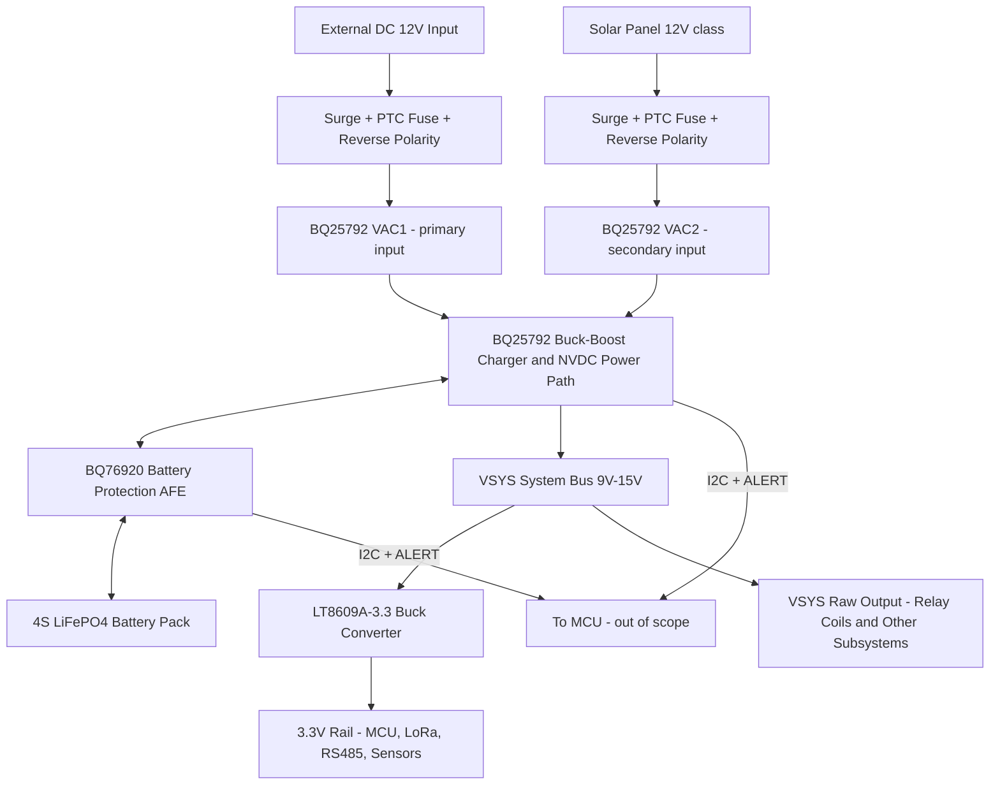

# SWAFarm Node V1 — Power Supply Subsystem Design

Author: Hardware Architect
Status: Architecture baseline — ready for schematic capture
Scope: Power Supply subsystem ONLY (12V external DC input, solar input, battery charging/protection, buck conversion to 3.3V, protection, sleep optimization). No sensor, relay, RS485, LoRaWAN, MCU, or enclosure design is included here — those are separate subsystems per `.ai/agent_index.md`.

This document is a **design record**, not a policy standard. It implements the normative rules already defined in `.ai/knowledge/power_management.md` and `.ai/knowledge/hardware_requirements.md` for the specific case of SWAFarm Node V1. It does not restate those documents' policy content — see the Cross References section for what to read there instead.

---

## 1. Summary

The Node V1 power supply is built around a **12.8V nominal system bus (VSYS)** backed by a 4S LiFePO4 battery, fed by two arbitrated input sources (external 12V DC and a 12V-class solar panel), and stepped down to a single ultra-low-power 3.3V rail for the MCU/RF/sensor load. Source arbitration, battery charge management, and system power-path switching are consolidated into one I2C-controlled buck-boost charger IC (TI BQ25792) rather than built from discrete diode-ORing logic — this both satisfies the "safe arbitration across solar, battery, and external DC" requirement in `power_management.md` and gives the fleet the voltage/current telemetry it asks for, in a single part.

Battery safety is handled by a **second, independent hardware layer** (TI BQ76920 protection AFE + protection FETs) so that pack protection does not depend on the charger IC's firmware/I2C state — this satisfies SWA-PWM-003 ("all high-risk fault modes must map to protective hardware... response").

LiFePO4 was chosen over Li-Ion/LiPo for V1 specifically because of Indian-farm thermal conditions and outdoor safety margin (see Trade-offs, §5.1).

Every external port (DC-IN, Solar-IN) gets its own staged surge clamp (GDT + TVS), PTC overcurrent protection, and a zero-loss "ideal diode" reverse-polarity stage — because both cables are expected to run outdoors, exposed, and near lightning-prone farm installations per `hardware_architect.md`'s environmental doctrine.

---

## 2. Requirements Traceability

| Task Requirement | Design Element | Traces To |
|---|---|---|
| 12V input | External DC port → protection stage → BQ25792 VAC1 | SWA-SWO-303, SWA-HWR-304 |
| Solar panel | Solar port → protection stage → BQ25792 VAC2 | SWA-SWO-303 |
| Battery | 4S LiFePO4 pack | SWA-SWO-303, SWA-PWM-302 |
| Reverse polarity protection | Ideal-diode controller + FET, both ports | SWA-HWR-003, hardware_architect.md "Protection" |
| Buck converter | LT8609A-3.3, VSYS → 3.3V | hardware_architect.md "Power Architecture" |
| Battery charging | BQ25792 multichemistry charge profile | SWA-PWM-001, SWA-HWR-304 |
| Battery protection | BQ76920 AFE + FETs, independent of charger | SWA-PWM-003, SWA-CST-304 |
| Sleep current optimization | Sub-3µA buck IQ, sub-1µA load switches, gateable rails | SWA-PWM-301, SWA-PWM-101, SWA-HWR-101 |
| Surge protection | GDT + TVS staged clamp, both external ports | SWA-HWR-003, SWA-CST-304 |
| Telemetry (implied by power_management.md architecture) | I2C from BQ25792 + BQ76920 to MCU | power_management.md "MON" block |

No new SWA-xxx-NNN requirement IDs were minted for this document — everything here implements existing baseline requirements.

---

## 3. Proposed Architecture



Design flow, in words:

1. **Two physically separate, individually protected input ports** (DC-IN, Solar-IN) present themselves to the two dedicated inputs (VAC1/VAC2) of a single charger IC. The IC — not discrete diode-ORing — decides which source is active, defaulting to external DC as primary (VAC1) with solar as secondary (VAC2), reconfigurable by firmware over I2C. This is a direct, silicon-level implementation of "managed transition with hold-up margin" and "safe arbitration" called out in `power_management.md`.
2. The charger regulates **VSYS** slightly above battery voltage (NVDC power path) whenever any input source is present, and falls back to battery directly when both inputs are absent — the same behavior `power_management.md`'s decision tree describes, but implemented as an inherent IC property instead of firmware-managed switching, which removes an entire class of reset-storm/glitch risk during source transitions.
3. Battery charge/discharge current physically flows through the **BQ76920 protection AFE's FET pair**, positioned between the charger's BAT pin and the physical cell stack. This AFE independently enforces over-voltage, under-voltage, over-current, and short-circuit cutoffs in hardware, regardless of what the charger IC or MCU firmware is doing — the required second, independent protection layer.
4. **VSYS is the one tap point** for everything downstream: the 3.3V buck converter for logic/RF/sensor loads, and a raw ~9–15V output made available to other subsystems (e.g., relay coil drivers) — this subsystem does not consume that raw rail itself, it only guarantees it is protected, arbitrated, and charge-managed.
5. **Sleep current optimization** is addressed at two levels: (a) component-level — every active IC on the always-on path (buck converter, charger, protection AFE) is chosen specifically for sub-µA/low-µA quiescent draw; (b) system-level — two ultra-low-leakage load switches are included so firmware can fully power-gate the LoRa/RS485/sensor front-ends during deep sleep rather than leaving them lightly loaded. This is the concrete mechanism behind the SWA-PWM-301/SWA-HWR-101 sleep current targets; the actual numeric budget must still be measured per SWA-PWM-201/SWA-HWR-203 once firmware duty-cycle behavior exists.

---

## 4. Component Selection

### 4.1 Charge / Power-Path Controller

| | |
|---|---|
| **Recommended** | TI **BQ25792** — I2C-controlled, 1–4 cell, 5A buck-boost battery charger with dual-input selector (VAC1/VAC2), NVDC power path, and MPPT-style input voltage/current regulation (VINDPM up to 22V, IINDPM up to 3.3A) |
| **Why** | Single IC replaces three separate blocks (input arbitration, charge management, power-path switching) that would otherwise need discrete ORing diodes/FETs and a separate charger. Native dual-input selector is an exact match for "solar + external DC, arbitrated" instead of building that logic ourselves. I2C telemetry (VBUS, VBAT, VSYS, IBUS, IBAT, TDIE, TS) satisfies the fleet power-health telemetry goal in `power_management.md` for free. |
| **Package** | VQFN-40 (5mm × 4mm class) |
| **Key constraint** | VAC1/VAC2 valid input window is 3.6V–24V and VINDPM regulation tops out at 22V — the solar panel's worst-case cold open-circuit voltage (Voc) must be confirmed to stay under this ceiling. Flagged as Risk R-1 (§9). |
| **Alternate** | Discrete controller + external power FETs/inductor (e.g., an ADI multichemistry buck controller with telemetry) — evaluated in Trade-offs §5.3 and rejected for V1 on part-count/manufacturability grounds. |

### 4.2 Battery Protection AFE

| | |
|---|---|
| **Recommended** | TI **BQ76920** battery monitor/protector, 3-series to 5-series cell support, drives external charge/discharge FET pair, autonomous hardware OV/UV/OCD/SCD protection, I2C cell-level telemetry |
| **Why** | Provides a protection layer that functions independently of the charger IC and MCU — required so a firmware or I2C-bus fault cannot leave the pack unprotected (SWA-PWM-003). Per-cell voltage telemetry also directly supports the "fleet-level battery health forecasting" item in `power_management.md`'s roadmap. |
| **Package** | TSSOP, per current datasheet |
| **Supporting parts** | 2× N-channel protection MOSFETs (charge FET + discharge FET, back-to-back in the pack's low-side return), precision shunt for coulomb counting, one-time series fuse as a tertiary failsafe beyond the FETs. |
| **Alternate** | Rely solely on charger-IC-side BATFET protection (drop this block entirely) — rejected: makes battery safety dependent on the charger's firmware/register state, violating SWA-PWM-003's independence intent. |

### 4.3 Battery Chemistry and Cells

| | |
|---|---|
| **Recommended** | 4S (4 cells in series) **LiFePO4**, cylindrical 26650-class format, ~3.2–3.5Ah per cell from an industrial cell manufacturer on an approved AVL (e.g., EVE, CALB, Lishen class — exact vendor/part to be locked during BOM qualification, not fabricated here) |
| **Why** | LiFePO4's nominal 3.2V/cell puts a 4S pack at ~12.8V nominal (10.0–14.6V operating range), a near-exact match for a "12V system" without a boost/buck mismatch. Its chemistry is inherently far more thermally stable than Li-Ion/LiPo (no cobalt-oxide thermal runaway pathway), tolerates a wider charge/discharge temperature range, and gives 2,000–5,000+ cycle life — all directly relevant to "optimize charging for Indian weather" and outdoor industrial deployment where enclosure internal temperatures can be extreme. |
| **Capacity sizing** | Provisional only — sized for a rough multi-day (5–7 day) no-solar autonomy target at an assumed few-mA average system draw. **Must be validated against a formal measured power budget (SWA-PWM-201) before this number is locked**; treat as a BOM placeholder, not a spec. |
| **Alternate chemistries** | Li-Ion (higher energy density, lower cost/Wh, worse thermal margin) and LiPo (lowest cost, worst mechanical/thermal robustness, least suited to an unattended outdoor enclosure) — both remain valid *future* options per `hardware_architect.md`, evaluated and rejected for V1 in §5.1. |

### 4.4 Buck Converter (3.3V Rail)

| | |
|---|---|
| **Recommended** | Analog Devices **LT8609A-3.3** (fixed 3.3V output variant) — synchronous step-down, 3V–42V input, 2A continuous / 3A peak, ~2.5µA quiescent current at 12V→3.3V |
| **Why** | Wide input range covers the full VSYS excursion (battery near-empty ~9V up to charging-elevated ~15V) with large margin to the 42V absolute rating — that margin is deliberate headroom against upstream surge let-through, not just convenience. Sub-3µA IQ is the dominant lever on system sleep current, directly addressing the explicit "sleep current optimization" requirement and SWA-PWM-301/SWA-HWR-101 targets. Synchronous topology avoids the LDO efficiency loss `hardware_architect.md` explicitly warns against. |
| **Package** | MSOP-10 |
| **Note on earlier candidate** | An initial TI TPS6282x-family candidate was considered and rejected after datasheet verification — that family's input range (2.4–5.5V) does not cover a 12V-class VSYS bus at all. Recorded here so the mistake isn't silently repeated in a later revision. |

### 4.5 Surge, Overcurrent, and Reverse-Polarity Protection (per external port — DC-IN and Solar-IN, ×2)

| | |
|---|---|
| **Primary surge clamp** | Gas discharge tube (GDT), e.g. Littelfuse CG2-series class — coarse, high-energy clamp closest to the connector, appropriate for lightning-induced transients on exposed outdoor cable runs (`hardware_architect.md`: "Lightning nearby," "Long cable runs") |
| **Secondary surge clamp** | Bidirectional TVS diode, e.g. Littelfuse SMBJ-series (36V standoff class, 600W peak pulse) — fast response, low let-through voltage, coordinated with the GDT via a small series impedance so the GDT fires first on the largest events |
| **Overcurrent** | PTC resettable fuse, sized to the port's expected max current with margin — satisfies the explicit "Fuse / Resettable fuse" item in `hardware_architect.md`'s protection checklist without requiring field fuse replacement |
| **Reverse polarity** | TI **LM74610-Q1** "ideal diode" controller driving an external N-channel MOSFET — zero added quiescent current, near-zero voltage drop (I×Rds(on) instead of a diode's ~0.4–0.7V), turns off within ~2µs on reverse polarity |
| **Why ideal-diode over a series diode** | A conventional series diode wastes 0.4–0.7V continuously — on a solar input that is direct harvested-power loss, and on both inputs it is wasted heat inside a sealed IP65 enclosure. The controller+FET approach is the industrial-grade choice; a bare series diode is the "hobby" shortcut `hardware_architect.md` explicitly tells us to avoid. |

### 4.6 Sleep Current — Downstream Load Gating

| | |
|---|---|
| **Recommended** | 2× ultra-low-leakage load switch (e.g., TI TPS22919-class), MCU-controlled, gating the LoRa/RF front-end rail and the RS485/sensor front-end rail independently from the always-on 3.3V rail |
| **Why** | Picking low-IQ regulators only addresses the *always-on* portion of sleep current. The larger win is fully disconnecting loads that don't need to be powered between duty cycles (RS485 transceiver, sensor excitation, etc.) rather than leaving them lightly loaded — this is the mechanism, the actual gating policy is firmware's decision and out of scope here. |

### 4.7 Connectors

| | |
|---|---|
| **Recommended** | Pluggable screw-terminal blocks (Phoenix Contact MSTB-class or equivalent Wago/Weidmüller, 5.08mm pitch) for DC-IN and Solar-IN; keyed high-current connector (e.g., Molex Mini-Fit Jr class) for the battery pack |
| **Why** | SWA-HWR-305 requires field-serviceable, polarity-safe connectors. Pluggable screw terminals are field-replaceable without soldering and are physically keyed against wrong-port insertion; a bare barrel jack or pin header is the kind of hobby-grade choice `hardware_architect.md` explicitly bans (SWA-HWR-001). |

---

## 5. Trade-offs

### 5.1 LiFePO4 vs. Li-Ion vs. LiPo

| Chemistry | Pros | Cons | V1 Decision |
|---|---|---|---|
| **LiFePO4** | Best thermal/safety margin, longest cycle life, natural 12V-class pack voltage at 4S | Lower energy density (larger physical cell for same Wh), slightly higher $/Wh than Li-Ion | **Selected** — outdoor/industrial safety margin outweighs the density penalty for a stationary, non-weight-constrained node |
| Li-Ion | Higher energy density, lower $/Wh | Materially worse thermal-runaway margin, tighter temperature-dependent charge limits, worse fit for unattended outdoor heat | Kept as a documented future option per `hardware_architect.md`, not used now |
| LiPo | Lowest cost, smallest footprint | Weakest mechanical/thermal robustness of the three, least appropriate for a sealed outdoor enclosure over a 10-year service life | Rejected for this product class |

### 5.2 Custom (bare-cell) BMS vs. Certified Drop-In Pack

| | Bare cells + on-board BQ76920/BQ25792 (chosen) | Certified pack with vendor-integrated BMS |
|---|---|---|
| Design control / telemetry | Full per-cell visibility, matches fleet-analytics roadmap goal | Pack's internal BMS typically does not expose cell-level data to the host |
| Compliance burden | We own UN38.3 transport testing / IEC 62133 qualification for the assembled pack | Vendor already carries that certification |
| Cost at volume | Lower recurring cost at million-unit scale | Higher recurring unit cost, but lower NRE/compliance cost near-term |
| **V1 recommendation** | **Bare cells with on-board protection**, because the task explicitly scopes "battery protection" as something this subsystem designs, and the program's stated fleet-telemetry ambitions depend on cell-level visibility a sealed vendor pack won't give us. | Documented as the faster-time-to-market fallback if the certification timeline becomes a program blocker. |

### 5.3 Integrated Buck-Boost Charger vs. Discrete Charge Controller

Chose the integrated BQ25792 (built-in power FETs) over a discrete controller + external MOSFETs/inductor/sense-resistor design (e.g., an ADI multichemistry buck controller). The discrete approach has a genuine advantage — higher achievable charge current and more layout flexibility — but for this node's modest solar/charge power (well under 5A), the integrated part wins on part count, PCB area, and first-pass-yield risk, which matter more per `manufacturing_rules.md`'s yield/DFM priorities than the marginal current headroom.

### 5.4 Two-Stage (GDT+TVS) vs. Single-Stage Surge Protection

A TVS-only front end is cheaper and is defensible for an enclosure-internal or short-cable-run installation. Given both the DC-IN and Solar-IN cables are expected to run outdoors to a remote panel/adapter in lightning-exposed farm terrain, the staged GDT+TVS approach was chosen despite the added BOM cost — this is a direct application of `hardware_architect.md`'s "never assume ideal operating conditions" rule. A cost-reduced single-stage variant is worth revisiting only if field data or a specific installation class (e.g., indoor/greenhouse nodes) justifies it.

---

## 6. Logical Schematic

This is a **logical/net-level** schematic for handoff to the schematic_designer role — it defines blocks, nets, and interconnects, not physical KiCad geometry (per the project's `pcb-workflow.md` sequence: Requirements → Schematic → Footprints → ERC → Layout).

```
                    ┌── GDT ── TVS ── PTC ── [LM74610-Q1 + FET] ──► VAC1
DC_IN(+) ──[J1]─────┤                                                   │
DC_IN(-) ────────────────────────────────────────────────────► GND ────┤
                                                                         │
                    ┌── GDT ── TVS ── PTC ── [LM74610-Q1 + FET] ──► VAC2
SOL_IN(+) ──[J2]────┤                                                   │
SOL_IN(-) ───────────────────────────────────────────────────► GND ────┤
                                                                         ▼
                                                        ┌────────────────────────┐
                                                        │   U1: BQ25792          │
                                                        │   Buck-Boost Charger   │
                                                        │   + NVDC Power Path    │
                                                        │   VAC1 VAC2  BAT  SYS  │
                                                        └───┬────────────┬───────┘
                                                            │            │
                                                    BAT_CHG/DSG      VSYS (9-15V)
                                                            │            │
                                                  ┌─────────▼───────┐    ├──────────────► VSYS_RAW_OUT
                                                  │  U2: BQ76920    │    │              (relay coils / other subsystems)
                                                  │  Protection AFE │    │
                                                  │  + CHG/DSG FETs │    ▼
                                                  └─────────┬───────┘  ┌─────────────────┐
                                                             │         │ U3: LT8609A-3.3  │
                                                        [Fuse]         │ Buck Converter   │
                                                             │         └────────┬─────────┘
                                                  ┌──────────▼──────┐           │
                                                  │  4S LiFePO4     │        3V3_RAIL ──┬──► MCU / always-on loads
                                                  │  Battery Pack   │                   │
                                                  │  [J3]           │                   ├──► U4: Load Switch ──► 3V3_RF (LoRa)
                                                  └─────────────────┘                   │
                                                                                         └──► U5: Load Switch ──► 3V3_SENS (RS485/Sensors)

I2C_SDA/SCL + ALERT/INT from U1 and U2 ──────────────────────────────────────────────► to MCU (out of scope)
```

Net naming for schematic capture: `DC_IN_P/N`, `SOL_IN_P/N`, `VAC1`, `VAC2`, `VSYS`, `VSYS_RAW_OUT`, `BAT_P/N` (pre-protection), `PACK_P/N` (post-protection, at cells), `3V3_RAIL`, `3V3_RF`, `3V3_SENS`, `PWR_I2C_SDA`, `PWR_I2C_SCL`, `CHG_ALERT_N`, `PROT_ALERT_N`.

---

## 7. KiCad Symbol List

| Ref Des | Component | Suggested KiCad Symbol | Notes |
|---|---|---|---|
| U1 | BQ25792 | Not in stock KiCad libraries — source from manufacturer (Ultra Librarian/SnapEDA) or author custom symbol | 40-pin VQFN, verify pinout against current datasheet revision before capture |
| U2 | BQ76920 | Custom/vendor symbol required | TSSOP, verify current pin count/revision |
| U3 | LT8609A-3.3 | Custom/vendor symbol required (ADI parts generally not in stock KiCad libs) | MSOP-10 |
| U4, U5 | TPS22919-class load switch | Custom/vendor symbol, or `Regulator_Linear` category as placeholder | SOT-23 |
| Q1–Q6 | N-channel MOSFETs (2× reverse-polarity, 4× charger selector, 2× battery protection — see BOM for exact count) | `Device:Q_NMOS_GDS` or `Transistor_FET:*` per chosen part | |
| D-GDT1, D-GDT2 | Gas discharge tubes | Custom symbol (not a standard KiCad device) | |
| D-TVS1, D-TVS2 | Bidirectional TVS diodes | `Diode:TVS_Bidirectional` or `Device:D_TVS_ALT` | |
| F1, F2 | PTC resettable fuses | `Device:Polyfuse` | |
| F3 | Battery series fuse (one-time) | `Device:Fuse` | |
| J1, J2 | DC-IN / Solar-IN pluggable terminal blocks | `Connector_Phoenix_MSTB:*` (family symbol matching selected part) | |
| J3 | Battery connector | `Connector_Molex:*` or generic `Connector:Conn_02x01` per selected part | |
| J4 | VSYS_RAW_OUT header | `Connector_Generic:Conn_01x02` | |
| U1_L1 | Charger power inductor | `Device:L` | |
| U3_L1 | Buck converter inductor | `Device:L` | |
| R_shunt (battery) | Coulomb-counting sense resistor | `Device:R` (current-sense variant if library provides one) | |
| C_* | Input/output bulk and decoupling capacitors | `Device:C`, `Device:C_Polarized` where electrolytic/tantalum is used | |
| NTC1 | Battery pack thermistor | `Device:Thermistor` or `Device:Thermistor_NTC` | |

All ICs marked "custom/vendor symbol required" should be pulled from the manufacturer's official KiCad library release where available (TI and ADI both publish some parts) rather than hand-drawn, to avoid pin-mapping errors — this is a task for the schematic_designer stage, not resolved in this document.

---

## 8. Footprint Recommendations

| Component | Package | Suggested KiCad Footprint (library:footprint) | Notes |
|---|---|---|---|
| U1 (BQ25792) | VQFN-40, ~5×4mm | `Package_DFN_QFN:VQFN-40*` (match exact pitch/pad to datasheet mechanical drawing) | Verify exposed-pad thermal via pattern against datasheet — this part dissipates real power at 5A charge current |
| U2 (BQ76920) | TSSOP | `Package_SO:TSSOP-*` (pin count per current datasheet) | |
| U3 (LT8609A) | MSOP-10 | `Package_SO:MSOP-10*` | |
| U4, U5 (load switches) | SOT-23 | `Package_TO_SOT_SMD:SOT-23` | |
| Q1–Q6 (MOSFETs) | SO-8 / SOT-23 / DPAK depending on selected current rating | `Package_TO_SOT_SMD:*` per selected part | Battery protection FETs and charger selector FETs carry the full charge/discharge current — do not undersize package thermally |
| GDTs | Radial leaded or SMD 2-electrode | `Diode_THT:*` or `Diode_SMD:*` per selected part | Confirm creepage/clearance to adjacent traces per SWA-PDR-303 |
| TVS diodes | SMB (DO-214AA) | `Diode_SMD:D_SMB` | |
| PTC fuses | SMD 1812/2920 class per current rating | `Fuse:Fuse_1812*` or manufacturer-specific | |
| J1, J2 | 5.08mm pluggable terminal block, 2-pos | Manufacturer-specific footprint from Phoenix Contact/Wago KiCad library | Edge-mounted, oriented for enclosure cable entry per `mechanical_design.md` |
| J3 | Battery connector, keyed | Manufacturer-specific | |
| Inductors (charger, buck) | Shielded SMD power inductor | `Inductor_SMD:*` sized to selected part | Keep switching loop area minimized per SWA-PDR-001 |
| Capacitors | 0805/1206 ceramic for most; larger case for bulk electrolytic/polymer at charger input/output | `Capacitor_SMD:C_*` | Bulk cap lifetime must be checked against SWA-CST-301 at the enclosure's worst-case thermal zone |

---

## 9. Risk Analysis

| ID | Risk | Likelihood | Impact | Mitigation |
|---|---|---|---|---|
| R-1 | Solar panel worst-case cold Voc exceeds BQ25792's 22V VINDPM ceiling / 24V VACx detection window, capping harvested power or tripping input-fault detection | Medium | Medium | Specify a panel with Voc ≤ ~20V at minimum-rated temperature in the mechanical/solar BOM; re-verify against the final panel's datasheet before release |
| R-2 | BQ25792 / BQ76920 / LT8609A are effectively single-source in this design (no qualified alternate yet) | Medium | High (violates SWA-HWR-002/SWA-CST-004 at MP) | Qualify at least one pin/function-compatible alternate per critical IC before mass-production ramp, per SWA-CST-004 |
| R-3 | Battery capacity is a provisional placeholder, not derived from a measured power budget | High (known, not yet done) | Medium | Execute SWA-PWM-201 formal power budget once firmware duty-cycle behavior is defined; treat capacity number in this doc as non-final |
| R-4 | Bare-cell 4S LiFePO4 pack requires UN38.3 transport testing and IEC 62133 qualification that the program does not yet carry | Medium | Medium (schedule risk, not technical risk) | Start certification track early per certification_requirements.md's "certification is a design-time requirement" philosophy, or fall back to the certified-pack alternative in §5.2 |
| R-5 | Surge clamp let-through voltage during a large event could still exceed IC absolute maximum ratings if GDT/TVS coordination is mis-sized | Low–Medium | High (IC damage) | Formal surge coordination calculation (GDT ignition voltage vs. TVS clamp voltage vs. IC abs-max) required at detailed design; test to a defined IEC 61000-4-5 level before release |
| R-6 | Charger selector FETs (VAC1/VAC2 back-to-back pairs) are sometimes mistaken for reverse-polarity protection — they are not | Low | Medium | This document explicitly keeps reverse-polarity protection as a separate upstream stage (§4.5); carry this distinction forward into schematic review |
| R-7 | Enclosure internal temperature (sealed IP65, direct sun) may push LiFePO4 charging outside its safe charge-temperature window during peak Indian summer | Medium | Medium | BQ25792's NTC/TS input and BQ76920's thermal protection both already handle this in hardware; confirm enclosure thermal design (mechanical_design.md) keeps the NTC-sensed temperature representative of actual cell temperature |
| R-8 | Two-input (VAC1/VAC2) priority logic defaults to external DC — if a site is solar-only with no external DC ever connected, this default has no negative effect, but firmware must not assume DC is always present | Low | Low | Note for firmware_architect handoff; no hardware change needed |

---

## 10. Cost Estimate

Rough-order-of-magnitude, component-only, budgetary figures at moderate volume (order of 10k units/year) — **not sourcing-team-quoted pricing**. See BOM (§11) for the itemized basis.

| Block | Approx. Cost (USD) |
|---|---|
| Connectors (DC-IN, Solar-IN, Battery, VSYS-out) | ~$4.10 |
| Surge/overcurrent protection (both ports) | ~$2.40 |
| Reverse-polarity protection (both ports) | ~$2.00 |
| Charger stage (IC + inductor + passives + selector FETs) | ~$6.60 |
| Battery cells + pack hardware | ~$15.10 |
| Battery protection AFE stage | ~$3.90 |
| Buck converter stage | ~$3.80 |
| Load switches | ~$0.70 |
| **Subtotal, component cost only** | **~$38.60** |

Battery cells dominate the subsystem cost, as expected for any solar/battery-backed industrial node. This figure excludes PCB fabrication, assembly labor, test fixture time, and enclosure/mechanical hardware — those belong to manufacturing_engineer / bom_optimizer scope. Per `cost_targets.md`'s philosophy, this should be treated as a starting point for yield-adjusted, total-cost-of-ownership analysis, not a target to hit by swapping to lower-grade parts.

---

## 11. Bill of Materials

Full itemized BOM exported to [`BOM/SWAFarmNodeV1_PowerSupply_BOM.csv`](../BOM/SWAFarmNodeV1_PowerSupply_BOM.csv) for direct use by the bom_optimizer role and procurement tooling. Summary:

- 34 line items across 8 functional blocks (connectors, surge protection, reverse-polarity protection, charge/power-path, battery cells, battery protection, buck conversion, load switching)
- All active ICs are current, non-NRND parts as of verification (BQ25792, BQ76920, LT8609A) — satisfies SWA-CST-001
- Second-source qualification is **not yet complete** for the three critical ICs — tracked as Risk R-2, must close before MP release per SWA-CST-004

---

## 12. Future Improvements

- **Second-source qualification** for BQ25792, BQ76920, and LT8609A before mass-production ramp (closes Risk R-2).
- **Coulomb-counter-based state-of-charge fuel gauge** — BQ76920 provides raw current/voltage data; a dedicated gauge or firmware-side coulomb integration would sharpen remaining-runtime estimates for fleet dashboards, per `power_management.md`'s recommended practices.
- **Supercapacitor-assisted transient buffering** — explicitly on `power_management.md`'s roadmap; worth evaluating once relay/RF transient current data exists from real hardware, to reduce peak stress on the battery during simultaneous relay + LoRaWAN TX events.
- **True MPPT (perturb-and-observe)** if a future panel size increase makes the BQ25792's fixed-VINDPM approximation leave meaningful harvested power on the table — not justified at current small panel wattage.
- **Optional 5V rail** if a specific RS485 transceiver or sensor front-end selected by the schematic_designer role turns out to need 5V rather than 3.3V logic — flagged here, not solved, to keep this document in scope.
- **Certified drop-in battery pack** re-evaluation (§5.2) if UN38.3/IEC 62133 self-certification timeline becomes a program-level blocker.

---

## 13. Action Items

1. Hand off this document, the logical schematic (§6), and the KiCad symbol/footprint lists (§§7–8) to the **schematic_designer** role for KiCad capture, per the project's `pcb-workflow.md` sequence (Requirements → Schematic → Footprints → ERC).
2. Confirm final solar panel spec (Voc, Vmp, wattage) and re-check against BQ25792's 22V VINDPM ceiling (Risk R-1).
3. Kick off second-source qualification for BQ25792, BQ76920, LT8609A (Risk R-2, SWA-CST-004).
4. Once firmware duty-cycle assumptions exist, run the formal SWA-PWM-201 power budget and lock the battery capacity number (Risk R-3).
5. Decide and start the LiFePO4 pack certification track (UN38.3/IEC 62133) early, per certification_requirements.md's design-time philosophy (Risk R-4).
6. Define the surge test level (e.g., an IEC 61000-4-5 class) so GDT/TVS coordination in §4.5 can be finalized against a real target rather than a qualitative "staged" description (Risk R-5).

---

## 14. Documentation Notes

- This document is new; it does not modify `power_management.md` or `hardware_requirements.md` — no architectural policy changed, this is an implementation of existing policy for Node V1, per the "never duplicate documentation" rule.
- Companion BOM created at `BOM/SWAFarmNodeV1_PowerSupply_BOM.csv`.
- `TODO.md` created at the project root to record this milestone and the follow-on action items in §13.
- No `.kicad_sch` changes were made — the logical schematic in §6 is the input to that step, not a substitute for it.

## Cross References
- [power_management.md](../.ai/knowledge/power_management.md) — normative power policy this document implements
- [hardware_requirements.md](../.ai/knowledge/hardware_requirements.md) — normative hardware requirements baseline
- [component_standards.md](../.ai/knowledge/component_standards.md) — component qualification/derating rules applied above
- [cost_targets.md](../.ai/knowledge/cost_targets.md) — cost governance philosophy applied in §10
- [certification_requirements.md](../.ai/knowledge/certification_requirements.md) — applies to Risk R-4 (battery cert) and any future RF-adjacent change
