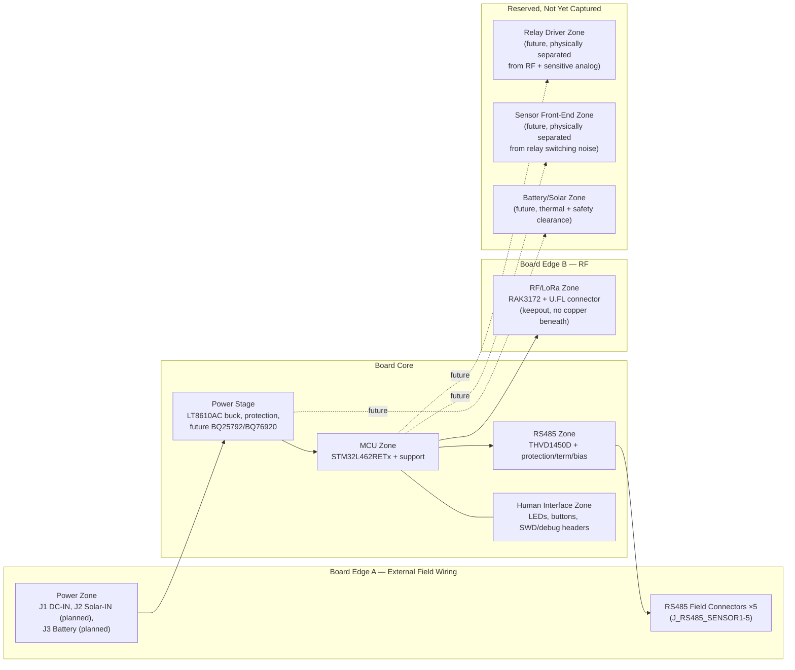

# SWAFarm Node V1 — PCB Floor Plan & Four-Layer Strategy (Pre-Layout Planning)

Author: Hardware Architect (AI-assisted), reviewed against `.ai/agents/pcb_layout_reviewer.md` and `.ai/agents/manufacturing_engineer.md` methodology
Status: **Planning document — no PCB routing performed, no `.kicad_pcb` file modified.** Produced in direct response to `.ai/global_engineering_rules.md`'s four-layer PCB constraint and the gap flagged in `SWAFarmNodeV1_05LoRaWAN_DesignReview.md` §12a ("no cross-subsystem physical region/floor-plan reservation exists yet").
Scope: Reconciles all six completed schematic subsystems (`01_power` through `06_Relay`) plus the three not-yet-captured ones (sensor, battery/solar, enclosure/mounting) against the planned four-layer stack-up. This is a **constraint-recording and zone-reservation** document, not a layout — it exists so that when PCB routing eventually begins, placement decisions are made against a reconciled plan rather than block-by-block improvisation.

---

## 1. Purpose and Why This Document Exists Now

`.ai/global_engineering_rules.md` requires, for the current (schematic) phase:
> "Reserve adequate physical regions for RF, power, RS485, relays, connectors, battery, solar, and mechanical mounting. Do not assume that every schematic block can be placed anywhere on the PCB."

Every subsystem captured so far (`01_power` → `05_LoRaWAN`) was independently verified correct at the schematic/netlist level, but each milestone's own documentation only recorded *that subsystem's* placement/grounding/RF/thermal constraints in isolation (e.g., `04_RS485`'s differential-routing notes, `05_LoRaWAN`'s RF keepout notes). No document until now reconciled them **against each other** on one board. This document closes that gap. Per `.ai/agents/pcb_layout_reviewer.md`'s own stated review workflow, it addresses items 1–4 of that workflow (floorplan/zone partition, power loop/return path, RF keepout/antenna path, high-current/relay switching path) at the *planning* level — item 5 (fabrication/assembly constraint review) is deferred to when a real stack-up and board outline exist.

**What this document is not:** a board outline, a placement file, or a routing guide. No board size, shape, or connector coordinates are fixed yet — mechanical/enclosure design (`TODO.md`: "not started") drives those. What follows is a **relative zone-adjacency plan** and an explicit list of constraints each future placement decision must satisfy.

---

## 2. Four-Layer Stack-Up Strategy (as specified) Mapped to Actual Subsystems

| Layer | Assigned Use | What Actually Lives Here (from captured subsystems) |
|---|---|---|
| L1 (top) | Components + signal routing | Most components: STM32L462RETx, THVD1450D, RAK3172, connectors, passives. Fast/sensitive signals (SWD, RF trace, RS485 differential pair) prefer L1 for shortest via-free path to their respective connectors. |
| L2 | Continuous solid ground plane | **Single reference plane for the whole board.** Every subsystem's `GND` net (verified as one unified net across all five milestones via netlist trace) returns here. This is the plane the RF keepout (§5), isolation provision (§7), and switching-loop discipline (§6) are all defined *relative to*. |
| L3 | Power distribution + selected low-speed signals | `3V3_RAIL`, `VIN_PROT`, and (once captured) `VSYS_RAW_OUT`/battery rails as copper pours/wide traces. Low-speed signals (I2C reservations, GPIO reservations, DIP-switch-gated RS485 term/bias nets) may also route here to keep L1 clear for the fast/sensitive nets above. |
| L4 (bottom) | Components + signal routing | Secondary component placement (test points, passives that don't need top-side access) and remaining signal routing overflow from L1. |

**Constraint carried forward from `05_LoRaWAN` §6, now stated at the layer level:** no L3 power copper (or L4 signal routing) permitted directly beneath the RF trace/antenna keepout region — the L2 ground plane must remain the *only* uninterrupted layer under the RF path; L3 power pours routed under an RF trace would couple switching noise into the antenna feed.

---

## 3. Zone / Region Floor Plan (relative adjacency, no board outline yet)

This mirrors `pcb_design_rules.md`'s own architecture diagram (`Power Zone — MCU Zone — LoRa Module Zone`, `MCU — Sensor/Relay IO Zone`, `MCU — Connector Zone`, `RS485 Zone — MCU`) — reused, not reinvented, per this project's "reuse existing conventions" discipline.

**Adjacency rules driving this layout:**
1. **RF zone at a board extremity, away from every switching/noisy zone** (power stage's buck converter, and the future relay driver) — per SWA-PDR-003 and `05_LoRaWAN`'s own RF keepout requirement. The RF zone should be the *farthest* zone from the power stage's switching loop.
2. **External connectors cluster at board edges** matching their real-world cable entry points — DC-IN/Solar-IN/Battery at one edge (they arrive together from the same enclosure gland region in typical installations), RS485's 5 field connectors at another edge (per `04_RS485`'s hub topology, these are a cluster by nature), antenna at a third edge or corner (nearest the planned enclosure SMA bulkhead).
3. **MCU zone is the hub** — every other zone connects back to it (UART/SPI/I2C/GPIO), so it sits centrally, minimizing average trace length to all peripherals.
4. **Future relay zone and future sensor zone are kept apart from each other** — per SWA-PDR-002 ("keep relay and inductive switching currents away from sensor reference paths") — neither exists yet, but the zone reservation prevents a future layout from being forced to interleave them for lack of space.
5. **Battery/solar zone reserved adjacent to the power stage**, not the RF or MCU zones — thermal and safety clearance (per `manufacturing_rules.md`'s "battery-related assembly must include safety handling controls") benefit from being physically grouped with the rest of the power path, away from digital/RF noise sources.

---

## 4. Grounding Strategy

- **L2 is the single, continuous reference plane for the entire board.** Confirmed via netlist trace across all five milestones that `GND` is genuinely one unified net (Power, MCU, HMI, RS485, and LoRaWAN subsystems all share it) — there is no schematic-level reason to split it, and `pcb_design_rules.md`'s "continuous low-impedance ground strategy" standard requires it stay that way on L2.
- **Return-current discipline per zone**, per SWA-PDR-203 ("perform return-current path review for every high-speed or switching net class"):
  - RF trace (§5): return current must flow directly beneath the trace on L2, uninterrupted by any plane split.
  - RS485 differential pair (`04_RS485` §15): same principle — continuous L2 reference beneath the A/B pair, at least through the protected zone.
  - Buck converter switching loop (§6): return path must stay tight/local to the loop, not forced to detour around a distant plane discontinuity.
- **Isolation gap — spatially reserved, not yet activated** (§7): if `04_RS485`'s flagged isolated-RS485 revisit (per `hardware_architect.md`'s "consider isolated RS485 for production versions") is adopted, an isolation barrier requires a *slot/moat* cut into the L2 plane (and matching keepout on L1/L3/L4) separating the RS485 field-side circuitry from the rest of the board. **Reserving physical space for this moat now** — even while the isolated-vs-non-isolated decision itself remains open — avoids a disruptive re-floorplan later. The RS485 zone (§3) is deliberately drawn as a distinct zone bordering the field-connector edge for exactly this reason.

---

## 5. RF Constraints (board-wide, formalizing `05_LoRaWAN` §6)

- RF trace: 50Ω target impedance (protocol/system standard, not yet a stack-up-specific geometry — see §10), shortest possible, via-free if achievable.
- Keepout: no copper (any layer, including L3 power pours and L4 routing) beneath or immediately adjacent to the RF trace and U.FL footprint.
- L2 ground plane must remain fully continuous and unslotted directly under the RF zone — this is the one place on the board where even the isolation-moat provision (§4) must **not** be allowed to encroach, since it would double as an unintended plane discontinuity under the antenna feed.
- Physical separation from the power stage's switching loop and the future relay zone (§3), per SWA-PDR-003.
- No tall/shielded components permitted in the RF near-field region above the module (`05_LoRaWAN` §6, restated here as a board-wide rule, not just a module-local one — the future relay or battery zones must not encroach on this region either).

---

## 6. High-Current / Switching Path Constraints

- **Power stage (LT8610AC buck converter, `01_power`):** switching loop (inductor–output caps–IC) must be placed compactly, per SWA-PDR-001 ("place power conversion and switching loops compactly") — minimizing loop area directly reduces both EMI radiation and the risk of coupling into the nearby MCU/RF zones.
- **Future relay driver zone:** flyback/coil switching currents must stay physically isolated from the sensor front-end zone (SWA-PDR-002) and from the RF zone (§5) — the floor plan (§3) already reserves separated zones for exactly this reason, ahead of that subsystem's own schematic capture.
- **Thermal implication carried alongside high-current routing:** see §8.

---

## 7. Isolation Provision (RS485)

As flagged in `05_LoRaWAN` §12a: `04_RS485`'s approved design does not include galvanic isolation, while `hardware_architect.md` recommends considering it for production. **This document does not resolve that decision** (that remains a team call, consistent with "explain why + wait for approval" for previously-approved subsystems) — it only ensures the floor plan doesn't foreclose the option:
- RS485 zone (§3) is placed at a board extremity, adjacent only to its own field connectors, with a clear boundary against the MCU zone — the natural location for an isolation moat if one is added later.
- If isolation is adopted: reserve a creepage/clearance gap (exact dimension per the eventual isolated-transceiver or digital-isolator part's datasheet and the safety class target) across L1/L2/L3/L4 at that zone boundary, and route the shared bus's control signals (DE/RE, TX/RX) through an isolator IC placed straddling that gap.
- If isolation is not adopted: the same zone boundary still provides a natural noise/creepage separation between the field-wired RS485 connectors and the rest of the board, consistent with `pcb_design_rules.md` SWA-PDR-303 (creepage/clearance aligned with voltage classes and safety goals) — not wasted effort either way.

---

## 8. Thermal Constraints

| Zone | Heat Source | Provision Needed |
|---|---|---|
| Power stage | LT8610AC buck converter (real dissipation at load current); future BQ25792 charger (dissipates during charge cycles, more so at higher charge current) | Thermal via strategy under/around the regulator packages; adequate copper pour for heat spreading — flagged per `pcb_layout_reviewer.md`'s "thermal via strategy under power devices" mandatory check |
| RF zone | RAK3172 during TX bursts (peak current substantially above its low sleep/idle current, though average stays low due to LoRaWAN's low duty cycle) | No dedicated thermal via strategy expected to be necessary given short TX burst duration, but placement should avoid stacking directly against the power stage's own heat source |
| Future relay zone | Relay coil driver dissipation, contact heating at rated load | To be assessed when that subsystem is captured; zone is already reserved apart from thermally-sensitive neighbors |
| Future battery/solar zone | Charge current dissipation, cell thermal limits (LiFePO4 per the original architecture doc) | Reserved adjacent to the power stage per §3, consistent with `mechanical_design.md`'s thermal-rise constraint (SWA-MEC-301) |

---

## 9. Connector and Mechanical Placement Constraints

- External field connectors (DC-IN, Solar-IN, Battery, RS485 ×5, antenna U.FL-to-SMA) must sit at board edges matching their eventual enclosure cable-entry points — exact edge assignment depends on the enclosure design (not started), but the zone floor plan (§3) already groups them logically (power-related together, RS485 together, RF at its own edge) so that whichever edge orientation the enclosure ultimately requires, no subsystem's connectors are scattered across the board.
- SWD/debug headers (`02_MCU`'s ARM 10-pin SWD, debug UART; `05_LoRaWAN`'s SWD test points) should remain accessible without full enclosure disassembly where the enclosure design permits — matching `mechanical_design.md`'s "physical access to debug/program ports must be controlled" (a security as well as serviceability constraint).
- Mounting holes: 4× M3 corner pattern already specified in `03_HMI` §7 — must be clear of the RF keepout zone (§5) and any isolation moat (§7) once those are geometrically fixed.
- Assembly/AOI visibility and rework access (`pcb_layout_reviewer.md`'s mandatory checks) — noted as a requirement for whoever performs the actual placement, not yet actionable without real footprints placed.
- **Field-connector clearance reservations (added `07_FieldIO`)**, applying to both the RS485 sensor connectors (`J_RS485_SENSOR1`–`5`) and the relay field connectors (`J_RELAY1`–`5`, `06_Relay`) — connector accessibility and serviceability are as important as the electrical design for an industrial product, so these are recorded now even though no board outline exists yet:
  - **Cable approach clearance:** ≥20mm of unobstructed board area beyond each connector's wire-entry face, for cable bend radius (4–6× cable OD for typical 16–18AWG industrial stranded cable) — no other component or the board edge may intrude into this zone.
  - **Tool access clearance:** ≥15mm of clear vertical access above each screw-terminal position for flat-blade screwdriver insertion/removal — do not place taller components directly above a connector row.
  - **Strain relief:** the board-level reservation above only guarantees the board itself doesn't obstruct strain relief; the enclosure design (future milestone) must budget its own cable-gland-to-connector run length within its cable entry path per `mechanical_design.md`'s `SWA-MEC-002`.
  - **Labeling:** ≈5×2mm of silkscreen area reserved per connector for its identification text (e.g. "Sensor 1", "Relay 3"), positioned so it stays legible once the connector and any strain-relief hardware are mated — not printed on the connector body itself.
  - At the existing 50.8mm connector pitch (both the RS485 sensor and relay rows), the ≈20.3mm-wide Phoenix MKDS-1,5-4 body leaves ≈25–28mm of clear gap between adjacent connectors — sufficient for the above reservations without redesigning the pitch.

---

## 10. Impedance Targets — Explicitly Deferred Pending Stack-Up

Per `global_engineering_rules.md`: **"Do not finalize impedance values without the selected manufacturer's stack-up."** Clarifying what has and has not been specified so far:

| Value | Status |
|---|---|
| RS485 differential pair: 120Ω target (`04_RS485` §9) | **Protocol standard**, not stack-up-dependent — RS-485/Modbus universally targets 120Ω regardless of PCB vendor |
| RF trace: 50Ω target (`05_LoRaWAN` §4, §6) | **RF/module system standard**, not stack-up-dependent — matches the RAK3172's own certified 50Ω output impedance |
| Trace width, spacing, dielectric height needed to *achieve* either target on this specific board | **Not specified — correctly deferred.** This requires the selected fabricator's actual stack-up (copper weight, dielectric constant, prepreg thickness), which does not exist yet. Will be calculated once a manufacturer/stack-up is locked, before routing begins. |

---

## 11. Per-Subsystem Region Reservation Summary

| Subsystem | Status | Zone (§3) | Key Constraints |
|---|---|---|---|
| Power (`01_power`) | Captured + Placed (`09_PCBFloorplan`) | Power Zone (X10-130,Y10-85) | Compact switching loop (§6), thermal via strategy (§8), external connector edge placement (§9) |
| MCU (`02_MCU`) | Captured + Placed | MCU Zone (central hub, X95-160,Y75-135) | Decoupling tightened to ~12mm of the IC during placement (see `09_PCBFloorplan` §8); hosts the SWD/debug access point (§9) |
| Human Interface (`03_HMI`) | Captured + Placed | HMI Zone (X165-210,Y118-138) | Mounting holes placed at all 4 corners (§9), board-ID silkscreen still deferred to enclosure milestone per `03_HMI` §7 |
| RS485 (`04_RS485`, field I/O protection added `07_FieldIO`) | Captured + Placed | RS485 Zone (left edge, X10-100,Y80-215) | Differential routing (existing §15 of that doc) still pending — placement only; isolation moat provision (§7) remains open; 5-connector edge cluster placed on the left board edge |
| LoRaWAN (`05_LoRaWAN`) | Captured + Placed | RF Zone (top-right corner, X210-290,Y10-70) | RF keepout (§5) remains a routing-stage item; antenna placed at the board's outer edge, farthest zone from every switching/high-current block (verified via rendered placement, not just intent) |
| Relay driver (`06_Relay`) | Captured + Placed | Relay Zone (bottom edge, X95-210,Y140-195) | 5× flyback-protected low-side N-MOSFET channels; contact side (COM/NO/NC) galvanically isolated from board GND by the relay itself — no PCB-level isolation moat needed here (contrast RS485 §7); real Finder 40.51 courtyard (29.55×12.95mm, measured not assumed) drove the final connector pitch |
| Battery/Solar (`08_BatterySolar`) | Captured + Placed | Battery Zone (X138-200,Y10-85), adjacent to Power Zone as planned | Thermal (§8) and safety clearance (`manufacturing_rules.md`) remain routing/layout-detail items; placement confirms the adjacent-to-Power-Zone plan from this document was followed |
| Sensor front-end | Not started | Reserved (Future) | Isolated from relay switching noise (§6) |
| Enclosure/mounting | Not started | N/A (drives edge assignments once designed) | Mounting hole clearance (§9) — 4× M3 corner holes now placed at a provisional 10mm inset, to be validated once a real enclosure exists; connector edge orientation (§9); antenna SMA bulkhead (`05_LoRaWAN` §5) |

---

## 12. Open Items and Assumptions

1. **No board outline exists yet.** This document is deliberately outline-agnostic (relative zones, not coordinates). Once mechanical/enclosure design begins, this floor plan should be the *input* to defining an actual outline, not revised to fit one chosen arbitrarily.
2. **Manufacturer/stack-up not yet selected** — blocks impedance geometry finalization (§10) and via/thermal specifics (§8), by design, per the global constraint.
3. **RS485 isolation decision remains open** (§7) — this document only preserves the option, it does not make the call.
4. **Three not-yet-captured subsystems** (sensor, battery/solar, enclosure) have zones reserved by *name and adjacency rule* only — their actual area/shape requirements will refine this plan as each is captured. Relay driver (`06_Relay`) is now captured and its row in §11 reflects real constraints rather than a placeholder.
5. This document should be revisited and updated at the start of each future milestone (sensor, battery/solar, enclosure, and again before PCB layout begins) rather than treated as final.

---

## 13. Cross References
- [SWAFarmNodeV1_05LoRaWAN_DesignReview.md](SWAFarmNodeV1_05LoRaWAN_DesignReview.md) §12a — origin of this document's request
- [SWAFarmNodeV1_04RS485_DesignReview.md](SWAFarmNodeV1_04RS485_DesignReview.md) §15 — existing differential-routing/RF-adjacent requirements reused here
- [SWAFarmNodeV1_03HMI_DesignReview.md](SWAFarmNodeV1_03HMI_DesignReview.md) §7 — mounting hole and board-ID specification reused here
- [../.ai/global_engineering_rules.md](../.ai/global_engineering_rules.md) — normative source of the four-layer constraint
- [../.ai/agents/pcb_layout_reviewer.md](../.ai/agents/pcb_layout_reviewer.md) — review methodology this document follows
- [../.ai/agents/manufacturing_engineer.md](../.ai/agents/manufacturing_engineer.md) — DFM/DFT lens applied in §9
- [../.ai/knowledge/pcb_design_rules.md](../.ai/knowledge/pcb_design_rules.md) — SWA-PDR-001/002/003/203/303, source of the zone-architecture diagram reused in §3
- [../.ai/knowledge/mechanical_design.md](../.ai/knowledge/mechanical_design.md) — thermal (SWA-MEC-301) and serviceability constraints
- [../.ai/knowledge/manufacturing_rules.md](../.ai/knowledge/manufacturing_rules.md) — battery assembly safety handling basis
- [../TODO.md](../TODO.md) — milestone tracker
